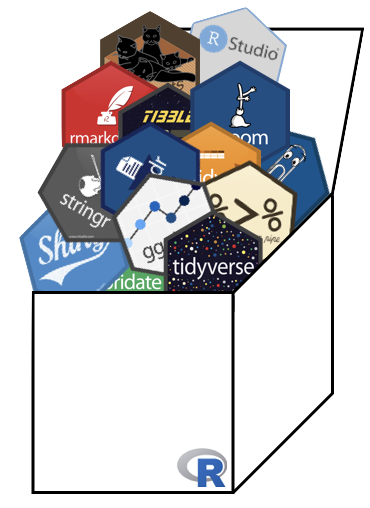

# Data Science Course in a Box 

**Note:** This repo is currently a WIP. Materials are based [this Spring 2018](http://www2.stat.duke.edu/courses/Spring18/Sta199/) course. See https://www.tidyverse.org/learn/ for other learning resources as well.

## Course description

How can we effectively and efficiently teach statistical thinking and computation to students with little to no background in either? How can we equip them with the skills and tools for reasoning with various types of data and leave them wanting to learn more? 

This introductory data science course that is our (working) answer to these questions. The courses focuses on data acquisition and wrangling, exploratory data analysis, data visualization, and effective communication and approaching statistics from a model-based, instead of an inference-based, perspective. A heavy emphasis is placed on a consitent syntax (with tools from the `tidyverse`), reproducibility (with R Markdown) and version control and collaboration (with git/GitHub). We help ease the learning curve by avoiding local installation and supplementing out-of-class learning with interactive tools (like `learnr` tutorials). By the end of the semester teams of students work on fully reproducible data analysis projects on data they acquired, answering questions they care about. 

This repository serves as a "data science course in a box" containing all materials required to teach (or learn from) the course described above.

## Contents

- `infrastructure`: This booklet contains information on the computing infrastructure of this course and is designed for teachers, while the remainder of the content is for teachers and learners. Specifically it covers:
	- RStudio: Why to use one of the below and how to structure the course if you’re using one of the below?
		- RStudio Server Pro
		- RStudio Cloud
	- git/GitHub: How to use git and GitHub as the learning management system for your course as well as a collaborative platform for your students.
		- Structure
		- Management:
			- GitHub Classroom
			- `ghclass`
	- Creating `learnr` modules
	- Using `blogdown` to create your course website
- `slides`: Course content as `xaringan` slides
- `labs`: Guided hands on exercises for students requiring minimal introduction from the instructor
- `assignments`: Team-based and individual assignments
- `midterms`: Sample take-home midterms
- `projects`: Sample student final projects (maybe)
- `learnr`: Interactive learning exercises built with `learnr`
