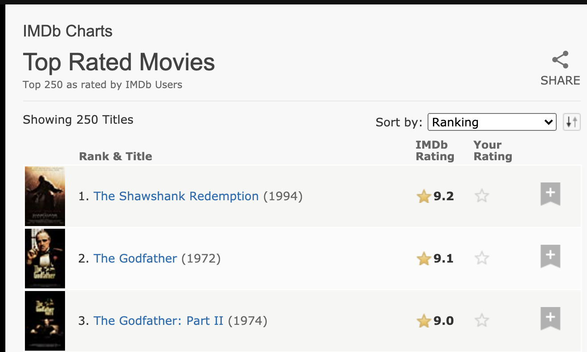
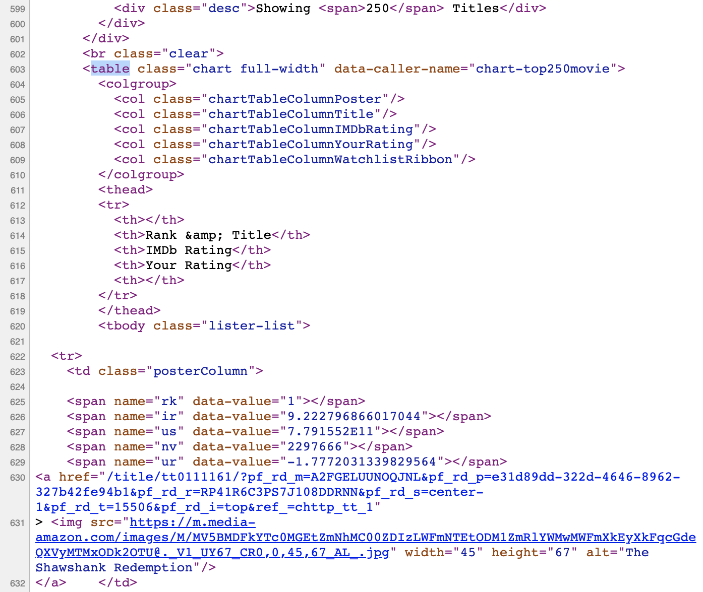
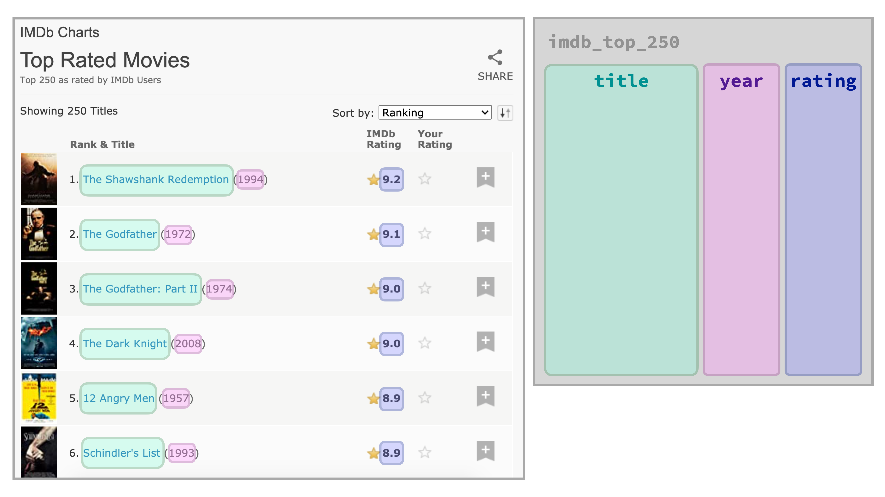
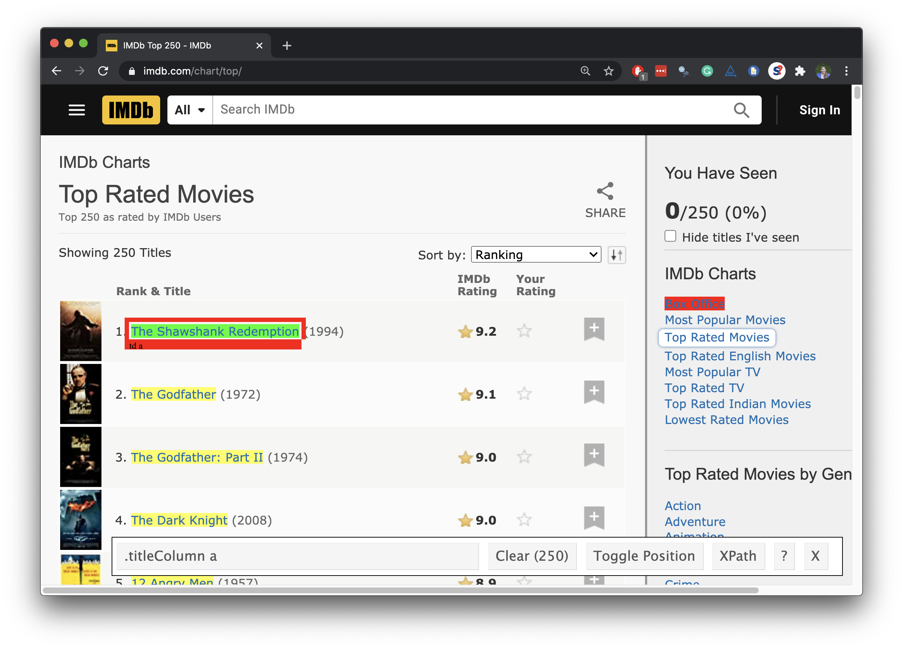
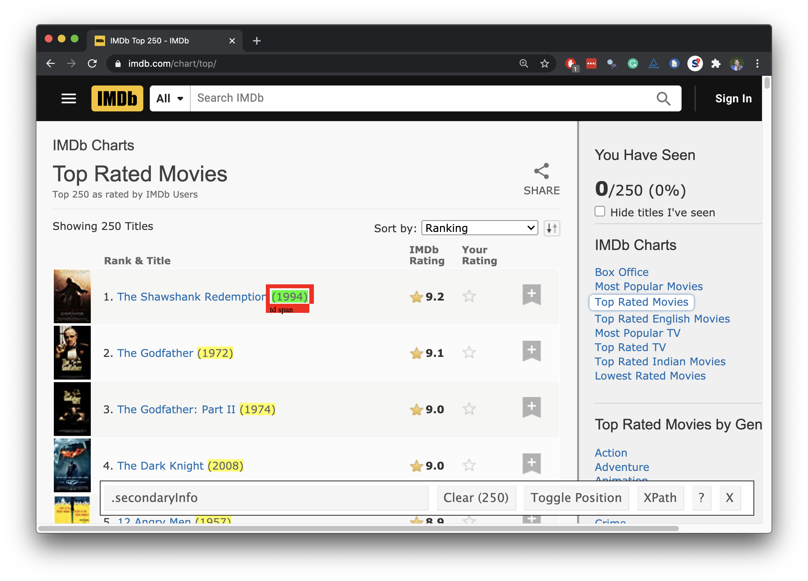
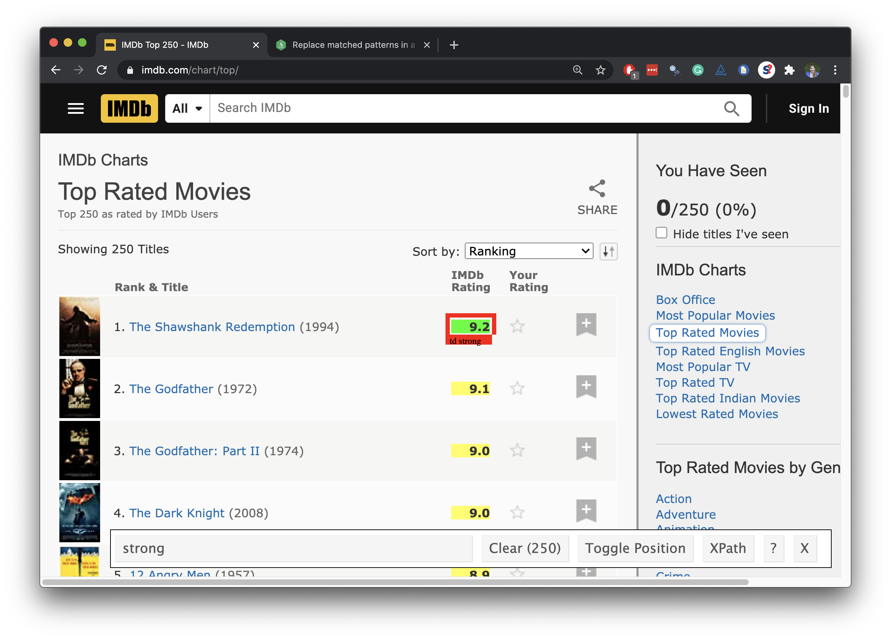

```{r child = "../setup.Rmd"}
```

```{r packages, echo = FALSE, message=FALSE, warning=FALSE}
library(tidyverse)
library(rvest)
library(DT)
```

class: middle

# Top 250 movies on IMDB

---

## Top 250 movies on IMDB

Take a look at the source code, look for the tag `table` tag:
<br>
http://www.imdb.com/chart/top

.pull-left[
```{r echo=FALSE, out.width="100%"}

```
]
.pull-right[
```{r echo=FALSE, out.width="94%"}

```
]


---

## First check if you're allowed!

```{r warning=FALSE}
library(robotstxt)
paths_allowed("http://www.imdb.com")
```

vs. e.g.

```{r warning=FALSE}
paths_allowed("http://www.facebook.com")
```

---

## Plan

```{r echo=FALSE, out.width="90%"}

```

---

## Plan

1. Read the whole page

2. Scrape movie titles and save as `titles` 

3. Scrape years movies were made in and save as `years`

4. Scrape IMDB ratings and save as `ratings`

5. Create a data frame called `imdb_top_250` with variables `title`, `year`, and `rating`

---

class: middle

# Step 1. Read the whole page

---

## Read the whole page

```{r}
page <- read_html("https://www.imdb.com/chart/top/")
page
```

---

## A webpage in R

- Result is a list with 2 elements

```{r}
typeof(page)
```

--

- that we need to convert to something more familiar, like a data frame....

```{r}
class(page)
```

---

class: middle

# Step 2. Scrape movie titles and save as `titles` 

---

## Scrape movie titles

```{r echo=FALSE, out.width="70%"}

```

---

## Scrape the nodes

.pull-left[
```{r output.lines=17}
page %>%
  html_nodes(".titleColumn a")
```
]
.pull-right[
```{r echo=FALSE, out.width="100%"}

```
]

---

## Extract the text from the nodes

.pull-left[
```{r output.lines=16}
page %>%
  html_nodes(".titleColumn a") %>%
  html_text()
```
]
.pull-right[
```{r echo=FALSE, out.width="100%"}

```
]

---

## Save as `titles`

.pull-left[
```{r output.lines=14}
titles <- page %>%
  html_nodes(".titleColumn a") %>%
  html_text()

titles
```
]
.pull-right[
```{r echo=FALSE, out.width="100%"}

```
]

---

class: middle

# Step 3. Scrape year movies were made and save as `years`

---

## Scrape years movies were made in

```{r echo=FALSE, out.width="70%"}

```

---

## Scrape the nodes

.pull-left[
```{r output.lines=17}
page %>%
  html_nodes(".secondaryInfo")
```
]
.pull-right[
```{r echo=FALSE, out.width="100%"}

```
]

---

## Extract the text from the nodes

.pull-left[
```{r output.lines=16}
page %>%
  html_nodes(".secondaryInfo") %>%
  html_text()
```
]
.pull-right[
```{r echo=FALSE, out.width="100%"}

```
]

---

## Clean up the text

We need to go from `"(1994)"` to `1994`:

- Remove `(` and `)`: string manipulation

- Convert to numeric: `as.numeric()`

---

## stringr

.pull-left-wide[
- **stringr** provides a cohesive set of functions designed to make working with strings as easy as possible
- Functions in stringr start with `str_*()`, e.g.
  - `str_remove()` to remove a pattern from a string
  ```{r}
   str_remove(string = "jello", pattern = "el")
  ```
  - `str_replace()` to replace a pattern with another
  ```{r}
  str_replace(string = "jello", pattern = "j", replacement = "h")
  ```
]
.pull-right-narrow[
```{r echo=FALSE, fig.align="left", out.width="100%"}

```
]

---

## Clean up the text

```{r output.lines=15}
page %>%
  html_nodes(".secondaryInfo") %>%
  html_text() %>%
  str_remove("\\(") # remove (
```

---

## Clean up the text

```{r output.lines=14}
page %>%
  html_nodes(".secondaryInfo") %>%
  html_text() %>%
  str_remove("\\(") %>% # remove (
  str_remove("\\)") # remove )
```

---

## Convert to numeric

```{r output.lines=13}
page %>%
  html_nodes(".secondaryInfo") %>%
  html_text() %>%
  str_remove("\\(") %>% # remove (
  str_remove("\\)") %>% # remove )
  as.numeric()
```

---

## Save as `years`

.pull-left[
```{r output.lines=11}
years <- page %>%
  html_nodes(".secondaryInfo") %>%
  html_text() %>%
  str_remove("\\(") %>% # remove (
  str_remove("\\)") %>% # remove )
  as.numeric()

years
```
]
.pull-right[
```{r echo=FALSE, out.width="100%"}

```
]

---

class: middle

# Step 4. Scrape IMDB ratings and save as `ratings`

---

## Scrape IMDB ratings

```{r echo=FALSE, out.width="70%"}

```

---

## Scrape the nodes

.pull-left[
```{r output.lines=17}
page %>%
  html_nodes("strong")
```
]
.pull-right[
```{r echo=FALSE, out.width="100%"}

```
]

---

## Extract the text from the nodes

.pull-left[
```{r output.lines=16}
page %>%
  html_nodes("strong") %>%
  html_text()
```
]
.pull-right[
```{r echo=FALSE, out.width="100%"}

```
]

---

## Convert to numeric

.pull-left[
```{r output.lines=15}
page %>%
  html_nodes("strong") %>%
  html_text() %>%
  as.numeric()
```
]
.pull-right[
```{r echo=FALSE, out.width="100%"}

```
]

---

## Save as `ratings`

.pull-left[
```{r output.lines=12}
ratings <- page %>%
  html_nodes("strong") %>%
  html_text() %>%
  as.numeric()

ratings
```
]
.pull-right[
```{r echo=FALSE, out.width="100%"}

```
]

---

class: middle

# Step 5. Create a data frame called `imdb_top_250`

---

## Create a data frame: `imdb_top_250`

```{r}
imdb_top_250 <- tibble(
  title = titles, 
  year = years, 
  rating = ratings
  )

imdb_top_250
```

---

```{r echo=FALSE}
options(htmltools.preserve.raw = FALSE)
imdb_top_250 %>% datatable(options(list(dom = "p", pageLength = 8)), height = 400)
```

---

## Clean up / enhance

May or may not be a lot of work depending on how messy the data are

- See if you like what you got:

```{r}
glimpse(imdb_top_250)
```

- Add a variable for rank
```{r}
imdb_top_250 <- imdb_top_250 %>%
  mutate(rank = 1:nrow(imdb_top_250)) %>%
  relocate(rank)
```

---

```{r echo=FALSE}
imdb_top_250 %>%
  print(n = 20)
```

---

class: middle

# What next?

---

.question[
Which years have the most movies on the list?
]

--

```{r}
imdb_top_250 %>% 
  count(year, sort = TRUE)
```

---

.question[
Which 1995 movies made the list?
]

--

```{r}
imdb_top_250 %>% 
  filter(year == 1995) %>%
  print(n = 8)
```

---

.question[
Visualize the average yearly rating for movies that made it on the top 250 list over time.
]

--

.panelset[
.panel[.panel-name[Plot]
```{r ref.label = "yearly-avg", echo = FALSE, out.width = "58%"}
```
]
.panel[.panel-name[Code]

```{r yearly-avg, fig.show = "hide"}
imdb_top_250 %>% 
  group_by(year) %>%
  summarise(avg_score = mean(rating)) %>%
  ggplot(aes(y = avg_score, x = year)) +
  geom_point() +
  geom_smooth(method = "lm", se = FALSE) +
  labs(x = "Year", y = "Average score")
```
]
]
