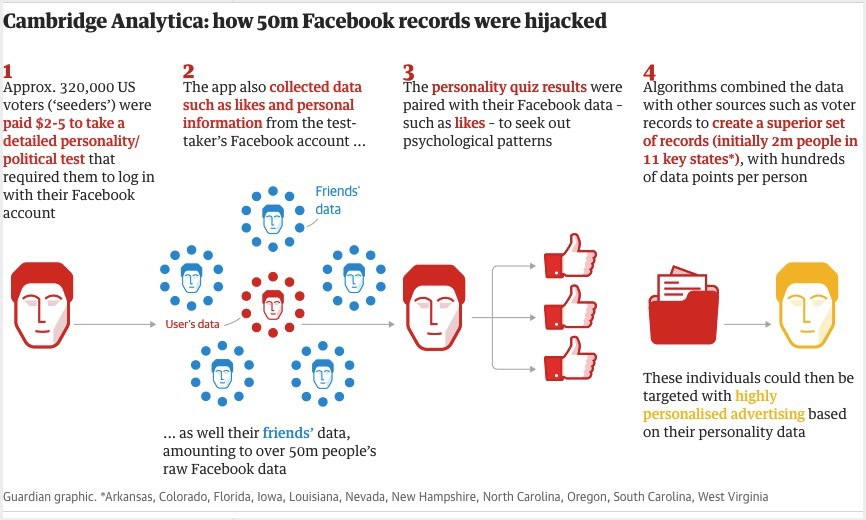

```{r child = "../setup.Rmd"}
```

class: middle

# Case study: 
# AOL search data leak 

---

```{r echo=FALSE, out.width="80%"}
knitr::include_graphics("img/aol-data-leak.png")
```

.footnote[
.midi[
Michael Barbaro and Tom Zeller Jr. [A Face Is Exposed for AOL Searcher No. 4417749](https://www.nytimes.com/2006/08/09/technology/09aol.html).  
New York Times. 9 August 2006.
]
]

---
class: middle

# Case study: 
# OK Cupid

---

## OK Cupid data breach

- In 2016, researchers published data of 70,000 OkCupid users—including usernames, political leanings, drug usage, and intimate sexual details

- Researchers didn't release the real names and pictures of OKCupid users, but their identities could easily be uncovered from the details provided, e.g. usernames

--

.pull-left-wide[
>Some may object to the ethics of gathering and releasing this data. However, all the data found in the dataset are or were already publicly available, so releasing this dataset merely presents it in a more useful form. 
>
>Researchers Emil Kirkegaard and Julius Daugbjerg Bjerrekær
]

---

.question[
In analysis of data that individuals willingly shared publicly on a given platform (e.g. social media), how do you make sure you don't violate reasonable expectations of privacy?
]

```{r echo=FALSE}
knitr::include_graphics("img/okcupid-tweet.png")
```

---

class: middle

# Case study: 
# Facebook & Cambridge Analytica

---

```{r echo=FALSE, out.width="75%"}

```

.footnote[
.midi[
Carole Cadwalladr and Emma Graham-Harrison. [How Cambridge Analytica turned Facebook ‘likes’ into a lucrative political tool](https://www.theguardian.com/technology/2018/mar/17/facebook-cambridge-analytica-kogan-data-algorithm). The Guardian. 17 March 2018.
]
]
