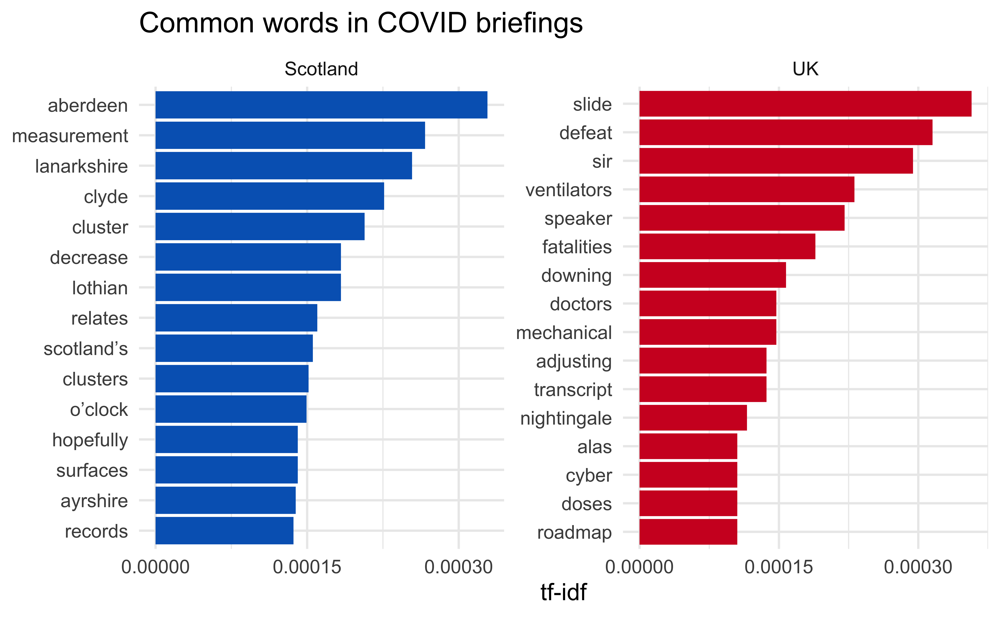

```{r child = "../setup.Rmd"}
```

## Machine learning models for text data

```{r echo=FALSE}

```

---

## Overview

- Fit a classification model
- Cross validate
- See if we can do better with hyperparameter tuning
- Predict!
- Discuss shortcomings of our implementation
