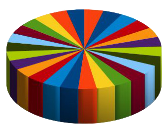

## Assignment

<div style= "float:right;position: relative; margin-left: 20px">
```{r setup, echo=FALSE, fig.align="right"}

```
</div>

Use any software you like to improve the data visualization assigned to you in class.

Assignments and final product collection via [this Google doc](https://docs.google.com/spreadsheets/d/19lrD-FuXzu6Jp4kvUtH2G_DrHzQ-mdV3SWzF6U-kn5A/edit#gid=0).

## Want to see more ugly charts?

- [Flowing Data - Ugly Charts](https://flowingdata.com/category/visualization/ugly-visualization/)
- [Reddit - Data is ugly](https://www.reddit.com/r/dataisugly/)

## Grading

Check / no check
