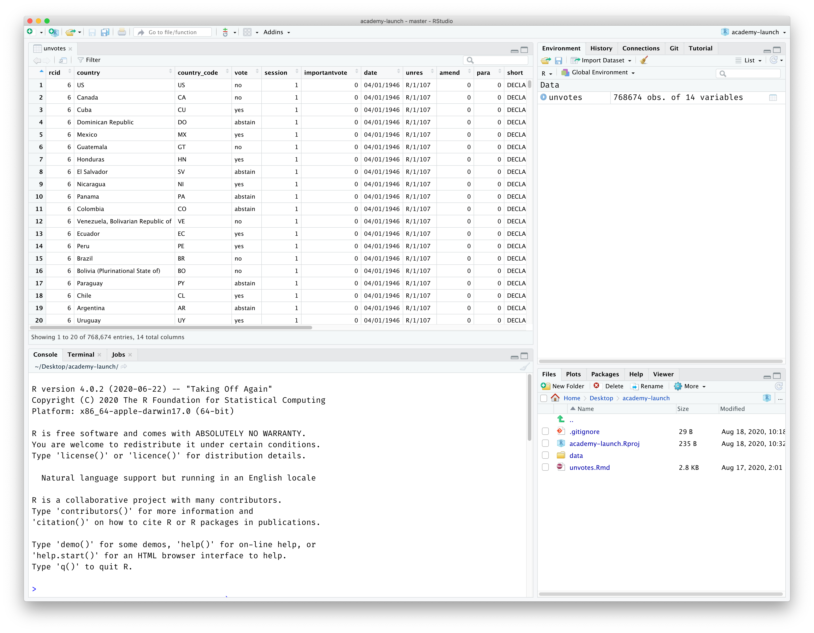
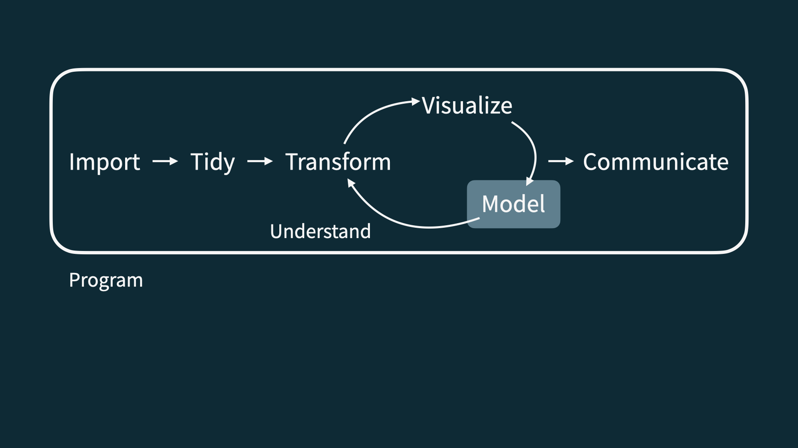
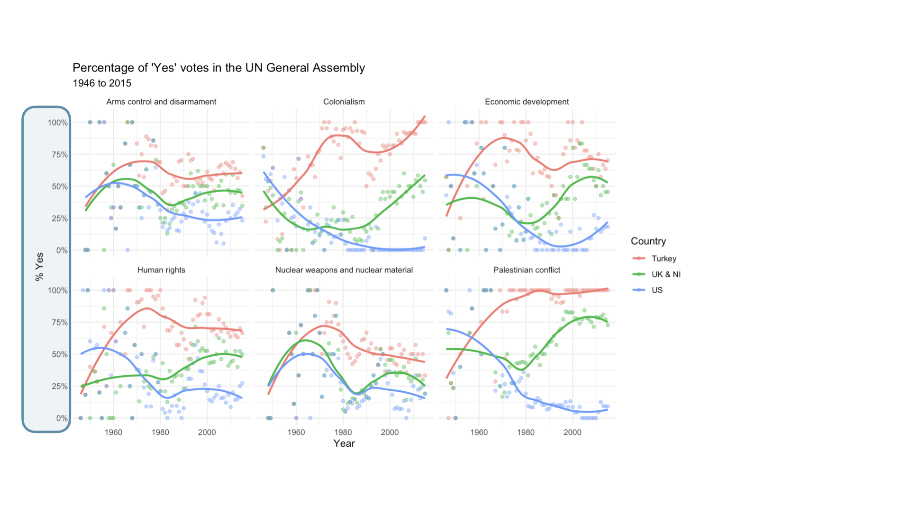
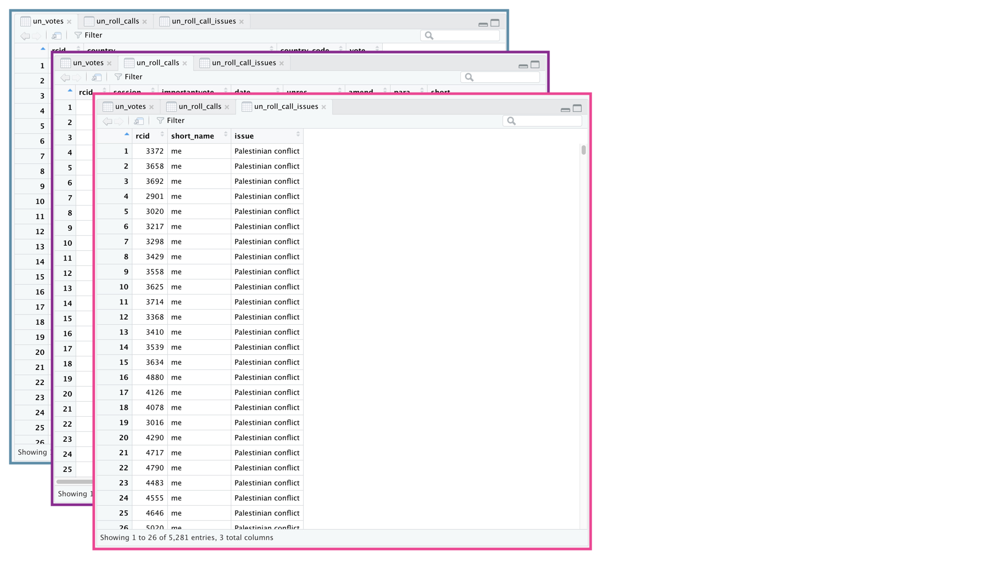
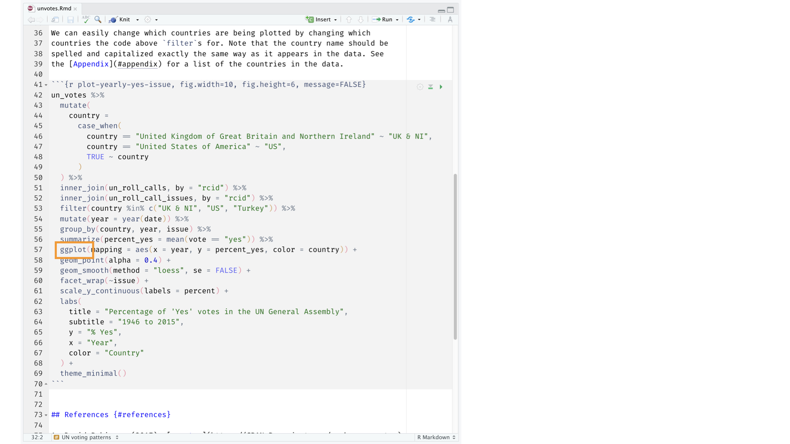

```{r}
#| child = "../setup.Rmd"
```

```{r}
#| label = "packages",
#| echo = FALSE,
#| message = FALSE,
#| warning = FALSE
library(tidyverse)
library(emo)
```


# Hello world!


## Data science {.smaller}

:::: {.columns}
::: {.column width="70%"}

- Data science is an exciting discipline that allows you to turn raw data into understanding, insight, and knowledge. 

- We're going to learn to do this in a `tidy` way -- more on that later!

- This is a course on introduction to data science, with an emphasis on statistical thinking.

:::
::::

## Course FAQ {.smaller}

:::: {.columns}
::: {.column width="70%"}

**Q - What data science background does this course assume?**  
A - None.

**Q - Is this an intro stat course?**  
A - While statistics $\ne$ data science, they are very closely related and have tremendous of overlap. Hence, this course is a great way to get started with statistics. However this course is *not* your typical high school statistics course.

**Q - Will we be doing computing?**   
A - Yes.

:::
::::


## Course FAQ {.smaller}

:::: {.columns}
::: {.column width="80%"}

**Q - Is this an intro CS course?**  
A - No, but many themes are shared.

**Q - What computing language will we learn?**  
A - R.

**Q: Why not language X?**  
A: We can discuss that over `r emo::ji("coffee")`.

:::
::::


# Software

##

```{r}
#| echo = FALSE,
#| out.width = "75%",
#| fig.align = "left"
knitr::include_graphics("img/excel.png")
```

##

```{r}
#| echo = FALSE,
#| out.width = "50%",
#| fig.align = "left"
knitr::include_graphics("img/r.png")
```

##

```{r}
#| echo = FALSE,
#| out.width = "73%",
#| fig.align = "left"

```


# Data science life cycle

##

```{r}
#| echo = FALSE,
#| out.width = "90%",
#| fig.align = "left"
knitr::include_graphics("img/data-science-cycle/data-science-cycle.001.png")
```

##

```{r}
#| echo = FALSE,
#| out.width = "90%",
#| fig.align = "left"
knitr::include_graphics("img/data-science-cycle/data-science-cycle.002.png")
```

##

```{r}
#| echo = FALSE,
#| out.width = "90%",
#| fig.align = "left"
knitr::include_graphics("img/data-science-cycle/data-science-cycle.003.png")
```

##

```{r}
#| echo = FALSE,
#| out.width = "90%",
#| fig.align = "left"
knitr::include_graphics("img/data-science-cycle/data-science-cycle.004.png")
```

##

```{r}
#| echo = FALSE,
#| out.width = "90%",
#| fig.align = "left"

```

##

```{r}
#| echo = FALSE,
#| out.width = "90%",
#| fig.align = "left"
knitr::include_graphics("img/data-science-cycle/data-science-cycle.006.png")
```

##

:::: {.columns}
::: {.column}
```{r}
#| echo = FALSE,
#| out.width = "75%",
#| fig.align = "left"
knitr::include_graphics("img/google-trend-index.png")
```
:::

::: {.column}
```{r}
#| echo = FALSE,
#| out.width = "90%",
#| fig.align = "right"
knitr::include_graphics("img/data-science-cycle/data-science-cycle.006.png")
```
:::
::::

##

:::: {.columns}
::: {.column}
```{r}
#| echo = FALSE,
#| out.width = "75%",
#| fig.align = "left"
knitr::include_graphics("img/google-trend-index.png")
```
:::

::: {.column}
```{r}
#| echo = FALSE,
#| out.width = "90%",
#| fig.align = "right"
knitr::include_graphics("img/data-science-cycle/data-science-cycle.006.png")
```
```{r}
#| echo = FALSE
travel <- tribble(
  ~date,              ~season,
  "23 January 2017",  "winter",
  "4 March 2017",     "spring",
  "14 June 2017",     "summer",
  "1 September 2017", "fall",
  "...", "..."
)
travel
```
:::
::::

##

```{r}
#| echo = FALSE,
#| out.width = "90%",
#| fig.align = "left"
knitr::include_graphics("img/data-science-cycle/data-science-cycle.007.png")
```

##

```{r}
#| echo = FALSE,
#| out.width = "90%",
#| fig.align = "left"
knitr::include_graphics("img/data-science-cycle/data-science-cycle.008.png")
```

##

```{r}
#| echo = FALSE,
#| out.width = "90%",
#| fig.align = "left"
knitr::include_graphics("img/data-science-cycle/data-science-cycle.009.png")
```

##

```{r}
#| echo = FALSE,
#| out.width = "85%",
#| fig.align = "left"
knitr::include_graphics("img/unvotes/unvotes.gif")
```

# Let's dive in! 

## {background-image="img/unvotes/unvotes-01.jpeg"}


##

```{r}
#| echo = FALSE,
#| out.width = "100%"
knitr::include_graphics("img/unvotes/unvotes-02.jpeg")
```

##

```{r}
#| echo = FALSE,
#| out.width = "100%"

```

##

```{r}
#| echo = FALSE,
#| out.width = "100%"
knitr::include_graphics("img/unvotes/unvotes-04.jpeg")
```

##

```{r}
#| echo = FALSE,
#| out.width = "100%"
knitr::include_graphics("img/unvotes/unvotes-05.jpeg")
```

##

```{r}
#| echo = FALSE,
#| out.width = "100%"
knitr::include_graphics("img/unvotes/unvotes-06.jpeg")
```

##

```{r}
#| echo = FALSE,
#| out.width = "100%"

```

##

```{r}
#| echo = FALSE,
#| out.width = "90%"
knitr::include_graphics("img/unvotes/unvotes-08.jpeg")
```

##

```{r}
#| echo = FALSE,
#| out.width = "90%"
knitr::include_graphics("img/unvotes/unvotes-09.jpeg")
```

##

```{r}
#| echo = FALSE,
#| out.width = "90%"
knitr::include_graphics("img/unvotes/unvotes-10.jpeg")
```

##

```{r}
#| echo = FALSE,
#| out.width = "90%"

```

##

```{r}
#| echo = FALSE,
#| out.width = "90%"
knitr::include_graphics("img/unvotes/unvotes-12.jpeg")
```

## 

```{r}
#| echo = FALSE,
#| out.width = "100%"
knitr::include_graphics("img/unvotes/unvotes-13.jpeg")
```

##

```{r}
#| echo = FALSE,
#| out.width = "100%"
knitr::include_graphics("img/unvotes/unvotes-14.jpeg")
```

##

:::{style="text-align: center;"}
[minecr.shinyapps.io/unvotes](https://minecr.shinyapps.io/unvotes/)
:::

```{r}
#| echo = FALSE,
#| out.width = "65%"
knitr::include_graphics("img/unvotes/unvotes-15.png")
```
