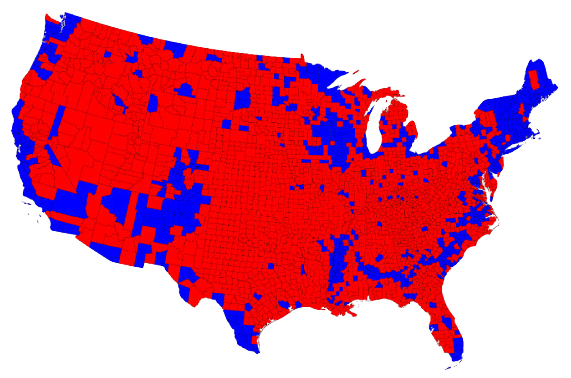

```{r child = "../setup.Rmd"}
```

```{r packages, echo = FALSE, message=FALSE, warning=FALSE}
library(tidyverse)
library(lubridate)
library(scales)
```

class: middle

# Causality

---

```{r echo=FALSE, out.width = "100%"}
knitr::include_graphics("img/exercise-cancer-time.png")
```

.footnote[
.midi[
Alice Park. [Exercise Can Lower Risk of Some Cancers By 20%](https://time.com/4330041/reduce-cancer-risk-exercise/). Time Magazine. 16 May 2016.
]
]

---

```{r echo=FALSE, out.width = "100%"}
knitr::include_graphics("img/exercise-cancer-latimes.png")
```

.footnote[
.midi[
Melissa Healy. [Exercising drives down risk for 13 cancers, research shows
](https://www.latimes.com/science/sciencenow/la-sci-sn-exercising-cancer-20160516-story.html).  
Los Angeles Times. 16 May 2016.
]
]

---

## Original study

Moore, Steven C., et al. **["Association of leisure-time physical activity with risk of 26 types of cancer in 1.44 million adults."](https://jamanetwork.com/journals/jamainternalmedicine/fullarticle/2521826)** JAMA internal medicine 176.6 (2016): 816-825.

- **Volunteers** were **asked** about their physical activity level over the preceding year. 
- Half exercised less than about 150 minutes per week, half exercised more. 
- Compared to the bottom 10% of exercisers, the top 10% had lower rates of esophageal, liver, lung, endometrial, colon, and breast cancer.
- Researchers found no association between exercising and 13 other cancers (e.g. pancreatic, ovarian, and brain).

.footnote[
.midi[
Carl Bergstrom and Jevin West. [Calling Bullshit: The art of skepticism in a data-driven world](https://www.callingbullshit.org/).  
Random House, 2020.  
Sharon Begley. ["Does exercise prevent cancer?"](https://www.statnews.com/2016/05/16/exercise-prevent-cancer/). StatNews. 16 May 2016. 
]
]

---

class: middle

# Axes and scale

---

.question[
What is the difference between these two pictures? Which presents a better way to represent these data?
]

```{r echo=FALSE, out.width="80%"}
knitr::include_graphics("img/axis-start-at-0.png")
```

.footnote[
.midi[
Christopher Ingraham. ["You’ve been reading charts wrong. Here’s how a pro does it."](https://www.washingtonpost.com/business/2019/10/14/youve-been-reading-charts-wrong-heres-how-pro-does-it/).  
The Washington Post. 14 October 2019.
]
]

---

.question[
What is wrong with this picture? How would you correct it?
]

```{r echo=FALSE, out.width="70%"}
knitr::include_graphics("img/cost_of_gas.png")
```

---

.pull-left-wide[
```{r echo=FALSE, out.width="100%"}
df <- tibble(
  date = ymd(c("2019-11-01", "2020-10-25", "2020-11-01")),
  cost = c(3.17, 3.51, 3.57)
)
ggplot(df, aes(x = date, y = cost, group = 1)) +
  geom_point() +
  geom_line() +
  geom_label(aes(label = cost), hjust = -0.25) +
  labs(
    title = "Cost of gas",
    subtitle = "National average",
    x = NULL, y = NULL, 
    caption = "Source: AAA Fuel Gauge Report"
  ) +
  scale_x_continuous(
    breaks = ymd(c("2019-11-01", "2020-10-25", "2020-11-01")), 
    labels = c("Last year", "Last week", "Current"),
    guide = guide_axis(angle = 90),
    limits = ymd(c("2019-11-01", "2020-11-29")),
    minor_breaks = ymd(c("2019-11-01", "2020-10-25", "2020-11-01"))
  ) +
  scale_y_continuous(labels = label_dollar())
```
]
.pull-right-narrow[
```{r echo=FALSE, out.width="100%"}
knitr::include_graphics("img/cost_of_gas.png")
```
]

---

.question[
What is wrong with this picture? How would you correct it?
]

```{r echo=FALSE, out.width="75%", fig.align = "left"}
knitr::include_graphics("img/ga-dph-declining-bars.jpg")
```

---

## Graph detective

.center[
<iframe width="900" height="450" src="https://livefreeordichotomize.com/posts/2020-05-17-graph-detective/" frameborder="0"></iframe>  
]

.footnote[
.midi[
Lucy D'Agostino McGowan. [Graph detective](https://livefreeordichotomize.com/posts/2020-05-17-graph-detective/). Live Free or Dichotomize. 17 May 2020.
]
]

---

class: middle

# Maps and areas

---

.question[
Do you recognize this map? What does it show?
]

```{r echo=FALSE,  out.width="60%"}

```

--

.footnote[
.midi[
Lazaro Gamio. ["Election maps are telling you big lies about small things"](https://www.washingtonpost.com/graphics/politics/2016-election/how-election-maps-lie/).  
The Washington Post. 1 Nov 2016.
]
]

---

.pull-left[
```{r echo=FALSE, out.width="60%"}
knitr::include_graphics("img/citizens-for-trump.png")
```
]
--
.pull-right[
```{r echo=FALSE, out.width="60%"}
knitr::include_graphics("img/counties-for-trump.png")
```
]

.footnote[
.midi[
Alberto Cairo. [Visual Trumpery talk](https://visualtrumperytour.wordpress.com/).
]
]

---

```{r echo=FALSE, out.width="65%"}
knitr::include_graphics("img/cairo-vote-percentages.png")
```

.footnote[
.midi[
Alberto Cairo. [Visual Trumpery talk](https://visualtrumperytour.wordpress.com/).
]
]

---

```{r echo=FALSE, out.width=900}
knitr::include_graphics("img/cairo-what-matters.png")
```

.footnote[
.midi[
Alberto Cairo. [Visual Trumpery talk](https://visualtrumperytour.wordpress.com/).
]
]

---

class: middle

# Visualising uncertainty

---

On December 19, 2014, the front page of Spanish national newspaper El
País read *"Catalan public opinion swings toward 'no' for independence, says survey"*.

```{r echo=FALSE}
catalan <- tibble(
  response = c("No", "Yes", "No answer"),
  rate     = c(45.3, 44.5, 10.2)
) %>%
  mutate(response = fct_relevel(response, "No", "Yes", "No answer"))
```

```{r catalan-misleading, echo=FALSE}
ggplot(catalan, aes(y = fct_rev(response), x = rate, color = response, group = response)) +
  geom_point() +
  geom_segment(aes(x = 0, xend = rate, 
                   y = fct_rev(response), yend = fct_rev(response)),
               linewidth = 1) +
  scale_color_manual(values = c("#5C8AA9", "#9D303A", "gray")) +
  scale_x_continuous(labels = label_percent(scale = 1)) +
  guides(color = "none") +
  theme_minimal(base_size = 16) +
  labs(
    title = "Do you want Catalonia\nto become an independent state?",
    caption = "Margin of error: +/-2.95% at 95% confidence level",
    x = NULL, y = NULL
  )
```

.footnote[
.midi[
Alberto Cairo. [The truthful art: Data, charts, and maps for communication](http://www.thefunctionalart.com/p/the-truthful-art-book.html). New Riders, 2016.
]
]

---

.pull-left-wide[
```{r echo=FALSE, out.width="100%"}
catalan <- catalan %>%
  mutate(
    low = rate - 2.95,
    high = rate + 2.95
  )
ggplot(catalan, aes(y = fct_rev(response), x = rate, color = response, group = response)) +
  geom_segment(aes(x = low, xend = high, 
                   y = fct_rev(response), yend = fct_rev(response)),
               linewidth = 0.8, color = "black") +
  geom_point(size = 3) +
  scale_color_manual(values = c("#5C8AA9", "#9D303A", "gray")) +
  scale_x_continuous(labels = label_percent(scale = 1)) +
  guides(color = "none") +
  theme_minimal(base_size = 16) +
  labs(
    title = "Do you want Catalonia\nto become an independent state?",
    caption = "The probability of the tiny difference between the\n'No' and 'Yes' being just due to random chance is very high.",
    x = NULL, y = NULL
  )
```
]
.pull-right-narrow[
```{r ref.label="catalan-misleading", out.width = "100%", echo = FALSE}
```
]

.footnote[
.midi[
Alberto Cairo. ["Uncertainty and Graphicacy: How Should Statisticians Journalists and Designers Reveal Uncertainty in Graphics for Public Consumption?"](https://ec.europa.eu/eurostat/cros/powerfromstatistics/OR/PfS-OutlookReport-Cairo.pdf), Power from Statistics: Data Information and Knowledge, 2017.
]
]

---

class: middle

# Further reading

---

.pull-left[
```{r echo=FALSE, out.width=350, fig.align="right"}
knitr::include_graphics("img/cairo-how-charts-lie.jpg")
```
]
.pull-right[
[How Charts Lie](http://www.thefunctionalart.com/p/reviews.html)  
Getting Smarter about Visual Information  

by Alberto Cairo
]

---

.pull-left[
```{r echo=FALSE, out.width=350, fig.align="right"}
knitr::include_graphics("img/calling-bullshit.png")
```
]
.pull-right[
[Calling Bullshit](https://www.callingbullshit.org/)  
The Art of Skepticism in a  
Data-Driven World   

by Carl Bergstrom and Jevin West
]
