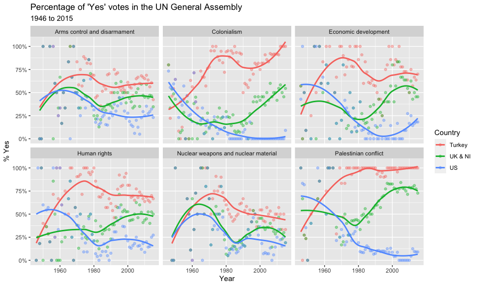
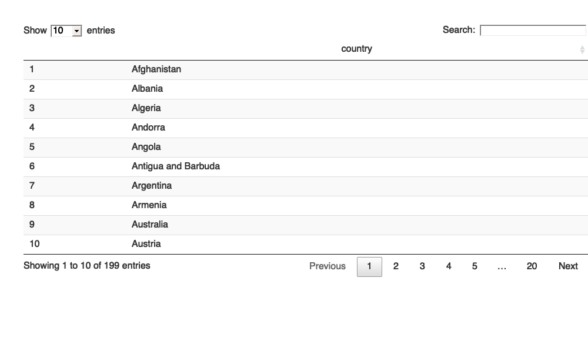

UN Votes
================
Mine Çetinkaya-Rundel

## Introduction

How do various countries vote in the United Nations General Assembly,
how have their voting patterns evolved throughout time, and how
similarly or differently do they view certain issues? Answering these
questions (at a high level) is the focus of this analysis.

### Packages

We will use the **tidyverse**, **lubridate**, and **scales** packages
for the data wrangling and visualization, and the **DT** package for
interactive display of tabular output.

``` r
library(tidyverse)
library(lubridate)
library(scales)
library(DT)
```

### Data

The data we’re using originally come from the **unvotes** package, but
it’s been modified a bit (by joining the various data frames provided in
the package) to help you get started with the analysis.

``` r
unvotes <- read_rds("data/unvotes.rds")
```

## UN voting patterns {\#voting}

Let’s create a data visualization that displays how the voting record of
the UK & NI changed over time on a variety of issues, and compares it to
two other countries: US and Turkey.

We can easily change which countries are being plotted by changing which
countries the code above `filter`s for. Note that the country name
should be spelled and capitalized exactly the same way as it appears in
the data. See the [Appendix](#appendix) for a list of the countries in
the data.

``` r
unvotes %>%
  filter(country %in% c("UK & NI", "US", "Turkey")) %>%
  mutate(year = year(date)) %>%
  group_by(country, year, issue) %>%
  summarize(percent_yes = mean(vote == "yes")) %>%
  ggplot(mapping = aes(x = year, y = percent_yes, color = country)) +
  geom_point(alpha = 0.4) +
  geom_smooth(method = "loess", se = FALSE) +
  facet_wrap(~issue) +
  scale_y_continuous(labels = percent) +
  labs(
    title = "Percentage of 'Yes' votes in the UN General Assembly",
    subtitle = "1946 to 2015",
    y = "% Yes",
    x = "Year",
    color = "Country"
  )
```

<!-- -->

## References {\#references}

1.  David Robinson (2017).
    [unvotes](https://CRAN.R-project.org/package=unvotes): United
    Nations General Assembly Voting Data. R package version 0.2.0.
2.  Erik Voeten “Data and Analyses of Voting in the UN General Assembly”
    Routledge Handbook of International Organization, edited by Bob
    Reinalda (published May 27, 2013).
3.  Much of the analysis has been modeled on the examples presented in
    the [unvotes package
    vignette](https://cran.r-project.org/web/packages/unvotes/vignettes/unvotes.html).

## Appendix {\#appendix}

Below is a list of countries in the dataset:

<!-- -->
