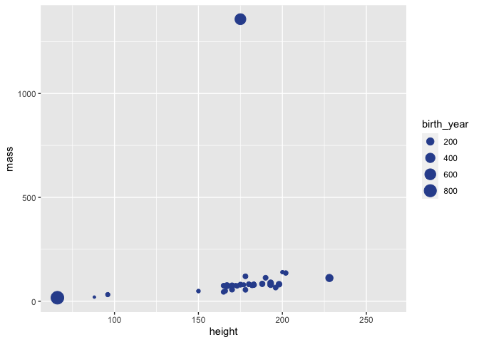

Visualizing Starwars characters
================
Mine Çetinkaya-Rundel

### Glimpse at the starwars data frame.

``` r
glimpse(starwars)
```

    ## Rows: 87
    ## Columns: 14
    ## $ name       <chr> "Luke Skywalker", "C-3PO",…
    ## $ height     <int> 172, 167, 96, 202, 150, 17…
    ## $ mass       <dbl> 77, 75, 32, 136, 49, 120, …
    ## $ hair_color <chr> "blond", NA, NA, "none", "…
    ## $ skin_color <chr> "fair", "gold", "white, bl…
    ## $ eye_color  <chr> "blue", "yellow", "red", "…
    ## $ birth_year <dbl> 19.0, 112.0, 33.0, 41.9, 1…
    ## $ sex        <chr> "male", "none", "none", "m…
    ## $ gender     <chr> "masculine", "masculine", …
    ## $ homeworld  <chr> "Tatooine", "Tatooine", "N…
    ## $ species    <chr> "Human", "Droid", "Droid",…
    ## $ films      <list> <"The Empire Strikes Back…
    ## $ vehicles   <list> <"Snowspeeder", "Imperial…
    ## $ starships  <list> <"X-wing", "Imperial shut…

### Modify the following plot to change the color of all points to `"pink"`.

``` r
ggplot(starwars, 
       aes(x = height, y = mass, color = gender, size = birth_year)) +
  geom_point(color = "#30509C")
```

    ## Warning: Removed 51 rows containing missing values
    ## (geom_point).

<!-- -->

### Add labels for title, x and y axes, and size of points. Uncomment to see the effect.

``` r
ggplot(starwars, 
       aes(x = height, y = mass, color = gender, size = birth_year)) +
  geom_point(color = "#30509C") +
  labs(
    #title = "___",
    #x = "___", 
    #y = "___",
    #___
    )
```

    ## Warning: Removed 51 rows containing missing values
    ## (geom_point).

<!-- -->

### Pick a single categorical variable from the data set and make a bar plot of its distribution.

(A little bit of starter code is provided below, and the code chunk is
set to not be evaluated with `eval = FALSE` because the current code in
there is not valid code and hence the document wouldn’t knit. Once you
replace the code with valid code, set the chunk option to `eval = TRUE`,
or remove the `eval` option altogether since it’s set to `TRUE` by
default.)

``` r
ggplot(starwars, aes(___)) +
  geom___
```

### Pick a single numerical variable and make a histogram of it.

(This time no starter code is provided, you’re on your own!)

### Pick a numerical variable and a categorical variable and make a visualisation (you pick the type!) to visualise the relationship between the two variables. Along with your code and output, provide an interpretation of the visualisation.

### Pick two categorical variables and make a visualisation to visualise the relationship between the two variables. Along with your code and output, provide an interpretation of the visualisation.

### Pick two numerical variables and two categorical variables and make a visualisation that incorportes all of them and provide an interpretation with your answer.
