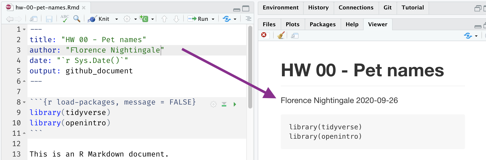
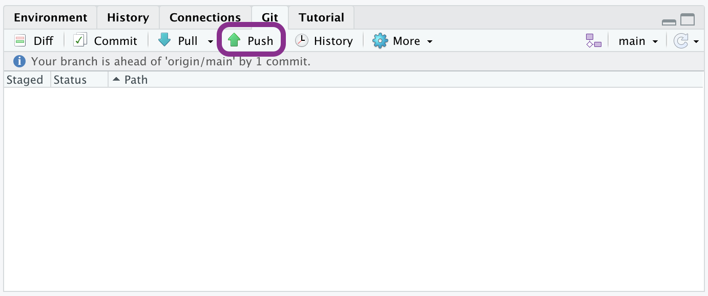

```{r include = FALSE}
knitr::opts_chunk$set(
  eval = FALSE,
  out.width = "80%",
  fig.asp = 0.618,
  fig.width = 10
)
library(tidyverse)
library(openintro)
library(ggrepel)
```

```{r photo, fig.margin = TRUE, echo = FALSE, fig.width = 3, fig.cap = "Photo by Jovana Askrabic on Unsplash", eval = TRUE}

```

The goal of this assignment is to introduce you to R, RStudio, Git, and GitHub, which you'll be using throughout the course both to learn the data science concepts discussed in the course and to analyze real data and come to informed conclusions.

# Getting started

## Prerequisites {data-link="Prerequisites"}

This assignment assumes that you have reviewed the lectures titled "Meet the toolkit: Programming" and "Meet the toolkit: version control and collaboration".
If you haven't yet done so, please pause and complete the following before continuing.

## Terminology

We've already thrown around a few new terms, so let's define them before we proceed.

-   **R:** Name of the programming language we will be using throughout the course.

-   **RStudio:** An integrated development environment for R.
    In other words, a convenient interface for writing and running R code.

-   **Git:** A version control system.

-   **GitHub:** A web platform for hosting version controlled files and facilitating collaboration among users.

-   **Repository:** A Git repository contains all of your project's files and stores each file's revision history.
    It's common to refer to a repository as a repo.

    -   In this course, each assignment you work on will be contained in a Git repo.
    -   For individual assignments, only you will have access to the repo. For team assignments, all team members will have access to a single repo where they work collaboratively.
    -   All repos associated with this course are housed in the course GitHub organization. The organization is set up such that students can only see repos they have access to, but the course staff can see all of them.

## Starting slow

As the course progresses, you are encouraged to explore beyond what the assignments dictate; a willingness to experiment will make you a much better programmer!
Before we get to that stage, however, you need to build some basic fluency in R.
First, we will explore the fundamental building blocks of all of these tools.

Before you can get started with the analysis, you need to make sure you:

-   have a GitHub account

-   are a member of the course GitHub organization

-   are a member of the course RStudio Cloud space

If you failed to confirm any of these, it means you have not yet completed the prerequisites for this assignment.
Please go back to [Prerequisites] and complete them before continuing the assignment.

# Workflow

```{marginfigure}
**IMPORTANT:** If there is no GitHub repo created for you for this assignment, it means I didn't have your GitHub username as of when I assigned the homework. Please let me know your GitHub username asap, and I can create your repo.
```

For each assignment in this course you will start with a GitHub repo that I created for you and that contains the starter documents you will build upon when working on your assignment.
The first step is always to bring these files into RStudio so that you can edit them, run them, view your results, and interpret them.
This action is called **cloning**.

Then you will work in RStudio on the data analysis, making **commits** along the way (snapshots of your changes) and finally **push** all your work back to GitHub.

The next few steps will walk you through the process of getting information of the repo to be cloned, cloning your repo in a new RStudio Cloud project, and getting started with the analysis.

### Step 1. Get URL of repo to be cloned

```{r clone-repo-link, fig.margin = TRUE, echo = FALSE, eval = TRUE}
knitr::include_graphics("img/clone-repo-link.png")
```

On GitHub, click on the green **Code** button, select **HTTPS** (this might already be selected by default, and if it is, you'll see the text *Use Git or checkout with SVN using the web URL* jas in the image on the right).
Click on the clipboard icon 📋 to copy the repo URL.

### Step 2. Go to RStudio Cloud

Go to [rstudio.cloud](https://rstudio.cloud/ "RStudio Cloud") and then **navigate to the course workspace** via the left sidebar.
It's very important that you do this for two reasons:

-   It's only when you're in the course workspace that you'll be able to benefit from R packages I've pre-installed for you so that your project can be configured correctly.
-   It's only when you're in the course workspace that your usage of RStudio Cloud won't count towards the free usage limits.

```{r course-workspace, fig.margin = TRUE, echo = FALSE, eval = TRUE}
knitr::include_graphics("img/course-workspace.png")
```

Before you proceed, confirm that you are in the course workspace by checking out what's on your top bar in RStudio Cloud.

### Step 3. Clone the repo

In RStudio, click on the **down arrow** next to New Project and then choose **New Project from Git Repository**.

In the pop-up window, **paste the URL** you copied from GitHub, make sure the box for **Add packages from the base project** is checked (it should be, by default) and then click **OK**.

```{r new-project-from-git, echo = FALSE, eval = TRUE, fig.align = "left"}
knitr::include_graphics("img/new-project-from-git.png")
```

# Hello RStudio!

RStudio is comprised of four panes.

```{r rstudio-anatomy, fig.fullwidth=TRUE, echo = FALSE, eval = TRUE}
knitr::include_graphics("img/rstudio-anatomy.png")
```

-   On the bottom left is the Console, this is where you can write code that will be evaluated. Try typing `2 + 2` here and hit enter, what do you get?
-   On the bottom right is the Files pane, as well as other panes that will come handy as we start our analysis.
-   If you click on a file, it will open in the editor, on the top left pane.
-   Finally, the top right pane shows your Environment. If you define a variable it would show up there. Try typing `x <- 2` in the Console and hit enter, what do you get in the **Environment** pane? Importantly, this pane is also where the **Git** interface lives. We will be using that regularly throughout this assignment.

# Warm up

Before we introduce the data, let's warm up with some simple exercises.

```{marginfigure}
The top portion of your R Markdown file (between the three dashed lines) is called **YAML**. It stands for "YAML Ain't Markup Language". It is a human friendly data serialization standard for all programming languages. All you need to know is that this area is called the YAML (we will refer to it as such) and that it contains meta information about your document.
```

## Step 1. Update the YAML

Open the R Markdown (Rmd) file in your project, change the author name to your name, and knit the document.

```{r yaml-raw-to-rendered, echo = FALSE, eval = TRUE, fig.align = "center"}

```

## Step 2: Commit

Then Go to the **Git pane** in your RStudio.

You should see that your Rmd (R Markdown) file and its output, your md file (Markdown), are listed there as recently changed files.

Next, click on **Diff**.
This will pop open a new window that shows you the **diff**erence between the last committed state of the document and its current state that includes your changes.
If you're happy with these changes, click on the checkboxes of all files in the list, and type *"Update author name"* in the **Commit message** box and hit **Commit**.

```{r update-author-name-commit, echo = FALSE, eval = TRUE, fig.align = "left"}
knitr::include_graphics("img/update-author-name-commit.png")
```

You don't have to commit after every change, this would get quite cumbersome.
You should consider committing states that are *meaningful to you* for inspection, comparison, or restoration.
In the first few assignments we will tell you exactly when to commit and in some cases, what commit message to use.
As the semester progresses we will let you make these decisions.

## Step 3. Push

Now that you have made an update and committed this change, it's time to push these changes to the web!
Or more specifically, to your repo on GitHub.
Why?
So that others can see your changes.
And by others, we mean the course teaching team (your repos in this course are private to you and us, only).
In order to push your changes to GitHub, click on **Push**.

```{r ready-to-push, fig.margin = TRUE, echo = FALSE, eval = TRUE}

```

This will prompt a dialogue box where you first need to enter your user name, and then your password.
This might feel cumbersome.
Bear with me...
I *will* teach you how to save your password so you don't have to enter it every time.
But for this one assignment you'll have to manually enter each time you push in order to gain some experience with it.

**Thought exercise:** Which of the above steps (updating the YAML, committing, and pushing) needs to talk to GitHub?[^1]

# Packages

R is an open-source language, and developers contribute functionality to R via packages.
In this assignment we will use the following packages:

-   **tidyverse**: a collection of packages for doing data analysis in a "tidy" way
-   **openintro**: a package that contains the datasets from OpenIntro resources

We use the `library()` function to load packages.
In your R Markdown document you should see an R chunk labelled `load-packages` which has the necessary code for loading both packages.
You should also load these packages in your Console, which you can do by sending the code to your Console by clicking on the **Run Current Chunk** icon (green arrow pointing right icon).

```{r load-packages-chunk, echo = FALSE, eval = TRUE, fig.align = "left"}
knitr::include_graphics("img/load-packages-chunk.png")
```

Note that these packages also get loaded in your R Markdown environment when you **Knit** your R Markdown document.

# Data

The city of [Seattle, WA](https://en.wikipedia.org/wiki/Seattle) has an open data portal that includes pets registered in the city.
For each registered pet, we have information on the pet's name and species.
The data used in this exercise can be found in the **openintro** package, and it's called `seattlepets`.
Since the dataset is distributed with the package, we don't need to load it separately; it becomes available to us when we load the package.

You can view the dataset as a spreadsheet using the `View()` function.
Note that you should not put this function in your R Markdown document, but instead type it directly in the Console, as it pops open a new window (and the concept of popping open a window in a static document doesn't really make sense...).
When you run this in the console, you'll see the following **data viewer** window pop up.

```{r view-data}
View(seattlepets)
```

```{r data.viewer, echo = FALSE, eval = TRUE, fig.align = "left"}
knitr::include_graphics("img/view-data.png")
```

You can find out more about the dataset by inspecting its documentation (which contains a **data dictionary**, name of each variable and its description), which you can access by running `?seattlepets` in the Console or using the Help menu in RStudio to search for `seattlepets`.

# Exercises

1.  According to the data dictionary, how many pets are included in this dataset?

🧶 ✅ ⬆️ *Write your answer in your R Markdown document under Exercise 1, knit the document, commit your changes with a commit message that says "Completed Exercise 1", and push. Make sure to commit and push all changed files so that your Git pane is cleared up afterwards.*

2.  Again, according to the data dictionary, how many variables do we have for each pet?

🧶 ✅ ⬆️ *Write your answer in your R Markdown document under Exercise 2, knit the document, commit your changes with a commit message that says "Completed Exercise 2", and push. Make sure to commit and push all changed files so that your Git pane is cleared up afterwards.*

3.  What are the three most common pet names in Seattle? To do this you will need to count the frequencies of each pet name and display the results in descending order of frequency so that you can easily see the top three most popular names. The following code does exactly that.

```{marginfigure}
The two lines of code can be read as "Start with the seattlepets data frame, and then count the animal_names, and display the results sorted in descending order. The 'and then' in the previous sentence maps to %>%, the pipe operator, which takes what comes before it and plugs it in as the first argument of the function that comes after it."
```

```{r}
seattlepets %>%
  count(animal_name, sort = TRUE)
```

🧶 ✅ ⬆️ *Write your answer in your R Markdown document under Exercise 3. In this exercise you will not only provide a written answer but also include some code and output. You should insert the code in the code chunk provided for you, knit the document to see the output, and then write your narrative for the answer based on the output of this function, and knit again to see your narrative, code, and output in the resulting document. Then, commit your changes with a commit message that says "Completed Exercise 3", and push. Make sure to commit and push all changed files so that your Git pane is cleared up afterwards.*

Let's also look to see what the most common pet names are for various species.
For this we need to first `group_by()` the `species`, and then do the same counting we did before.

```{marginfigure}
Looks like many of those NAs were cats. Poor unnamed kitties…
```

```{r species-names, eval=TRUE}
seattlepets %>% 
  group_by(species) %>%
  count(animal_name, sort = TRUE)
```

But this output isn't exactly what we wanted.
We wanted to know the most common cat and dog names, but there are barely any cats present in this output!
This is because there are more dogs than cats in the dataset overall.
We can confirm this by counting the various species in the data.

```{marginfigure}
6 pigs in the city? Ok… But we'll continue with cats and dogs.
```

```{r species, eval=TRUE}
seattlepets %>%
  count(species, sort = TRUE)
```

Let's search for the top 5 cat and dog names.
To do this, we can use the `slice_max()` function.
The first argument in the function is the variable we want to select the highest values of, which is `n`.
The second argument is the number of rows to select, which is `n = 5` for the top 5.
It may be a bit confusing that both of these are `n`, but this is because we already have a variable called `n` in the data frame.

```{r species-names-top5, eval=TRUE}
seattlepets %>% 
  group_by(species) %>%
  count(animal_name, sort = TRUE) %>% 
  slice_max(n, n = 5)
```

1.  Based on the previous output we can easily identify the most common cat and dog names in Seattle, but the output is sorted by `n` (the frequencies) as opposed to being organized by the `species`. Build on the pipeline to arrange the results so that they're arranged by `species` first, and then `n`. This means you will need to add one more step to the pipeline, and you have two options: `arrange(species, n)` or `arrange(n, species)`. You should try both and decide which one organizes the output by species and then ranks the names in order of frequency for each species.

🧶 ✅ ⬆️ *Write your answer in your R Markdown document under Exercise 4. In this exercise you're asked to complete the code provided for you. You should insert the code in the code chunk provided for you, knit the document to see the output, and then write your narrative for the answer based on the output of this function, and knit again to see your narrative, code, and output in the resulting document. Then, commit your changes with a commit message that says "Completed Exercise 4", and push. Make sure to commit and push all changed files so that your Git pane is cleared up afterwards.*

The following visualization plots the proportion of dogs with a given name versus the proportion of cats with the same name.
The 20 most common cat and dog names are displayed.
The diagonal line on the plot is the $x = y$ line; if a name appeared on this line, the name's popularity would be exactly the same for dogs and cats.

```{r eval = TRUE, echo = FALSE, fig.fullwidth = TRUE}
# data prep
name_props <- seattlepets %>% 
  filter(
    !is.na(animal_name),
    species %in% c("Dog", "Cat")
    ) %>%
  group_by(species) %>% 
  count(animal_name, sort = TRUE) %>%
  mutate(prop = n / sum(n))
    
cat_name_props <- name_props %>%
  filter(species == "Cat") %>%
  rename(cat_prop = prop) %>%
  slice(1:30)

dog_name_props <- name_props %>%
  filter(species == "Dog") %>%
  rename(dog_prop = prop) %>%
  slice(1:30)
    
comb_name_props <- inner_join(cat_name_props, dog_name_props, 
                              by = "animal_name") %>%
  ungroup() %>%
  select(animal_name, cat_prop, dog_prop)
    
# create viz
ggplot(comb_name_props, aes(x = cat_prop, y = dog_prop)) +
  geom_abline(intercept = 0, 
              color = COL["lgray","full"], 
              alpha = 0.8, 
              size = 1.5) +
  geom_text_repel(aes(label = animal_name), 
                  segment.color = COL["gray","full"], 
                  seed = 291252, max.iter = 10000) +
  geom_point(color = COL["blue","full"], alpha = 0.8) +
  theme_minimal() +
  labs(x = "Proportion of cats", y = "Proportion of dogs") +
  xlim(0.002, 0.01) +
  ylim(0.002, 0.01) +
  ggimage::geom_emoji(
      image = "1f436", aes(x = 0.003, y = 0.009), size = 0.1
      ) +
  ggimage::geom_emoji(
      image = "1f431", aes(x = 0.009, y = 0.003), size = 0.1
      )
```

1.  What names are more common for cats than dogs? The ones above the line or the ones below the line?
2.  Is the relationship between the two variables (proportion of cats with a given name and proportion of dogs with a given name) positive or negative? What does this mean in context of the data?

🧶 ✅ ⬆️ *Now is a good time to commit and push your changes to GitHub with an appropriate commit message. Commit and push all changed files so that your Git pane is cleared up afterwards. Make sure that your last push to the repo comes before the deadline. You should confirm that what you committed and pushed are indeed in your repo that we will see by visiting your repo on GitHub.*

[^1]: Only pushing requires talking to GitHub, this is why you're asked for your password at that point.
