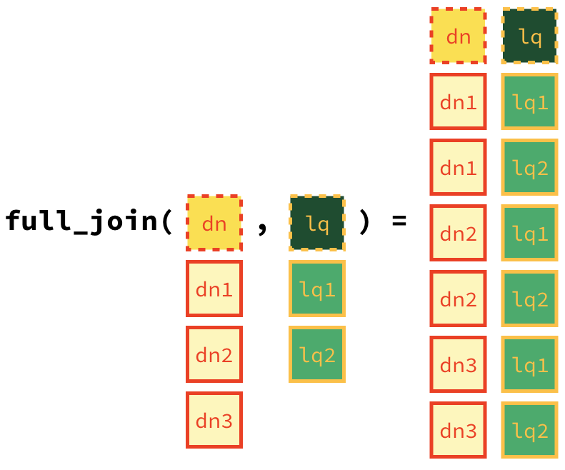

```{r fig.margin = TRUE, echo = FALSE}
knitr::include_graphics("img/mitch-hedgeberg-lqd.jpg")
```

In this lab we revisit the Denny's and La Quinta Inn and Suites data we visualized in the previous lab.

# Learning goals

-   Working with spatial data
-   Writing and using a custom function

# Getting started

Go to the course GitHub organization and locate your homework repo, clone it in RStudio and open the R Markdown document.
Knit the document to make sure it compiles without errors.

## Warm up

Before we introduce the data, let's warm up with some simple exercises.
Update the YAML of your R Markdown file with your information, knit, commit, and push your changes.
Make sure to commit with a meaningful commit message.
Then, go to your repo on GitHub and confirm that your changes are visible in your Rmd **and** md files.
If anything is missing, commit and push again.

## Packages

We'll use the **tidyverse** package for much of the data wrangling and visualisation and the data lives in the **dsbox** package.
These packages are already installed for you.
You can load them by running the following in your Console:

```{r message = FALSE}
library(tidyverse) 
library(dsbox) 
```

## Data

Remember that the datasets we'll use are called `dennys` and `laquinta` from the **dsbox** package.
Since the datasets are distributed with the package, we don't need to load them separately; they become available to us when we load the package.
You can find out more about the datasets by inspecting their documentation, which you can access by running `?dennys` and `?laquinta` in the Console or using the Help menu in RStudio to search for `dennys` or `laquinta`.
You can also find this information [here](https://rstudio-education.github.io/dsbox/reference/dennys.html) and [here](https://rstudio-education.github.io/dsbox/reference/laquinta.html).

# Exercises

1.  Filter the Denny's dataframe for Alaska (AK) and save the result as `dn_ak`. How many Denny's locations are there in Alaska?

```{r}
dn_ak <- dennys %>%
  filter(state == "AK")
nrow(dn_ak)
```

2.  Filter the La Quinta dataframe for Alaska (AK) and save the result as `lq_ak`. How many La Quinta locations are there in Alaska?

```{r}
lq_ak <- laquinta %>%
  filter(state == "AK")
nrow(lq_ak)
```

Next we'll calculate the distance between all Denny's and all La Quinta locations in Alaska.
Let's take this step by step:

**Step 1:** There are 3 Denny's and 2 La Quinta locations in Alaska.
(If you answered differently above, you might want to recheck your answers.)

{width="300px" height="300px"}

**Step 2:** Let's focus on the first Denny's location.
We'll need to calculate two distances for it: (1) distance between Denny's 1 and La Quinta 1 and (2) distance between Denny's 1 and La Quinta (2).

{width="300px" height="150px"}

**Step 3:** Now let's consider all Denny's locations.

{width="300px" height="450px"}

3.  How many pairings are there between all Denny's and all La Quinta locations in Alaska, i.e. how many distances do we need to calculate between the locations of these establishments in Alaska?

In order to calculate these distances we need to first restructure our data to pair the Denny's and La Quinta locations.
To do so, we will join the two data frames.
We have six join options in R.
Each of these join functions take at least three arguments: `x`, `y`, and `by`.

-   `x` and `y` are data frames to join
-   `by` is the variable(s) to join by

Four of these join functions combine variables from the two data frames:

```{marginfigure}
These are called **mutating joins**.
```

-   `inner_join()`: return all rows from `x` where there are matching values in `y`, and all columns from `x` and `y`.

-   `left_join()`: return all rows from `x`, and all columns from `x` and `y`.
    Rows in x with no match in y will have NA values in the new columns.

-   `right_join()`: return all rows from `y`, and all columns from `x` and `y`.
    Rows in y with no match in x will have NA values in the new columns.

-   `full_join()`: return all rows and all columns from both `x` and `y`.
    Where there are not matching values, returns NA for the one missing.

And the other two join functions only keep cases from the left-hand data frame, and are called **filtering joins**.
We'll learn about these another time but you can find out more about the join functions in the help files for any one of them, e.g. `?full_join`.

In practice we mostly use mutating joins.
In this case we want to keep all rows and columns from both `dn_ak` and `lq_ak` data frames.
So we will use a `full_join`.

{height="300px" width="300px"}

Let's join the data on Denny's and La Quinta locations in Alaska, and take a look at what it looks like:

```{r}
dn_lq_ak <- full_join(dn_ak, lq_ak, by = "state")
dn_lq_ak
```

4.  How many observations are in the joined `dn_lq_ak` data frame? What are the names of the variables in this data frame.

`.x` in the variable names means the variable comes from the `x` data frame (the first argument in the `full_join` call, i.e. `dn_ak`), and `.y` means the variable comes from the `y` data frame.
These varibles are renamed to include `.x` and `.y` because the two data frames have the same variables and it's not possible to have two variables in a data frame with the exact same name.

Now that we have the data in the format we wanted, all that is left is to calculate the distances between the pairs.

🧶 ✅ ⬆️ Knit, *commit, and push your changes to GitHub with an appropriate commit message. Make sure to commit and push all changed files so that your Git pane is cleared up afterwards.*

5.  What function from the tidyverse do we use the add a new variable to a data frame while keeping the existing variables?

One way of calculating the distance between any two points on the earth is to use the Haversine distance formula.
This formula takes into account the fact that the earth is not flat, but instead spherical.

This function is not available in R, but we have it saved in a file called `haversine.R` that we can load and then use:

```{r}
haversine <- function(long1, lat1, long2, lat2, round = 3) {
  # convert to radians
  long1 = long1 * pi / 180
  lat1  = lat1  * pi / 180
  long2 = long2 * pi / 180
  lat2  = lat2  * pi / 180
  
  R = 6371 # Earth mean radius in km
  
  a = sin((lat2 - lat1)/2)^2 + cos(lat1) * cos(lat2) * sin((long2 - long1)/2)^2
  d = R * 2 * asin(sqrt(a))
  
  return( round(d,round) ) # distance in km
}
```

This function takes five arguments:

-   Longitude and latitude of the first location
-   Longitude and latitude of the second location
-   A parameter by which to round the responses

6.  Calculate the distances between all pairs of Denny's and La Quinta locations and save this variable as `distance`.
    Make sure to save this variable in THE `dn_lq_ak` data frame so that you can use it later.

7.  Calculate the minimum distance between a Denny's and La Quinta for each Denny's location.
    To do so we group by Denny's locations and calculate a new variable that stores the information for the minimum distance.

```{r eval = FALSE}
dn_lq_ak_mindist <- dn_lq_ak %>%
  group_by(address.x) %>%
  summarise(closest = min(distance))
```

8.  Describe the distribution of the distances Denny's and the nearest La Quinta locations in Alaska. Also include an appripriate visualization and relevant summary statistics.

🧶 ✅ ⬆️ Knit, *commit, and push your changes to GitHub with an appropriate commit message. Make sure to commit and push all changed files so that your Git pane is cleared up afterwards.*

9.  Repeat the same analysis for North Carolina: (i) filter Denny's and La Quinta Data Frames for NC, (ii) join these data frames to get a completelist of all possible pairings, (iii) calculate the distances between all possible pairings of Denny's and La Quinta in NC, (iv) find the minimum distance between each Denny's and La Quinta location, (v) visualize and describe the distribution of these shortest distances using appropriate summary statistics.

10. Repeat the same analysis for Texas.

11. Repeat the same analysis for a state of your choosing, different than the ones we covered so far.

12. Among the states you examined, where is Mitch Hedberg's joke most likely to hold true?
    Explain your reasoning.

🧶 ✅ ⬆️ Knit, *commit, and push your changes to GitHub with an appropriate commit message. Make sure to commit and push all changed files so that your Git pane is cleared up afterwards and review the md document on GitHub to make sure you're happy with the final state of your work.*
