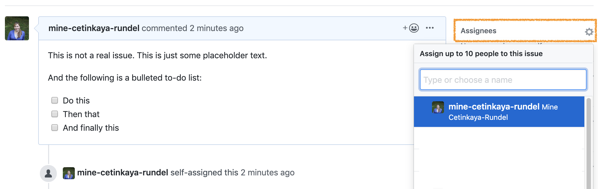
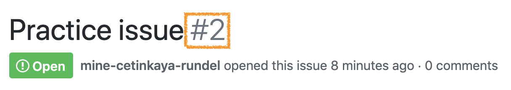
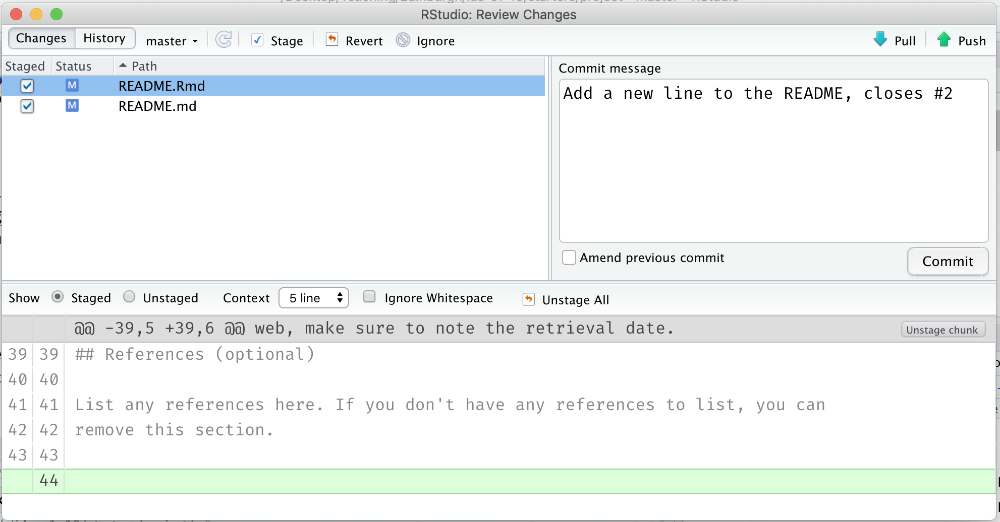
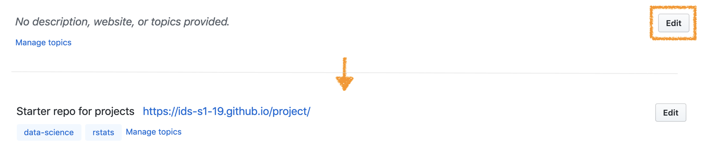

```{r setup, include=FALSE}
knitr::opts_chunk$set(echo = FALSE)
```

This week you'll continue working on your projects.
The first half of the workshop is structured, and you can use the second half to make progress on your projects.

# GitHub issues

Issues are a great way to keep track of tasks, enhancements, and bugs for your projects.
They're kind of like email---except they can be shared and discussed with the rest of your team.
You can use issues as to-do lists as well as a place for brainstorming / discussing ideas.

## Opening an issue

1.  Go to your project repo and open a new issue titled "Practice issue".
2.  Add the following text to the issue:

<!-- -->

    This is not a real issue. This is just some placeholder text.

    And the following is a bulleted to-do list:
    - [ ] Do this
    - [ ] Then that
    - [ ] And finally this

3.  Hit preview to make sure the issue looks like the following:

```{r}
knitr::include_graphics("img/practice-issue-create.png")
```

4.  Submit the issue.
5.  Then, assign the issue to one or few members of the team.

```{r}

```

## Working on the issue

As you work on the issue you can check the boxes.

```{r}
knitr::include_graphics("img/practice-issue-check.png")
```

Note that this will also show progress on the issue on the issue dashboard.

```{r}
knitr::include_graphics("img/practice-issue-progress.png")
```

6.  Check some of the boxes on your practice issue and confirm that you can see the progress result on the issue dashboard.

## Closing the issue

Once you're done with an issue, you should close it.
You can do this in one of two ways: on GitHub by clicking on Close issue or via a commit that directly addresses the issue.
We'll practice the second one.
If you preface your commits with "Fixes", "Fixed", "Fix", "Closes", "Closed", or "Close", the issue will be closed when you push the changes to your repo.

7.  Take a note of the issue number, which will show up next to the issue title.

```{r}

```

8.  Go to your project on RStudio and make a change. This can be something silly like adding a new line to the issue README. Then commit this change. In your commit message, use one of the special words listed above and reference the issue. For example, if the change I made was to add a new line to the README I would say something like the following:

<!-- -->

    Add a new line to the README, closes #2

```{r}

```

9.  Push your changes and observe that the issue is now closed on GitHub. Click on the referenced commit to confirm that it was your last commit that closed the issue.

```{r}

```

# Project progress

Now back to your project...

10. **Crafting your to-do list:** Discuss your plan for your project as a team, and open **at least n issues**, where n is the number of students in your team.
    Not every issue needs to have a checklist, but you might want to include checklists in some of them to remind yourselves the exact steps you discussed to tackle the issue.
    Then assign **at least one** issue to each team member.

11. **Customizing your website theme:** (Optional) Edit the `_config.yml` document to change the theme of your project website.
    Your options are [architect](https://pages-themes.github.io/architect), [cayman](https://pages-themes.github.io/cayman), [dinky](https://pages-themes.github.io/dinky), [hacker](https://pages-themes.github.io/hacker), [leap-day](https://pages-themes.github.io/leap-day), [merlot](https://pages-themes.github.io/merlot), [midnight](https://pages-themes.github.io/midnight), [minima](https://pages-themes.github.io/minima), [minimal](https://pages-themes.github.io/minimal), [modernist](https://pages-themes.github.io/modernist), [slate](https://pages-themes.github.io/slate), [tactile](https://pages-themes.github.io/tactile), and [time-machine](https://pages-themes.github.io/time-machine).
    Suppose you want the `architect` theme, you'd add `theme: architect` to the `_config.yml` document, save, commit, and push.

```{r}

```

12. **Updating your project description:** If you have not yet done so, add a brief description, link to your project website, and topics to your project repo.

13. **Citing your data:** Now is the time to fix up those citations!
    In your project README there is a link to a resource for properly citing data.
    Develop a citation for your dataset and add it under the data section using this guidance.
    If you have questions, ask a tutor for help!

14. **Confirming presentation format:** Go to the website for your repo and click on the link that should take you to your presentation.
    Confirm that your latest changes to the presentation are reflected at this link (which means you must have pushed the resulting HTML file along with the Rmd file where you wrote your presentation).

15. **Tidying up your coding style:** Go to the pull requests tab and take a look at the code styling suggestions.
    Implement them in the relevant files.
    Make sure to check these before you finalize work on your repo.

```{r}
knitr::include_graphics("img/styler-1.png")
knitr::include_graphics("img/styler-2.png")
```

16. **Strongly recommended:** Get a hold of a tutor and run your ideas by them.
