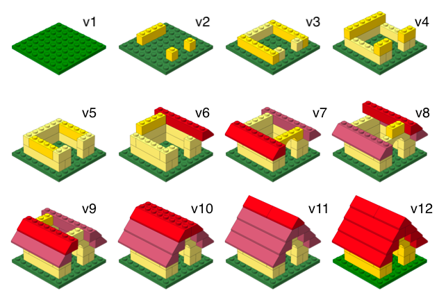
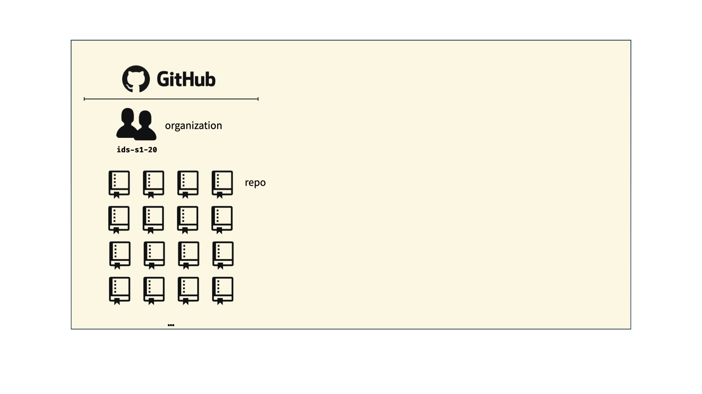
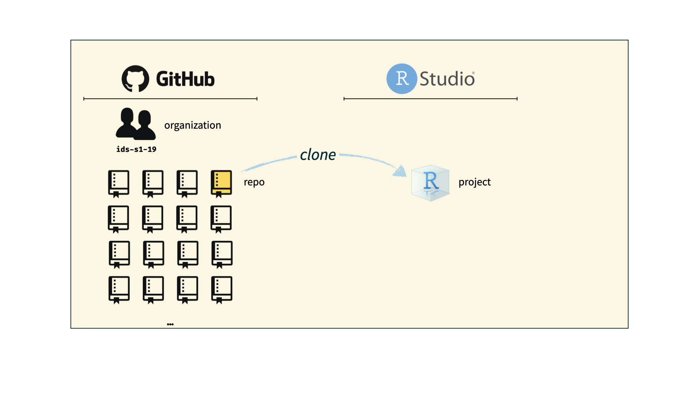

```{r child = "../setup.Rmd"}
```

```{r packages, echo=FALSE, message=FALSE, warning=FALSE}
library(tidyverse)
library(viridis)
library(sugrrants)
library(lubridate)
```

## Course toolkit

<br>

.pull-left[
### .gray[Course operation]
.gray[
- introds.org
- Learn
- Zoom
- Teams
- Piazza
]
]
.pull-right[
### .gray[Doing data science]
- .gray[Programming:]
  - .gray[R]
  - .gray[RStudio]
  - .gray[tidyverse]
  - .gray[R Markdown]
- .pink[Version control and collaboration:]
  - .pink[Git]
  - .pink[GitHub]
]

---

class: middle

# Git and GitHub

---

## Git and GitHub

.pull-left[
```{r echo=FALSE, out.width="25%"}
knitr::include_graphics("img/git-logo.png")
```
- Git is a version control system -- like “Track Changes” features from Microsoft Word, on steroids
- It's not the only version control system, but it's a very popular one
]
.pull-right[
```{r echo=FALSE, out.width="25%"}

```
- GitHub is the home for your Git-based projects on the internet -- like DropBox but much, much better

- We will use GitHub as a platform for web hosting and collaboration (and as our course management system!)
]

---

## Versioning

```{r echo=FALSE, fig.align = "center", out.width = "70%"}

```

---

## Versioning 

### with human readable messages

```{r echo=FALSE, fig.align = "center", out.width = "60%"}
knitr::include_graphics("img/lego-steps-commit-messages.png")
```

---

## Why do we need version control?

```{r echo=FALSE, fig.align = "center", out.width="35%"}
knitr::include_graphics("img/phd_comics_vc.gif")
```

---

## How will we use Git and GitHub?

```{r echo=FALSE, out.width="100%"}

```

---

## How will we use Git and GitHub?

```{r echo=FALSE, out.width="100%"}
knitr::include_graphics("img/whole-game-02.png")
```

---

## How will we use Git and GitHub?

```{r echo=FALSE, out.width="100%"}

```

---

## How will we use Git and GitHub?

```{r echo=FALSE, out.width="100%"}
knitr::include_graphics("img/whole-game-04.png")
```

---

# Git and GitHub tips

- There are millions of git commands -- ok, that's an exaggeration, but there are a lot of them -- and very few people know them all. 99% of the time you will use git to add, commit, push, and pull.

--
- We will be doing Git things and interfacing with GitHub through RStudio, but if you google for help you might come across methods for doing these things in the command line -- skip that and move on to the next resource unless you feel comfortable trying it out.

--
- There is a great resource for working with git and R: [happygitwithr.com](http://happygitwithr.com/). Some of the content in there is beyond the scope of this course, but it's a good place to look for help.

---

## Tour: Git and GitHub

- Create a GitHub account
- Verify your GitHub email
- Adjust your GitHub settings for a more pleasant GitHub experience
  - Settings > Emails > Uncheck "Keep my email address private"
  - Settings > Emails > Update name and photo

<br>

*Next week...*

*Work with R, RStudio, Git, and GitHub together!*<sup>+</sup>

.footnote[
<sup>+</sup>Just like a real data scientist!
]
