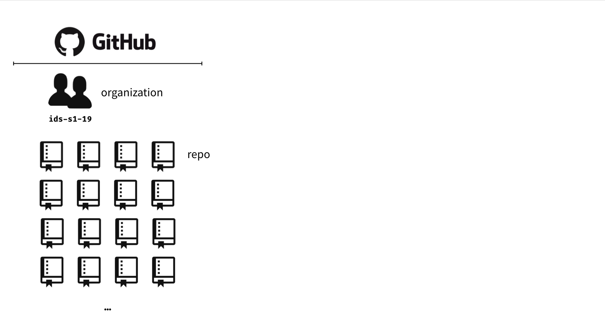
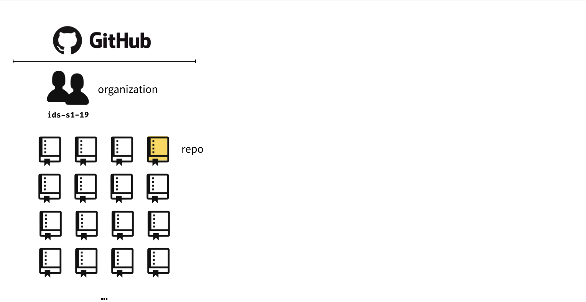
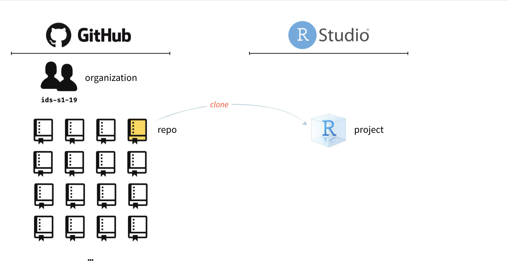
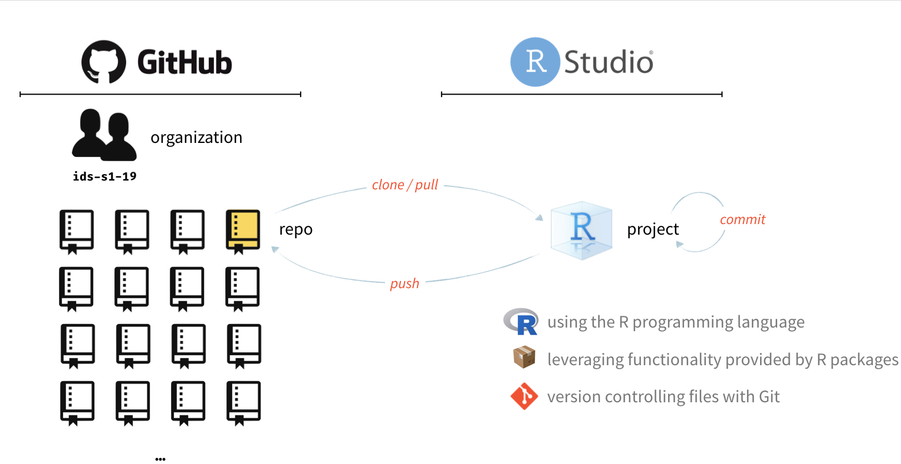
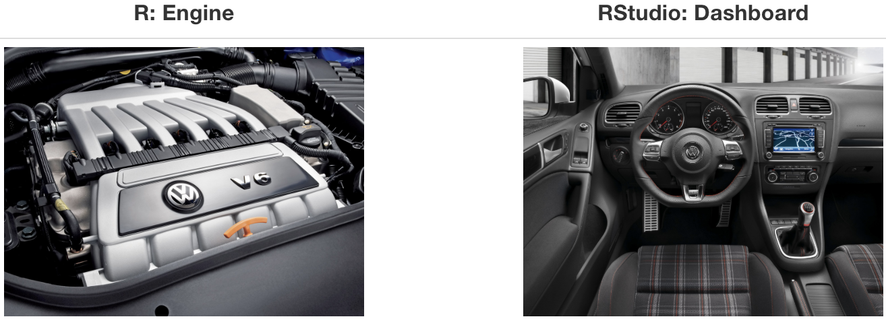
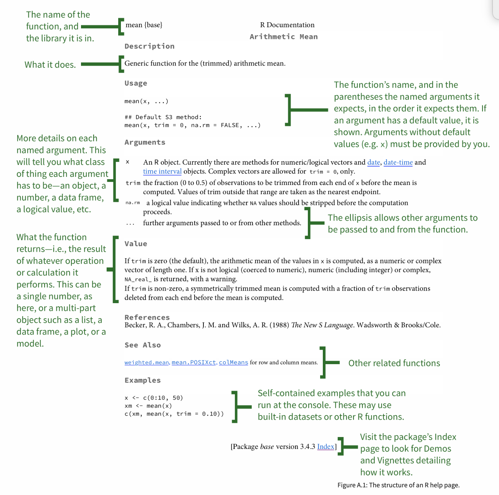

```{r child = "../setup.Rmd"}
```

```{r packages, echo=FALSE, message=FALSE, warning=FALSE}
library(tidyverse)
library(fontawesome)
```

class: middle

# Reproducible data analysis

---

## Reproducibility checklist

.question[
What does it mean for a data analysis to be "reproducible"?
]

--

Near-term goals:

- Are the tables and figures reproducible from the code and data?
- Does the code actually do what you think it does?
- In addition to what was done, is it clear **why** it was done? 
(e.g., how were parameter settings chosen?)

Long-term goals:

- Can the code be used for other data?
- Can you extend the code to do other things?

---

## Toolkit


- Scriptability $\rightarrow$ R
- Literate programming (code, narrative, output in one place) $\rightarrow$ R Markdown
- Version control $\rightarrow$ Git / GitHub

---

class: middle

# Toolkit overview

---

```{r echo=FALSE, out.width="100%"}

```

---

```{r echo=FALSE, out.width="100%"}

```

---

```{r echo=FALSE, out.width="100%"}

```

---

```{r echo=FALSE, out.width="100%"}

```

---

class: middle

# R and RStudio

---

## What is R/RStudio?

- R is a statistical programming language
- RStudio is a convenient interface for R (an integrated development environment, IDE)
- At its simplest:<sup>[+]</sup>
    - R is like a car’s engine
    - RStudio is like a car’s dashboard

```{r fig.align="center", echo=FALSE}

```

.footnote[
[+] Source: [Modern Dive](https://moderndive.com/)
]

---

## Let's take a tour - R / RStudio

.center[

]

- Console
- Using R as a calculator
- Environment
- Loading and viewing a data frame
- Accessing a variable in a data frame
- R functions

---

## R essentials

A short list (for now):

- Functions are (most often) verbs, followed by what they will be applied to in parantheses:

```{r eval=FALSE}
do_this(to_this)
do_that(to_this, to_that, with_those)
```

--

- Columns (variables) in data frames are accessed with `$`:

```{r eval=FALSE}
dataframe$var_name
```

--

- Packages are installed with the `install.packages` function and loaded with the `library` function, once per session:

```{r eval=FALSE}
install.packages("package_name")
library(package_name)
```

---

## tidyverse

.pull-left[

]

.pull-right[
.center[
[tidyverse.org](https://www.tidyverse.org/)
]

- The tidyverse is an opinionated collection of R packages designed for data science. 
- All packages share an underlying philosophy and a common grammar. 
]

---

class: middle

# R Markdown

---


## R Markdown

- Fully reproducible reports -- each time you knit the analysis is ran from the beginning
- Simple markdown syntax for text
- Code goes in chunks, defined by three backticks, narrative goes outside of chunks

---

## Let's take a tour - R Markdown


.center[

]

Concepts introduced:

- Copying a project of mine
- Knitting documents
- R Markdown and (some) R syntax

---

.your-turn[

- The Bechdel test asks whether a work of fiction features at least two women who talk to each other about something other than a man, and there must be two women named characters.
- Go to RStudio Cloud ([rstd.io/dsbox-cloud](http://rstd.io/dsbox-cloud)) and start the assignment `AE 02 - Bechdel + R Markdown`. 
- Open and knit the R Markdown document `bechdel.Rmd` and follow along with the instructions. 
- Once done, place a green sticky on your laptop. If you have questions, place a pink sticky.
]

---

## R Markdown help

.pull-left[
.center[
[R Markdown cheat sheet](https://github.com/rstudio/cheatsheets/raw/master/rmarkdown-2.0.pdf)
]

]
.pull-right[
.center[
Markdown Quick Reference  
`Help -> Markdown Quick Reference`
]

]

---

## Workspaces

Remember this, and expect it to bite you a few times as you're learning to work 
with R Markdown: The workspace of your R Markdown document is separate from the Console!

- Run the following in the console
```{r eval = FALSE}
x <- 2
x * 3
```
.question[
All looks good, eh?
]

- Then, add the following chunk in your R Markdown document
```{r eval = FALSE}
x * 3
```
.question[
What happens? Why the error?
]

---

## How will we use R Markdown?

- Every assignment / report / project / etc. is an R Markdown document
- You'll always have a template R Markdown document to start with
- The amount of scaffolding in the template will decrease over the semester

---

class: middle

# Git and GitHub

---

## Version control

- We introduced GitHub as a platform for collaboration
- But it's much more than that...
- It's actually desiged for version control

---

## Versioning

```{r echo=FALSE, fig.align = "center", out.width = "70%"}
knitr::include_graphics("img/lego-steps.png")
```

---

## Versioning 

with human readable messages

```{r echo=FALSE, fig.align = "center", out.width = "70%"}
knitr::include_graphics("img/lego-steps-commit-messages.png")
```

---

## Why do we need version control?

```{r echo=FALSE, fig.align = "center"}
knitr::include_graphics("img/phd_comics_vc.gif")
```

---

# Git and GitHub tips

- Git is a version control system -- like “Track Changes” features from Microsoft Word on steroids. GitHub is the home for your Git-based projects on the internet -- like DropBox but much, much better).

--
- There are millions of git commands -- ok, that's an exaggeration, but there are a lot of them -- and very few people know them all. 99% of the time you will use git to add, commit, push, and pull.

--
- We will be doing Git things and interfacing with GitHub through RStudio, but if you google for help you might come accross methods for doing these things in the command line -- skip that and move on to the next resource unless you feel comfortable trying it out.

--
- There is a great resource for working with git and R: [happygitwithr.com](http://happygitwithr.com/). Some of the content in there is beyond the scope of this course, but it's a good place to look for help.

---

## Let's take a tour - Git and GitHub

.center[

]

- Connect an R project to Github repository
- Working with a local and remote repository
- Making a change locally, committing, and pushing
- Making a change on GitHub and pulling
- There is just a bit more of GitHub that we'll use in this class, but for today this is enough

---

class: middle

# Getting help in R

---

## Reading help files

```{r echo=FALSE, out.width="50%"}

```

.footnote[
Source: http://socviz.co/appendix.html#a-little-more-about-r
]

---

## Asking good questions

.pull-left[
- **Good:** Describe your intention and include your code and the error
- **Better:** Describe your intention and create a minimum working example
- **Best:** Write a **rep**roducible **ex**ample (reprex) -- we'll introduce this concept more formally and teach you the tools for it a little later in the semester
]
--
.pull-right[

- Use code formatting
- For issues with R code: copy / paste your code and resulting error, don't use screenshots 
]
