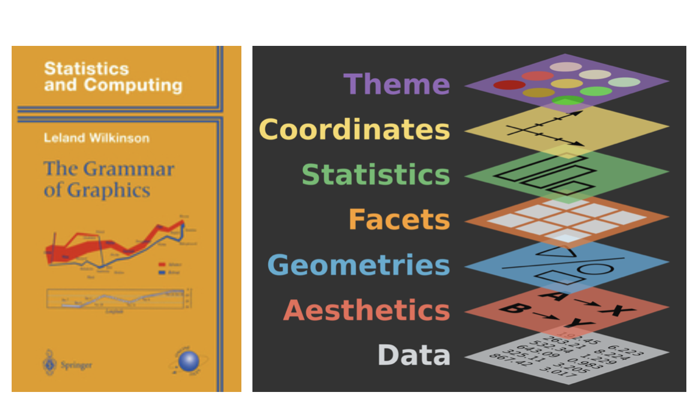
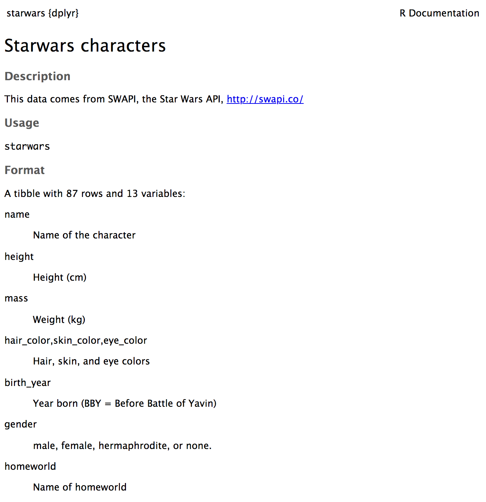
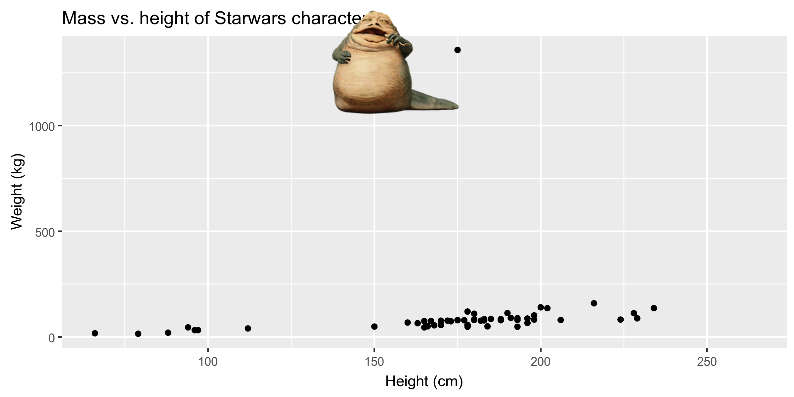

```{r child = "../setup.Rmd"}
```

```{r packages, echo=FALSE, message=FALSE, warning=FALSE}
library(emo)
library(tidyverse)
library(fontawesome)
library(magick)
library(Tmisc)
library(dsbox)
```

class: middle

# Exploratory data analysis

---

## What is EDA?

- Exploratory data analysis (EDA) is an approach to analyzing data sets to summarize its main characteristics.
- Often, this is visual. That's what we're focusing on today.
- But we might also calculate summary statistics and perform data wrangling/manipulation/transformation at (or before) this stage of the analysis. That's what we'll focus on next.

---

class: middle

# Data visualization

---

## Data visualization

> *"The simple graph has brought more information to the data analyst's mind than any other device." --- John Tukey*

- Data visualization is the creation and study of the visual representation of data.
- There are many tools for visualizing data (R is one of them), and many approaches/systems within R for making data visualizations (**ggplot2** is one of them, and that's what we're going to use).

---

## ggplot2 $\in$ tidyverse

.pull-left[
```{r echo=FALSE, out.width="80%"}
knitr::include_graphics("img/ggplot2-part-of-tidyverse.png")
```
] 
.pull-right[ 
- **ggplot2** is tidyverse's data visualization package - The `gg` in "ggplot2" stands for Grammar of Graphics 
- It is inspired by the book **Grammar of Graphics** by Leland Wilkinson
]

---

## Grammar of Graphics

A grammar of graphics is a tool that enables us to concisely describe the components of a graphic

```{r echo=FALSE, out.width="70%"}

```

.footnote[ Source: [BloggoType](http://bloggotype.blogspot.com/2016/08/holiday-notes2-grammar-of-graphics.html)]

---

```{r out.width="70%"}
ggplot(data = starwars, mapping = aes(x = height, y = mass)) +
  geom_point() +
  labs(title = "Mass vs. height of Starwars characters",
       x = "Height (cm)", y = "Weight (kg)")
```

---

.question[ 
- What are the functions doing the plotting?
- What is the dataset being plotted?
- Which variable is on the x-axis and which variable is on the y-axis?
- What does the warning mean?
]

```{r eval=FALSE}
ggplot(data = starwars, mapping = aes(x = height, y = mass)) +
  geom_point() +
  labs(
    title = "Mass vs. height of Starwars characters",
    x = "Height (cm)", 
    y = "Weight (kg)"
    )
```

    ## Warning: Removed 28 rows containing missing values (geom_point).

---

.question[
What does `geom_smooth()` do?
]

```{r out.width="70%", warning=FALSE, message=FALSE}
ggplot(data = starwars, mapping = aes(x = height, y = mass)) +
  geom_point() +
  geom_smooth() + #<<
  labs(title = "Mass vs. height of Starwars characters",
       x = "Height (cm)", y = "Weight (kg)")
```

---

## Hello ggplot2!

- `ggplot()` is the main function in ggplot2
- Plots are constructed in layers
- Structure of the code for plots can be summarized as

```{r eval = FALSE}
ggplot(data = [dataset], 
       mapping = aes(x = [x-variable], y = [y-variable])) +
   geom_xxx() +
   other options
```

- To use ggplot2 functions, first load tidyverse

```{r}
library(tidyverse)
```

- For help with the ggplot2, see [ggplot2.tidyverse.org](http://ggplot2.tidyverse.org/)

---

class: middle

# Visualizing Star Wars

---

## Dataset terminology

- Each row is an **observation**
- Each column is a **variable**

.small[

```{r message=FALSE}
starwars
```

]

---

## Luke Skywalker


---

## What's in the Star Wars data?

Take a `glimpse` at the data:

```{r}
glimpse(starwars)
```

---

## What's in the Star Wars data?

.question[
How many rows and columns does this dataset have?
What does each row represent?
What does each column represent?
]

```{r eval = FALSE}
?starwars
```

```{r echo=FALSE}

```

---
## Mass vs. height

```{r out.width="70%"}
ggplot(data = starwars, mapping = aes(x = height, y = mass)) +
  geom_point()
```

---

## What's that warning?

- Not all characters have height and mass information (hence 28 of them not plotted)

<!-- -->

    ## Warning: Removed 28 rows containing missing values (geom_point).

- Going forward I'll supress the warning to save room on slides, but it's important to note it

---

## Labels

.small[

```{r out.width="70%", warning=FALSE}
ggplot(data = starwars, mapping = aes(x = height, y = mass)) +
  geom_point() +
  labs(title = "Mass vs. height of Starwars characters", #<<
       x = "Height (cm)", y = "Weight (kg)")             #<<
```

]

---

## Mass vs. height

.question[ 
How would you describe this relationship?
What other variables would help us understand data points that don't follow the overall trend?
Who is the not so tall but really chubby character?
]

.small[

```{r out.width="70%", warning=FALSE,echo=FALSE}
ggplot(data = starwars, mapping = aes(x = height, y = mass)) +
  geom_point() +
  labs(title = "Mass vs. height of Starwars characters",
       x = "Height (cm)", y = "Weight (kg)")
```

]

---

## Jabba!

```{r echo=FALSE, warning=FALSE, cache=TRUE}
jabba <- image_read("img/jabba.png")

fig <- image_graph(width = 2400, height = 1200, res = 300)
ggplot(data = starwars, mapping = aes(x = height, y = mass)) +
  geom_point(size = 1.5) + 
  labs(title = "Mass vs. height of Starwars characters",
       x = "Height (cm)", y = "Weight (kg)")
dev.off()

out <- fig %>% image_composite(jabba, offset = "+1000+30")

image_write(out, "img/jabbaplot.png", format = "png")

```

---
## Additional variables

We can map additional variables to various features of the plot:

- aesthetics
    - shape
    - colour
    - size
    - alpha (transparency)
- faceting: small multiples displaying different subsets

---

class: middle

# Aesthetics

---

## Aesthetics options

Visual characteristics of plotting characters that can be **mapped to a specific variable** in the data are

- `color`
- `size`
- `shape`
- `alpha` (transparency)

---

## Mass vs. height + gender

```{r out.width="70%", warning=FALSE}
ggplot(data = starwars, 
       mapping = aes(x = height, y = mass, color = gender)) +
  geom_point()
```

---
## Mass vs. height + gender

```{r out.width="70%", warning=FALSE}
ggplot(data = starwars, 
       mapping = aes(x = height, y = mass, color = gender, 
                     size = birth_year)) + #<<
  geom_point()
```

---

## Mass vs. height + gender

Let's now increase the size of all points **not** based on the values of a variable in the data:

```{r out.width="70%", warning=FALSE}
ggplot(data = starwars, mapping = aes(x = height, y = mass, color = gender)) +
  geom_point(size = 2) #<<
```

---

## Aesthetics summary

- Continuous variables are measured on a continuous scale
- Discrete variables are measured (or often counted) on a discrete scale

aesthetics | discrete                 | continuous                              
-----------|--------------------------|-----------------------------------------
color      | rainbow of colors        | gradient
size       | discrete steps           | linear mapping between radius and value 
shape      | different shape for each | shouldn't (and doesn't) work            

- Use aesthetics for mapping features of a plot to a variable, define the features in the geom for customization **not** mapped to a variable

---

class: middle

# Faceting

---

## Faceting

- Smaller plots that display different subsets of the data
- Useful for exploring conditional relationships and large data

---

```{r out.width="80%", warning=FALSE}
ggplot(data = starwars, mapping = aes(x = height, y = mass)) +
  facet_grid(. ~ gender) + #<<
  geom_point() +
  labs(title = "Mass vs. height of Starwars characters",
       subtitle = "Faceted by gender")  #<<
```

---

## Dive further...

.question[
In the next few slides describe what each plot displays.
Think about how the code relates to the output.
]

--

<br><br><br>

.alert[ The plots in the next few slides do not have proper titles, axis labels, etc. because we want you to figure out what's happening in the plots.
But you should always label your plots!]

---

```{r out.width="90%", warning=FALSE}
ggplot(data = starwars, mapping = aes(x = height, y = mass)) +
  geom_point() +
  facet_grid(gender ~ .)
```

---
```{r out.width="90%", warning=FALSE}
ggplot(data = starwars, mapping = aes(x = height, y = mass)) +
  geom_point() +
  facet_grid(. ~ gender)
```

---
```{r out.width="95%", warning=FALSE}
ggplot(data = starwars, mapping = aes(x = height, y = mass)) +
  geom_point() +
  facet_wrap(~ eye_color)
```

---

## Facet summary

- `facet_grid()`:
    - 2d grid
    - `rows ~ cols`
    - use `.` for no split
- `facet_wrap()`: 1d ribbon wrapped into 2d

---

class: middle

# Why do we visualize?

---

## Data: `datasaurus_dozen`

Below is an excerpt from the `datasaurus_dozen` dataset:

```{r datasaurus-view-wide, echo=FALSE}
library(datasauRus)
datasaurus_dozen_wide %>%
  select(1:8)
```

---

## Summary statistics

.small[

```{r datasaurus-cor}
datasaurus_dozen %>%
  group_by(dataset) %>%
  summarise(r = cor(x, y))
```

]

---

.question[
How similar do the relationships between `x` and `y` in the thirteen datasets look?
How similar are they based on summary stats?
]

```{r datasaurus-plot, echo=FALSE, fig.height=4, fig.width=7}
ggplot(datasaurus_dozen, aes(x = x, y = y, color = dataset))+
  geom_point()+
  facet_wrap(~ dataset, ncol = 5) +
  theme(legend.position = "none")
```

---

## Anscombe's quartet

```{r quartet-for-show, eval=FALSE, echo=FALSE}
library(Tmisc)
quartet
```

.pull-left[
```{r quartet-view1, echo=FALSE}
quartet[1:22,]
```
] 
.pull-right[
```{r quartet-view2, echo=FALSE}
quartet[23:44,]
```
]

---

## Summarising Anscombe's quartet

```{r quartet-summary}
quartet %>%
  group_by(set) %>%
  summarise(
    mean_x = mean(x), 
    mean_y = mean(y),
    sd_x = sd(x),
    sd_y = sd(y),
    r = cor(x, y)
  )
```

---

## Visualizing Anscombe's quartet

```{r quartet-plot, out.width="75%"}
ggplot(quartet, aes(x = x, y = y)) +
  geom_point() +
  facet_wrap(~ set, ncol = 4)
```

---

## Age at first kiss

.question[ 
Do you see anything out of the ordinary?
]

```{r fig.height=2.5, echo=FALSE, warning=FALSE}
ggplot(student_survey, aes(x = first_kiss)) +
  geom_histogram(binwidth = 1) +
  labs(title = "How old were you when you had your first kiss?")
```

---

## Facebook visits

.question[ 
How are people reporting lower vs. higher values of FB visits?
]

```{r fig.height=2.5, echo=FALSE, warning=FALSE}
ggplot(student_survey, aes(x = fb_visits_per_day)) +
  geom_histogram(binwidth = 1) +
  labs(title = "How many times do you go on Facebook per day?", x = "")
```
