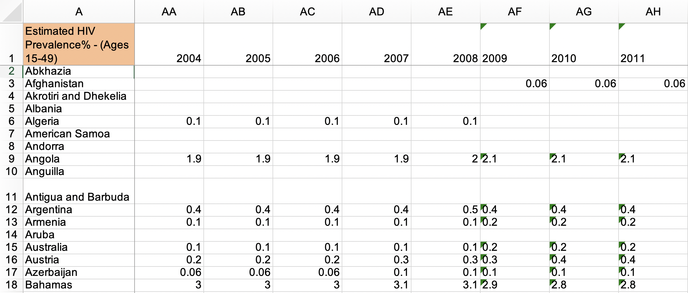

```{r child = "../setup.Rmd"}
```

```{r packages, echo=FALSE, message=FALSE, warning=FALSE}
library(tidyverse)
library(emo)
library(dsbox)
```

class: middle

# Tidy data

---

## Tidy data

>Happy families are all alike; every unhappy family is unhappy in its own way. 
>
>Leo Tolstoy

--

.pull-left[
**Characteristics of tidy data:**

- Each variable forms a column.
- Each observation forms a row.
- Each type of observational unit forms a table.
]
--
.pull-right[
**Characteristics of untidy data:**

!@#$%^&*()
]

---

## 

.question[
What makes this data not tidy?
]

```{r hyperwar-airplanes-on-hand, echo=FALSE, out.width="90%", fig.align = "center", caption = "WW2 Army Air Force combat aircraft"}
knitr::include_graphics("img/untidy-data/hyperwar-airplanes-on-hand.png")
```

.footnote[
Source: [Army Air Forces Statistical Digest, WW II](https://www.ibiblio.org/hyperwar/AAF/StatDigest/aafsd-3.html)
]

---

.question[
What makes this data not tidy?
]

<br>

```{r hiv-est-prevalence-15-49, echo=FALSE, out.width="95%", fig.align = "center", caption = "Estimated HIV prevalence among 15-49 year olds"}

```

.footnote[
Source: [Gapminder, Estimated HIV prevalence among 15-49 year olds](https://www.gapminder.org/data)
]

---

.question[
What makes this data not tidy?
]

<br>

```{r us-general-economic-characteristic-acs-2017, echo=FALSE, out.width="95%", fig.align = "center", caption = "US General Economic Characteristics, ACS 2017"}
knitr::include_graphics("img/untidy-data/us-general-economic-characteristic-acs-2017.png")
```

.footnote[
Source: [US Census Fact Finder, General Economic Characteristics, ACS 2017](https://factfinder.census.gov/faces/tableservices/jsf/pages/productview.xhtml?pid=ACS_17_5YR_DP03&src=pt)
]

---

## Summary tables 

.question[
Is each of the following a dataset or a summary table?
]

.midi[
.pull-left[
```{r echo=FALSE}
starwars %>%
  select(name, height, mass)
```
]
.pull-right[
```{r echo=FALSE}
starwars %>%
  group_by(gender) %>%
  summarize(
    avg_height = mean(height, na.rm = TRUE) %>% round(2)
  )
```
]
]

---

## Displaying data

```{r eval=FALSE}
starwars %>%
  select(name, height, mass)
```

## Summarizing data

```{r eval=FALSE}
starwars %>%
  group_by(gender) %>%
  summarize(
    avg_height = mean(height, na.rm = TRUE) %>% round(2)
  )
```

---

class: middle

# Grammar of data wrangling

---

## A grammar of data wrangling...

... based on the concepts of functions as verbs that manipulate data frames

.pull-left[
```{r dplyr-part-of-tidyverse, echo=FALSE, out.width="80%", fig.align = "center", caption = "dplyr is part of the tidyverse"}
knitr::include_graphics("img/dplyr-part-of-tidyverse.png")
```
]
.pull-right[
.midi[
- `select`: pick columns by name
- `arrange`: reorder rows
- `slice`: pick rows using index(es)
- `filter`: pick rows matching criteria
- `distinct`: filter for unique rows
- `mutate`: add new variables
- `summarise`: reduce variables to values
- `group_by`: for grouped operations
- ... (many more)
]
]

---

## Rules of **dplyr** functions

- First argument is *always* a data frame
- Subsequent arguments say what to do with that data frame
- Always return a data frame
- Don't modify in place

---

## Data: Hotel bookings

- Data from two hotels: one resort and one city hotel
- Observations: Each row represents a hotel booking
- Goal for original data collection: Development of prediction models to classify a hotel booking's likelihood to be cancelled ([Antonia et al., 2019](https://www.sciencedirect.com/science/article/pii/S2352340918315191#bib5))
- Featured in [TidyTuesday](https://github.com/rfordatascience/tidytuesday)!

```{r message=FALSE}
hotels <- read_csv("data/hotels.csv")
```

---

## First look: Variables

```{r message=FALSE}
names(hotels)
```

---

## Second look: Overview

.xxsmall[
```{r}
glimpse(hotels)
```
]

---

## Select a single column

View only the `lead_time` type (number of days between booking and arrival date):

--
.pull-left[
```{r}
select(.data = hotels, lead_time)
```
]
--
.pull-right[
- Start with the function (a verb): `select()`
- First argument is `.data` (the data frame we're working with) = `hotels`
- Second argument is variable we want to select: `lead_time`
- The result is a data frame with 119,300 and 1 column: --dplyr functions always 
expect a data frame and always yield a data frame.
]

---

.tip[
You can skip the argument name for the first two arguments of a function.
]

.pull-left[
```{r}
select(.data = hotels, lead_time)
```
]
.pull-right[
```{r}
select(hotels, lead_time)
```
]

---

## Select multiple columns


View only the `hotel` type and `lead_time`:

--

.pull-left[
```{r}
select(hotels, hotel, lead_time)
```
]
--
.pull-right[
.discussion[
What if we wanted to select these columns, and then arrange the data in descending order of lead time?
]
]

---

## Data wrangling, step-by-step

.pull-left[
Select:
```{r}
hotels %>%
  select(hotel, lead_time)
```
]

--
.pull-right[
Select, then arrange:
```{r}
hotels %>%
  select(hotel, lead_time) %>%
  arrange(desc(lead_time))
```
]

---

class: middle

# Pipes

---

## What is a pipe?

In programming, a pipe is a technique for passing information from one process to another.

--

.pull-left[
- Start with the data frame `hotels`, and pass it to the `select()` function,
]
.pull-right[
.small[
```{r}
hotels %>% #<<
  select(hotel, lead_time) %>%
  arrange(desc(lead_time))
```
]
]

---

## What is a pipe?

In programming, a pipe is a technique for passing information from one process to another.

.pull-left[
- Start with the data frame `hotels`, and pass it to the `select()` function,
- then we select the variables `hotel` and `lead_time`,
]
.pull-right[
.small[
```{r}
hotels %>%
  select(hotel, lead_time) %>% #<<
  arrange(desc(lead_time))
```
]
]

---

## What is a pipe?

In programming, a pipe is a technique for passing information from one process to another.

.pull-left[
- Start with the data frame `hotels`, and pass it to the `select()` function,
- then we select the variables `hotel` and `lead_time`,
- and then we arrange the data frame by `lead_time` in descending order.
]
.pull-right[
.small[
```{r}
hotels %>%
  select(hotel, lead_time) %>% 
  arrange(desc(lead_time)) #<<
```
]
]

---

## Aside

The pipe operator is implemented in the package **magrittr**, though we don't need to load this package explicitly since **tidyverse** does this for us.

--

.discussion[
Any guesses as to why the package is called magrittr?
]

--

.pull-left[
```{r magritte, echo=FALSE, out.width="100%", fig.align = "center", caption = "Magritte's pipe"}
knitr::include_graphics("img/magritte.jpg")
```
]
.pull-right[
```{r magrittr, echo=FALSE, out.width="100%", fig.align = "center", caption = "magrittr's pipe"}
knitr::include_graphics("img/magrittr.jpg")
```
]

---

## How does a pipe work?

- You can think about the following sequence of actions - find key, 
unlock car, start car, drive to work, park.

--
- Expressed as a set of nested functions in R pseudocode this would look like:
```{r eval=FALSE}
park(drive(start_car(find("keys")), to = "work"))
```

--
- Writing it out using pipes give it a more natural (and easier to read) 
structure:
```{r eval=FALSE}
find("keys") %>%
  start_car() %>%
  drive(to = "work") %>%
  park()
```

---

## What about other arguments?

Use the dot to

- send results to a function argument other than first one or 
- use the previous result for multiple arguments

```{r fig.height=1.8, fig.width = 3.75}
hotels %>%
  filter(hotel == "Resort Hotel") %>%
  lm(adr ~ lead_time, data = .) #<<
```

---

## A note on piping and layering

- The `%>%` operator in **dplyr** functions is called the pipe operator. This means you "pipe" the output of the previous line of code as the first input of the next line of code.

--
- The `+` operator in **ggplot2** functions is used for "layering". This means you create the plot in layers, separated by `+`.

---

## dplyr

.midi[
`r emo::ji("x")`

```{r error=TRUE}
hotels +
  select(hotel, lead_time)
```

`r emo::ji("white_check_mark")`

```{r eval=FALSE}
hotels %>%
  select(hotel, lead_time)
```

```{r echo=FALSE}
hotels %>%
  select(hotel, lead_time) %>%
  print(n = 6)
```
]

---

## ggplot2

.midi[
`r emo::ji("x")`

```{r error=TRUE}
ggplot(hotels, aes(x = hotel, fill = deposit_type)) %>%
  geom_bar()
```

`r emo::ji("white_check_mark")`

```{r fig.width=10, fig.height=2, dpi=300}
ggplot(hotels, aes(x = hotel, fill = deposit_type)) +
  geom_bar()
```
]

---

## Code styling

Many of the styling principles are consistent across `%>%` and `+`:

- always a space before
- always a line break after (for pipelines with more than 2 lines)

`r emo::ji("x")`

```{r eval=FALSE}
ggplot(hotels,aes(x=hotel,y=deposit_type))+geom_bar()
```

`r emo::ji("white_check_mark")`

```{r eval=FALSE}
ggplot(hotels, aes(x = hotel, y = deposit_type)) + 
  geom_bar()
```

---

class: middle

# Working with a single data frame

---

class: middle

.hand[You...]

.huge-blue[have] .hand[a single data frame]

.huge-pink[want] .hand[to slice it, and dice it, and juice it, and process it]

---

## `select` to keep variables

```{r}
hotels %>%
  select(hotel, lead_time) #<<
```

---

## `select` to exclude variables

.small[
```{r}
hotels %>%
  select(-agent) #<<
```
]

---

## `select` a range of variables

```{r}
hotels %>%
  select(hotel:arrival_date_month) #<<
```

---

## `select` variables with certain characteristics

```{r}
hotels %>%
  select(starts_with("arrival")) #<<
```

---

## `select` variables with certain characteristics

```{r}
hotels %>%
  select(ends_with("type")) #<<
```

---

## Select helpers

- `starts_with()`: Starts with a prefix
- `ends_with()`: Ends with a suffix
- `contains()`: Contains a literal string
- `num_range()`: Matches a numerical range like x01, x02, x03
- `one_of()`: Matches variable names in a character vector
- `everything()`: Matches all variables
- `last_col()`: Select last variable, possibly with an offset
- `matches()`: Matches a regular expression (a sequence of symbols/characters expressing a string/pattern to be searched for within text)

.footnote[
See help for any of these functions for more info, e.g. `?everything`.
]

---

## `arrange` in ascending / descending order

.pull-left[
```{r}
hotels %>%
  select(adults, children, babies) %>%
  arrange(babies) #<<
```
]
.pull-right[
```{r}
hotels %>%
  select(adults, children, babies) %>%
  arrange(desc(babies)) #<<
```
]

---

## `slice` for certain row numbers

.midi[
```{r}
# first five
hotels %>%
  slice(1:5) #<<
```
]

---

.tip[
In R, you can use the `#` (hashtag or pound sign, depending on your age 
`r emo::ji("stuck_out_tongue_winking_eye")`) for adding comments to your code. 
Any text following `#` will be printed as is, and won't be run as R code.
This is useful for leaving comments in your code and for temporarily disabling 
certain lines of code while debugging.
]

.small[
```{r}
hotels %>%
  # slice the first five rows  # this line is a comment
  #select(hotel) %>%           # this one doesn't run
  slice(1:5)                   # this line runs
```
]

---

## `slice` for certain row numbers

.midi[
```{r}
# last five
last_row <- nrow(hotels)         # nrow() gives the number of rows in a data frame
hotels %>%
  slice((last_row - 4):last_row) #<<
```
]

---

## `filter` to select a subset of rows

.midi[
```{r}
# bookings in City Hotels
hotels %>%
  filter(hotel == "City Hotel") #<<
````
]

---

## `filter` for many conditions at once

```{r}
hotels %>%
  filter( 
    adults == 0,     #<<
    children >= 1    #<<
    ) %>% 
  select(adults, babies, children)
```

---

## `filter` for more complex conditions

```{r}
# bookings with no adults and some children or babies in the room
hotels %>%
  filter( 
    adults == 0,     
    children >= 1 | babies >= 1     # | means or  #<<
    ) %>%
  select(adults, babies, children)
```

---

## Logical operators in R

<br>

operator    | definition                   || operator     | definition
------------|------------------------------||--------------|----------------
`<`         | less than                    ||`x`&nbsp;&#124;&nbsp;`y`     | `x` OR `y` 
`<=`        |	less than or equal to        ||`is.na(x)`    | test if `x` is `NA`
`>`         | greater than                 ||`!is.na(x)`   | test if `x` is not `NA`
`>=`        |	greater than or equal to     ||`x %in% y`    | test if `x` is in `y`
`==`        |	exactly equal to             ||`!(x %in% y)` | test if `x` is not in `y`
`!=`        |	not equal to                 ||`!x`          | not `x`
`x & y`     | `x` AND `y`                  ||              |

---

.your-turn[

Time to actually play around with the Star Wars dataset!

- Go to RStudio Cloud ([rstd.io/dsbox-cloud](http://rstd.io/dsbox-cloud)) and start `AE 04 - Hotels + Data wrangling`.
- Open the R Markdown document and complete Exercises 1 - 4.
- Once done, place a green sticky on your laptop. If you have questions, place a pink sticky.
]

---

```{r include=FALSE}
options(dplyr.print_max = 20)
```


## `distinct` to filter for unique rows

... and `arrange` to order alphabetically

.small[
.pull-left[
```{r}
hotels %>% 
  distinct(market_segment) %>% #<<
  arrange(market_segment)
```
]
.pull-right[
```{r}
hotels %>% 
  distinct(hotel, market_segment) %>% #<<
  arrange(hotel, market_segment)
```
]
]

---

## `count` to create frequency tables

.pull-left[
```{r}
# alphabetical order by default
hotels %>%
  count(market_segment) #<<
```
]
--
.pull-right[
```{r}
# descending frequency order
hotels %>%
  count(market_segment, sort = TRUE) #<<
```
]

---

## `count` and `arrange`

.pull-left[
```{r}
# ascending frequency order
hotels %>%
  count(market_segment) %>%
  arrange(n) #<<
```
]
.pull-right[
```{r}
# descending frequency order
# just like adding sort = TRUE
hotels %>%
  count(market_segment) %>%
  arrange(desc(n)) #<<
```
]

---

## `count` for multiple variables

```{r}
hotels %>%
  count(hotel, market_segment) #<<
```

---

## order matters when you `count`

.midi[
.pull-left[
```{r}
# hotel type first
hotels %>%
  count(hotel, market_segment) #<<
```
]
.pull-right[
```{r}
# market segment first
hotels %>%
  count(market_segment, hotel) #<<
```
]
]

---

.your-turn[

Time to actually play around with the Star Wars dataset!

- Go to RStudio Cloud ([rstd.io/dsbox-cloud](http://rstd.io/dsbox-cloud)) and start `AE 04 - Hotels + Data wrangling`.
- Open the R Markdown document and complete Exercises 5 and 6.
- Once done, place a green sticky on your laptop. If you have questions, place a pink sticky.
]

---

## `mutate` to add a new variable

```{r}
hotels %>%
  mutate(little_ones = children + babies) %>% #<<
  select(children, babies, little_ones) %>%
  arrange(desc(little_ones))
```

---


## Little ones in resort and city hotels

.midi[
.pull-left[
```{r}
# Resort Hotel
hotels %>%
  mutate(little_ones = children + babies) %>%
  filter(
    little_ones >= 1,
    hotel == "Resort Hotel"
    ) %>%
  select(hotel, little_ones)
```
]
.pull-right[
```{r}
# City Hotel
hotels %>%
  mutate(little_ones = children + babies) %>%
  filter(
    little_ones > 1,
    hotel == "City Hotel"
    )  %>%
  select(hotel, little_ones)
```
]
]

---

.discussion[
What is happening in the following chunk?
]

.midi[
```{r}
hotels %>%
  mutate(little_ones = children + babies) %>%
  count(hotel, little_ones) %>%
  mutate(prop = n / sum(n))
```
]

---

# `summarise` for summary stats

```{r}
# mean average daily rate for all bookings
hotels %>%
  summarise(mean_adr = mean(adr)) #<<
```

--

<br>

.tip[
`summarise()` changes the data frame entirely, it collapses rows down to a single 
summary statistics, and removes all columns that are irrelevant to the calculation.
]

---

.tip[
`summarise()` also lets you get away with being sloppy and not naming your new 
column, but that's not recommended!
]

.midi[
`r emo::ji("x")`

```{r}
hotels %>%
  summarise(mean(adr))
```

`r emo::ji("white_check_mark")`

```{r}
hotels %>%
  summarise(mean_adr = mean(adr))
```
]

---

# `group_by` for grouped operations

```{r}
# mean average daily rate for all booking at city and resort hotels
hotels %>%
  group_by(hotel) %>% #<<
  summarise(mean_adr = mean(adr))
```

---

## Calculating frequencies

The following two give the same result, so `count` is simply short for `group_by` then determine frequencies 

.pull-left[
```{r}
hotels %>%
  group_by(hotel) %>%
  summarise(n = n())
```
]
.pull-right[
```{r}
hotels %>%
  count(hotel)
```
]

---

# Multiple summary statistics

`summarise` can be used for multiple summary statistics as well

```{r}
hotels %>%
  summarise(
    min_adr = min(adr),
    mean_adr = mean(adr),
    median_adr = median(adr),
    max_adr = max(adr)
    )
```

---

.your-turn[

Time to actually play around with the Star Wars dataset!

- Go to RStudio Cloud ([rstd.io/dsbox-cloud](http://rstd.io/dsbox-cloud)) and start `AE 04 - Hotels + Data wrangling`.
- Open the R Markdown document and complete Exercises 7 and 8.
- Once done, place a green sticky on your laptop. If you have questions, place a pink sticky.
]
