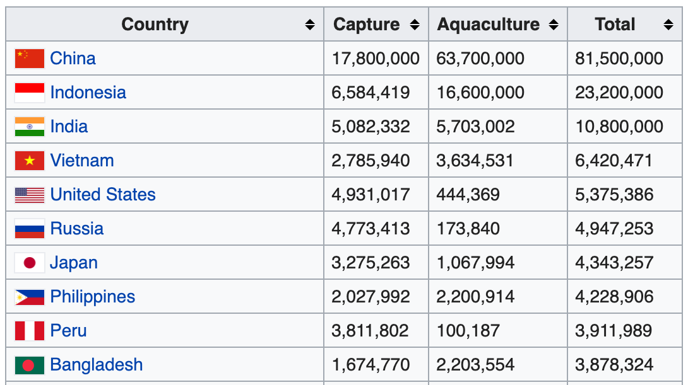
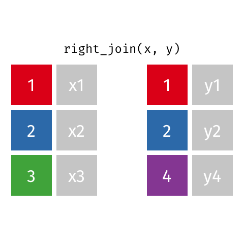
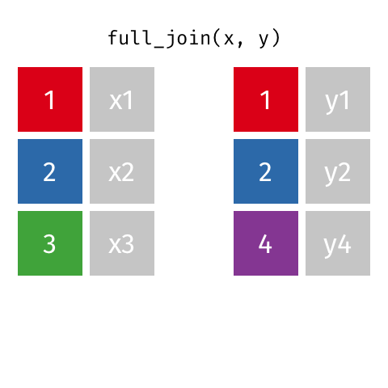
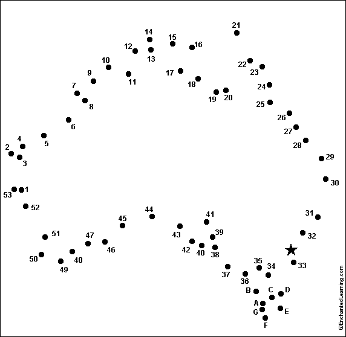

```{r child = "../setup.Rmd"}
```

```{r packages, echo=FALSE, message=FALSE, warning=FALSE}
library(tidyverse)
library(emo)
library(knitr)
library(skimr)
library(scales)
```

class: middle

# Working with multiple data frames

---

class: middle

.hand[You...]

.huge-blue[have] .hand[multiple data frames]

.huge-pink[want] .hand[to slice it, and dice it, and juice it, and process it]

---

## Fisheries of the world

Fisheries and Aquaculture Department of the Food and Agriculture Organization of 
the United Nations collects data on fisheries production of countries.

```{r echo=FALSE, out.width="60%"}

```
.center[
.hand[...]
]

.footnote[
- Source: https://en.wikipedia.org/wiki/Fishing_industry_by_country
]

---

## Load data

```{r}
fisheries <- read_csv("data/fisheries.csv")
```

---

## First peek at the data

.xsmall[
```{r render = normal_print, echo=2}
options(width=140)
skim(fisheries)
```
]

---

## Some summary stats

```{r}
fisheries %>%
  summarise(
    mean_cap = mean(capture),
    mean_aqc = mean(aquaculture),
    mean_tot = mean(total)
  )
```

--

<br>

.hand[
well, that was boring...
]

---

## A new approach!

```{r}
fisheries %>%
  summarise(across(capture:total, mean))
```

--

.hand[and once we learn more about data types...]

```{r}
fisheries %>%
  summarise(across(is.numeric, mean))
```

---

.question[
The (not-so-great) visualization below shows the distribution of fishery harvest 
of countries for 2016, by capture and aquaculture. What are some ways you would 
improve this visualization? Note that countries whose total harvest was less 
than 100,000 tons are not included in the visualization.
]

```{r echo=FALSE, out.width="60%"}
include_graphics("img/fisheries.png")
```

--

- Calculate summary statistics at the continent level and visualize them.
- Map the data.

---

.huge-pink[goal:] 

.hand-blue[calculate summary statistics at the continent level and visualize them]

---

## Data prep

```{r message=FALSE}
continents <- read_csv("data/continents.csv")
```

Filter out countries whose total harvest was less than 100,000 tons since they 
are not included in the visualization:

```{r}
fisheries <- fisheries %>%
  filter(total > 100000)

fisheries
```

---

class: middle

# Data joins

---

.pull-left[
```{r}
fisheries %>% select(country)
```
]
.pull-right[
```{r}
continents
```
]

---

## Joining data frames

```
something_join(x, y)
```

- `inner_join()`: all rows from x where there are matching values in y, return 
all combination of multiple matches in the case of multiple matches
- `left_join()`: all rows from x
- `right_join()`: all rows from y
- `full_join()`: all rows from both x and y
- `semi_join()`: all rows from x where there are matching values in y, keeping just columns from x.
- `anti_join()`: return all rows from x where there are not matching values in y, never duplicate rows of x
- ...
 
---

## Setup

For the next few slides...

.pull-left[
```{r echo=FALSE}
x <- tibble(value = c(1, 2, 3))
```
```{r}
x
```
]
.pull-right[
```{r echo=FALSE}
y <- tibble(value = c(1, 2, 4))
```
```{r}
y
```
]

---

## `inner_join()`

.pull-left[
```{r}
inner_join(x, y)
```
]
.pull-right[
```{r echo=FALSE}

```
]

---

## `left_join()`

.pull-left[
```{r}
left_join(x, y)
```
]
.pull-right[
```{r echo=FALSE}

```
]

---

## `right_join()`

.pull-left[
```{r}
right_join(x, y)
```
]
.pull-right[
```{r echo=FALSE}

```
]

---

## `full_join()`

.pull-left[
```{r}
full_join(x, y)
```
]
.pull-right[
```{r echo=FALSE}

```
]

---

## `semi_join()`

.pull-left[
```{r}
semi_join(x, y)
```
]
.pull-right[
```{r echo=FALSE}

```
]

---

## `anti_join()`

.pull-left[
```{r}
anti_join(x, y)
```
]
.pull-right[
```{r echo=FALSE}

```
]

---

.question[
We want to keep all rows and columns from `fisheries` and add a column for 
corresponding continents. Which join function should we use?
]

.pull-left[
```{r}
fisheries %>% select(country)
```
]
.pull-right[
```{r}
continents
```
]

---

## Join fisheries and continents 

```{r}
fisheries <- left_join(fisheries, continents) 
```

--

.question[
How does `left_join()` know to join the two data frames by `country`?
]

Hint:

- Variables in the original fisheries dataset:

```{r echo=FALSE}
fisheries %>% select(-continent) %>% names()
```

- Variables in the continents dataset:

```{r echo=FALSE}
names(continents)
```


---

## Check the data

```{r}
fisheries %>%
  filter(is.na(continent))
```

---

## Implement fixes

```{r}
fisheries <- fisheries %>%
  mutate(continent = case_when(
    country == "Democratic Republic of the Congo" ~ "Africa",
    country == "Hong Kong"                        ~ "Asia",
    country == "Myanmar"                          ~ "Asia",
    TRUE                                          ~ continent
    )
  )
```

...and check again

```{r include=FALSE}
options(width=90)
```


```{r}
fisheries %>%
  filter(is.na(continent))
```

---

.question[
What does the following code do?
]

```{r eval=FALSE}
fisheries %>%
  mutate(aquaculture_perc = aquaculture / total)
```

---

.your-turn[
- [RStudio Cloud](http://rstd.io/dsbox-cloud) > `AE 05 - Fisheries + Data joins` > open `fisheries.Rmd` and knit.
- Knit the document and work on the Exercise 1.
- Once done, place a green sticky on your laptop. If you have questions, place a pink sticky.
]

---

.your-turn[
- [RStudio Cloud](http://rstd.io/dsbox-cloud) > `AE 05 - Fisheries + Data joins` > open `fisheries.Rmd` and knit.
- Knit the document and work on the Exercises 2 - 4.
- Once done, place a green sticky on your laptop. If you have questions, place a pink sticky.
]

---

```{r include=FALSE}
fisheries <- fisheries %>%
  mutate(aquaculture_perc = aquaculture / total)

fisheries_summary <- fisheries %>%
  group_by(continent) %>%
  summarise(
    min_ap  = min(aquaculture_perc),
    mean_ap = mean(aquaculture_perc),
    max_ap  = max(aquaculture_perc)
  )
```

## Visualize continent summary stats

```{r out.width="80%"}
ggplot(fisheries_summary, aes(x = continent, y = mean_ap)) +
  geom_col()
```

---

## Improve visualization

```{r out.width="80%"}
ggplot(fisheries_summary, 
       aes(x = fct_reorder(continent, mean_ap), y = mean_ap)) + #<<
  geom_col()
```

---

## Improve visualization further

```{r eval=FALSE}
ggplot(fisheries_summary, 
       aes(y = fct_reorder(continent, mean_ap), x = mean_ap)) +
  geom_col() +
  scale_x_continuous(labels = label_percent(accuracy = 1)) + #<<
  labs( #<<
    x = "",  #<<
    y = "",  #<<
    title = "Average share of aquaculture by continent",  #<<
    subtitle = "out of total fisheries harvest, 2016",  #<<
    caption = "Source: bit.ly/2VrawTt" #<<
  ) +  #<<
  theme_minimal() #<<
```

$\rightarrow$ See next slide...

---

```{r echo=FALSE}
ggplot(fisheries_summary, 
       aes(y = fct_reorder(continent, mean_ap), x = mean_ap)) +
  geom_col() +
  scale_x_continuous(labels = label_percent(accuracy = 1)) +
  labs(
    x = "", y = "",
    title = "Average share of aquaculture by continent",
    subtitle = "out of total fisheries harvest, 2016",
    caption = "Source: bit.ly/2VrawTt"
  ) +
  theme_minimal()
```

---


.huge-pink[goal:] 

.hand-blue[map fishery data at the country level]

---

## Mapping the fisheries data

- Obtain country boundaries and store as a data frame
- Join the fisheries and country boundaries data frames
- Plot the country boundaries, and fill by fisheries harvest data

---

## `map_data()`

The `map_data()` function turns data from the **maps** package into a data frame 
suitable for plotting with ggplot2:

```{r eval=FALSE}
map_data("world")
```

```{r echo=FALSE}
map_data("world")[1:14,]
```

---

## Connect the dots

```{r echo=FALSE, out.width="50%"}

```

---

## A few fixes for better matching

.question[
What does the following code do?
]

```{r}
world_map <- map_data("world") %>%
  mutate(region = case_when(
    region == "UK"           ~ "United Kingdom",
    region == "USA"          ~ "United States",
    subregion == "Hong Kong" ~ "Hong Kong",
    TRUE                     ~ region
    )
  )
```

---

## Map the world

.midi[
```{r}
ggplot(world_map, aes(x = long, y = lat, group = group)) +
  geom_polygon(fill = "gray") +
  theme_minimal()
```
]


---

## Join fisheries and world map

.pull-left[
```{r}
fisheries %>% select(country)
```
]
.pull-right[
```{r}
world_map %>% select(region)
```
]

---

## Join fisheries and world map

```{r}
fisheries_map <- left_join(fisheries, world_map, 
                           by = c("country" = "region")) #<<
```

```{r}
glimpse(fisheries_map)
```

---

## Mapping fisheries

.midi[
```{r fig.asp=0.4}
ggplot(fisheries_map, mapping = aes(x = long, y = lat, group = group)) +
  geom_polygon(aes(fill = capture)) +
  scale_fill_viridis_c() +
  theme_minimal()
```
]

---

.question[
What is misleading about the following map?
]

```{r echo=FALSE, fig.asp=0.4}
ggplot(fisheries_map, mapping = aes(x = long, y = lat, group = group)) +
  geom_polygon(aes(fill = capture)) +
  scale_fill_viridis_c() +
  theme_minimal()
```

---

## Putting it altogether

```{r eval=FALSE}
ggplot() +
  # layer 1
  geom_polygon(world_map, 
               mapping = aes(x = long, y = lat, group = group), 
               fill = "lightgray") + #<<
  # layer 2
  geom_polygon(fisheries_map, 
               mapping = aes(x = long, y = lat, group = group, 
                             fill = capture)) + #<<
  scale_fill_viridis_c() +
  theme_minimal() +
  theme(legend.position = "bottom") +
  labs(
    x = "", y = "",
    title = "Fisheries harvest by capture, 2016",
    subtitle = "Capture measured in tonnes",
    caption = "Source: bit.ly/2VrawTt"
  )
```

---

```{r echo=FALSE, fig.asp=0.8}
ggplot() +
  geom_polygon(world_map, 
               mapping = aes(x = long, y = lat, group = group), 
               fill = "lightgray") +
  geom_polygon(fisheries_map, 
               mapping = aes(x = long, y = lat, group = group, 
                             fill = capture)) +
  scale_fill_viridis_c() +
  theme_minimal() +
  theme(legend.position = "bottom") +
  labs(
    x = "", y = "",
    title = "Fisheries harvest by capture, 2016",
    subtitle = "Capture measured in tonnes",
    caption = "Source: bit.ly/2VrawTt"
  )
```

---

## Log scale

```{r eval=FALSE}
ggplot() +
  geom_polygon(world_map, 
               mapping = aes(x = long, y = lat, group = group), 
               fill = "lightgray") +
  geom_polygon(fisheries_map, 
               mapping = aes(x = long, y = lat, group = group, 
                                            fill = log(capture))) + #<<
  scale_fill_viridis_c() +
  theme_minimal() +
  theme(legend.position = "bottom") +
  labs(
    x = "", y = "",
    title = "Fisheries harvest by capture, 2016",
    subtitle = "Capture measured in logged tonnes",
    caption = "Source: bit.ly/2VrawTt"
  )
```

---

```{r echo=FALSE, fig.asp=0.8}
ggplot() +
  geom_polygon(world_map, mapping = aes(x = long, y = lat, group = group), fill = "lightgray") +
  geom_polygon(fisheries_map, mapping = aes(x = long, y = lat, group = group, fill = log(capture))) +
  scale_fill_viridis_c() +
  theme_minimal() +
  theme(legend.position = "bottom") +
  labs(
    x = "", y = "",
    title = "Fisheries harvest by capture, 2016",
    subtitle = "Capture measured in logged tonnes",
    caption = "Source: bit.ly/2VrawTt"
  )
```

---

## Aquaculture

```{r eval=FALSE}
ggplot() +
  geom_polygon(world_map, 
               mapping = aes(x = long, y = lat, group = group), 
               fill = "lightgray") +
  geom_polygon(fisheries_map, 
               mapping = aes(x = long, y = lat, group = group, 
                             fill = log(aquaculture+1))) + #<<
  scale_fill_viridis_c() +
  theme_minimal() +
  theme(legend.position = "bottom") +
  labs(
    x = "", y = "",
    title = "Fisheries harvest by aquaculture, 2016",
    subtitle = "Aquaculture measured in logged tonnes",
    fill = "log(aquaculture)",
    caption = "Source: bit.ly/2VrawTt"
  )
```

---

```{r echo=FALSE, fig.asp=0.8}
ggplot() +
  geom_polygon(world_map, mapping = aes(x = long, y = lat, group = group), fill = "lightgray") +
  geom_polygon(fisheries_map, mapping = aes(x = long, y = lat, group = group, fill = log(aquaculture+1))) +
  scale_fill_viridis_c() +
  theme_minimal() +
  theme(legend.position = "bottom") +
  labs(
    x = "", y = "",
    title = "Fisheries harvest by aquaculture, 2016",
    subtitle = "Aquaculture measured in logged tonnes",
    fill = "log(aquaculture)",
    caption = "Source: bit.ly/2VrawTt"
  )
```

---

```{r echo=FALSE}
fisheries_map <- fisheries_map %>%
  mutate(
    aquaculture_perc = aquaculture / total
  )

ggplot() +
  geom_polygon(world_map, 
               mapping = aes(x = long, y = lat, group = group), 
               fill = "lightgray") +
  geom_polygon(fisheries_map, 
               mapping = aes(x = long, y = lat, group = group, 
                             fill = aquaculture_perc)) +
  scale_fill_viridis_c(labels = label_percent(accuracy = 1)) +
  theme_minimal() +
  theme(legend.position = "bottom", legend.key.width = unit(2, "lines")) +
  labs(
    x = "", y = "",
    title = "Average share of aquaculture by country",
    subtitle = "out of total fisheries harvest, 2016",
    caption = "Source: bit.ly/2VrawTt",
    fill = "Aquaculture %"
  )
```
