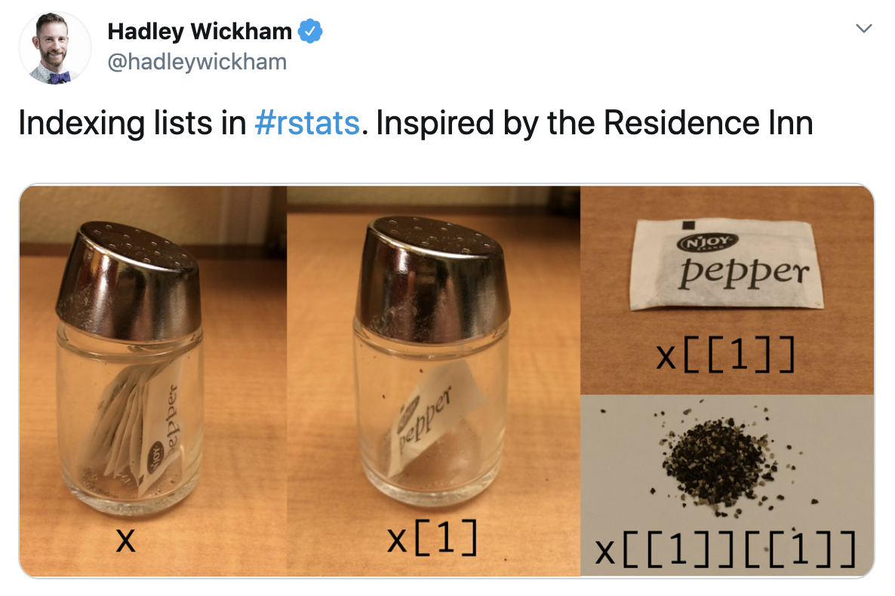

```{r child = "../setup.Rmd"}
```

```{r packages, echo=FALSE, message=FALSE, warning=FALSE}
library(tidyverse)
library(patchwork)
library(knitr)
library(DT)
library(here)
```

class: middle

# Data classes and types

---

## Data types in R

* **logical**
* **double**
* **integer**
* **character**
* **lists**
* and some more, but we won't be focusing on those

---

## Logical & character

.pull-left[
**logical** - boolean values `TRUE` and `FALSE`

```{r}
typeof(TRUE)
```
]
.pull-right[
**character** - character strings

```{r}
typeof("hello")
```
]

---

## Double & integer

.pull-left[
**double** - floating point numerical values (default numerical type)

```{r}
typeof(1.335)
typeof(7)
```
]
.pull-right[
**integer** - integer numerical values (indicated with an `L`)

```{r}
typeof(7L)
typeof(1:3)
```
]

---

## Lists

**Lists** are 1d objects that can contain any combination of R objects

.pull-left[
.midi[
```{r}
mylist <- list(
  "A", 
  1:4, 
  c(TRUE, FALSE), 
  (1:4)/2
  )
mylist
```
]
]
.pull-right[
```{r}
str(mylist)
```
]

---

## Named lists

Because of their more complex structure we often want to name the elements of a list (we 
can also do this with vectors). This can make reading and accessing the list more 
straight forward.

.pull-left[
```{r}
myotherlist <- list(
  A = "hello", 
  B = 1:4, 
  "knock knock" = "who's there?"
  )
```
]
.pull-right[
.midi[
```{r}
str(myotherlist)
names(myotherlist)
myotherlist$B
```
]
]

---

## Concatenation

Vectors can be constructed using the `c()` function.

```{r}
c(1, 2, 3)
c("Hello", "World!")
c(1, c(2, c(3)))
```

---


## Vectors vs. lists

.pull-left[
```{r, error=TRUE}
x <- c(8,4,7)
```
```{r}
x[1]
```
```{r}
x[[1]]
```
]
--
.pull-right[
```{r}
y <- list(8,4,7)
```
```{r}
y[2]
```
```{r}
y[[2]]
```
]

--

<br>

**Note:** When using tidyverse code you'll rarely need to refer to elements using square brackets, but it's good to be aware of this syntax, especially since you might encounter it when searching for help online.

---

```{r echo=FALSE, caption="Hadley Wickham's tweet on indexing with salt and pepper shakers", out.width="80%", fig.align="center"}

```

---

## Type coercion

R will happily convert between the various types without complaint.

```{r}
c(1, "Hello")
c(FALSE, 3L)
c(1.2, 3L)
```

--

...and that's not alwas a great thing!

---

## Missing Values

R uses `NA` to represent missing values in its data structures.

```{r}
typeof(NA)
```

---

## `NA`s are special `r emo::ji('snowflake')`s

```{r}
x <- c(1, 2, 3, 4, NA)
```

```{r}
mean(x)
mean(x, na.rm = TRUE)
summary(x)
```


---

## Other Special Values

`NaN` - Not a number

`Inf` - Positive infinity

`-Inf` - Negative infinity

--

.pull-left[
```{r}
pi / 0
0 / 0
1/0 + 1/0
```
]
.pull-right[
```{r}
1/0 - 1/0
NaN / NA
NaN * NA
```
]

---

.midi[
.your-turn[
- [RStudio Cloud](http://rstd.io/dsbox-cloud) > `AE 06 - Hotels + Data types` > open `type-coercion.Rmd` and knit.
- What is the type of the given vectors? First, guess. Then, try it out in R. 
If your guess was correct, great! If not, discuss why they have that type.
]
]

.small[
**Example:** Suppose we want to know the type of `c(1, "a")`. First, I'd look at: 

.pull-left[
```{r}
typeof(1)
```
]
.pull-right[
```{r}
typeof("a")
```
]

and make a guess based on these. Then finally I'd check:
.pull-left[
```{r}
typeof(c(1, "a"))
```
]
]

---

## Example: Cat lovers

A survey asked respondents their name and number of cats. The instructions said to enter the number of cats as a numerical value.

```{r message=FALSE}
cat_lovers <- read_csv("data/cat-lovers.csv")
```

```{r echo=FALSE}
cat_lovers
```

---

## Oh why won't you work?!

```{r}
cat_lovers %>%
  summarise(mean = mean(number_of_cats))
```

---

```{r eval=FALSE}
?mean
```

```{r echo=FALSE, caption="Help for mean", out.width="80%", fig.align="center"}
include_graphics("img/mean-help.png")
```

---

## Oh why won't you still work??!!

```{r}
cat_lovers %>%
  summarise(mean_cats = mean(number_of_cats, na.rm = TRUE))
```

---

## Take a breath and look at your data

.discussion[
What is the type of the `number_of_cats` variable?
]

```{r}
glimpse(cat_lovers)
```

---

## Let's take another look

.small[
```{r echo=FALSE}
cat_lovers %>%
  datatable()
```
]

---

## You might need to babysit your respondents

```{r}
cat_lovers %>%
  mutate(number_of_cats = case_when(
    name == "Ginger Clark" ~ 2,
    name == "Doug Bass"    ~ 3,
    TRUE                   ~ as.numeric(number_of_cats)
    )) %>%
  summarise(mean_cats = mean(number_of_cats))
```

---

## Always you need to respect data types

```{r}
cat_lovers %>%
  mutate(
    number_of_cats = case_when(
      name == "Ginger Clark" ~ "2",
      name == "Doug Bass"    ~ "3",
      TRUE                   ~ number_of_cats
      ),
    number_of_cats = as.numeric(number_of_cats)
    ) %>%
  summarise(mean_cats = mean(number_of_cats))
```

---

## Now that we know what we're doing...

```{r}
cat_lovers <- cat_lovers %>% #<<
  mutate(
    number_of_cats = case_when(
      name == "Ginger Clark" ~ "2",
      name == "Doug Bass"    ~ "3",
      TRUE                   ~ number_of_cats
      ),
    number_of_cats = as.numeric(number_of_cats)
    )
```

---

## Moral of the story

- If your data does not behave how you expect it to, type coercion upon reading in the data might be the reason.
- Go in and investigate your data, apply the fix, *save your data*, live happily ever after.

---

class: middle

# Data "set"

---

## Data "sets" in R

- "set" is in quotation marks because it is not a formal data class
--

- A tidy data "set" can be one of the following types:
    + `tibble`
    + `data.frame`
--
- We'll often work with `tibble`s:
    + `readr` package (e.g. `read_csv` function) loads data as a `tibble` by default
    + `tibble`s are part of the tidyverse, so they work well with other packages we are using
    + they make minimal assumptions about your data, so are less likely to cause hard to track bugs in your code

---

## Data frames

- A data frame is the most commonly used data structure in R: it is a list of equal length vectors. 
--

- Each vector is treated as a column and elements of the vectors as rows.
--

- A tibble is a type of data frame that makes your life (i.e. data analysis) easier.

---

## Constructing data frames

- Most often a data frame will be constructed by reading in from a file
- But we can also create them from scratch.

.midi[
.pull-left[
```{r}
df <- tibble(
  x = 1:3, 
  y = c("a", "b", "c")
  )
class(df)
glimpse(df)
```
]
.pull-right[
```{r}
df <- tribble(
  ~x, ~y,
  1,  "a",
  2,  "b",
  3,  "c"
)
df
```
]
]

---

## Working with data frames in pipelines

.discussion[
How many respondents have below average number of cats?
]

--

```{r}
mean_cats <- cat_lovers %>%
  summarise(mean_cats = mean(number_of_cats))

cat_lovers %>%
  filter(number_of_cats < mean_cats) %>%
  nrow()
```

--

.discussion[
Do you believe this number? Why, why not?
]

---

## A result of a pipeline is always a data frame

```{r}
mean_cats
class(mean_cats)
```

---

## `pull()` can be your new best friend

But use it sparingly!

```{r}
mean_cats <- cat_lovers %>%
  summarise(mean_cats = mean(number_of_cats)) %>%
  pull() #<<
mean_cats
class(mean_cats)
```

```{r}
cat_lovers %>%
  filter(number_of_cats < mean_cats) %>%
  nrow()
```

--

.pull-left[
```{r}
mean_cats
```
]
.pull-right[
```{r}
class(mean_cats)
```
]

---

## to conlcude discussion on data frames / tibbles...

.pull-left[
```{r echo=FALSE, out.width="60%",fig.align="center"}
include_graphics("img/tibble-part-of-tidyverse.png")
```
]
.pull-right[
- **tibble** is also the name of the Tidyverse package that implements this data type
- But you rarely need to directly load this package since `library(tidyverse)` takes care of it
- And you rarely need to use functions from this package for data wrangling and visualisation, except when you're manually creating your data frames for a short example with `tibble()` or `tribble()`
]

---

## Recap

- Always best to think of data as part of a tibble
    + This plays nicely with the `tidyverse` as well
    + Rows are observations, columns are variables
--
- Be careful about data types / classes
    + Sometimes `R` makes silly assumptions about your data class 
        + Using `tibble`s help, but it might not solve all issues
        + Think about your data in context, e.g. 0/1 variable is most likely a `factor`
    + If a plot/output is not behaving the way you expect, first
    investigate the data class
    + If you are absolutely sure of a data class, overwrite it in your
    tibble so that you don't need to keep having to keep track of it
        + `mutate` the variable with the correct class
        
---

## Two data types worth knowing your way around

- .huge-blue[factors]

- .huge-blue[dates]

---

class: middle

# Factors

---

## Factors

Factor objects are how R stores data for categorical variables (fixed numbers of discrete values).

```{r}
(x = factor(c("BS", "MS", "PhD", "MS")))
```

```{r}
glimpse(x)
```

```{r}
typeof(x)
```

---

## Read data in as character strings

```{r}
glimpse(cat_lovers)
```

---

## But coerce when plotting

```{r out.width="70%"}
ggplot(cat_lovers, mapping = aes(x = handedness)) +
  geom_bar()
```

---

## Use forcats to manipulate factors

```{r fig.retina=3, fig.height=2, fig.width=6}
cat_lovers %>%
  mutate(handedness = fct_infreq(handedness)) %>% #<<
  ggplot(mapping = aes(x = handedness)) +
  geom_bar()
```

---

## Come for the functionality

.pull-left[
... stay for the logo
]
.pull-right[
```{r echo=FALSE, out.width="70%"}
include_graphics("img/forcats-part-of-tidyverse.png")
```
]

- R uses factors to handle categorical variables, variables that have a fixed and known set of possible values
- Factors are useful when you have true categorical data and you want to override the ordering of character vectors to improve display
- They are also useful in modeling scenarios
- The **forcats** package provides a suite of useful tools that solve common problems with factors

---

.your-turn[
- [RStudio Cloud](http://rstd.io/dsbox-cloud) > start `AE 06 - Hotels + Data types` > open `hotels-forcats.Rmd` and knit.
- Recreate the following. The x-axis first, then, as a stretch goal, the y-axis.
]

```{r fig.height=3, fig.width=9, echo=FALSE, message=FALSE, warning=FALSE}
library(scales)
hotels <- readr::read_csv("https://raw.githubusercontent.com/rfordatascience/tidytuesday/master/data/2020/2020-02-11/hotels.csv")
hotels %>%
  group_by(hotel, arrival_date_month) %>%   # group by hotel type and arrival month
  summarise(mean_adr = mean(adr)) %>%       # calculate mean_adr for each group
  ggplot(aes(
    x = arrival_date_month,
    y = mean_adr,                           # y-axis is the mean_adr calculated above
    group = hotel,                          # group lines by hotel type
    color = hotel)                          # and color by hotel type
    ) +
  geom_line() +                             # use lines to represent data
  scale_y_continuous(labels = label_dollar()) +
  theme_minimal() +                         # use a minimal theme
  labs(x = "Arrival month",                 # customize labels
       y = "Mean ADR (average daily rate)",
       title = "Comparison of resort and city hotel prices across months",
       subtitle = "Resort hotel prices soar in the summer while city hotel prices remain relatively constant throughout the year",
       color = "Hotel type")
```

---

class: middle

# Dates

---

## Make a date

.pull-left[
```{r echo=FALSE, out.width="70%", fig.align="center"}
include_graphics("img/lubridate-not-part-of-tidyverse.png")
```
]
.pull-right[
- **lubridate** is the tidyverse-friendly package that makes dealing with dates a little easier
- It's not one of the *core* tidyverse packages, hence it's installed with `install.packages("tidyverse)` but it's not loaded with it, and needs to be explicitly loaded with `library(lubridate)`
]

---

class: middle

.hand-blue[
we're just going to scratch the surface of working with dates in R here...
]


---

.discussion[
Calculate and visualise the number of bookings on any given arrival date.
]

```{r}
hotels %>%
  select(starts_with("arrival_"))
```

---

### Step 1. Put together dates.

.midi[
```{r}
library(glue)

hotels %>%
  mutate(
    arrival_date = glue("{arrival_date_year} {arrival_date_month} {arrival_date_day_of_month}") #<<
    ) %>% 
  select(starts_with("arrival_"))
```
]

---

### Step 2. Count number of bookings per date.

.midi[
```{r}
hotels %>%
  mutate(arrival_date = glue("{arrival_date_year} {arrival_date_month} {arrival_date_day_of_month}")) %>%
  count(arrival_date)
```
]

---

### Step 3. Visualise number of bookings per date.

.midi[
```{r fig.height=3, fig.width=9}
hotels %>%
  mutate(arrival_date = glue("{arrival_date_year} {arrival_date_month} {arrival_date_day_of_month}")) %>%
  count(arrival_date) %>%
  ggplot(aes(x = arrival_date, y = n, group = 1)) +
  geom_line() +
  ylim(0, 450)
```
]

---

.hand[zooming in a bit...]

.question[
Why does the plot start with August when we know our data start in July? And why does 10 August come after 1 August?
]

.midi[
```{r fig.height=3, fig.width=9, echo=FALSE}
hotels %>%
  mutate(arrival_date = glue("{arrival_date_year} {arrival_date_month} {arrival_date_day_of_month}")) %>%
  count(arrival_date) %>%
  slice(1:7) %>%
  ggplot(aes(x = arrival_date, y = n, group = 1)) +
  geom_line()
```
]

---

### Step 1. `REVISED` Put together dates `as dates`.

.midi[
```{r}
library(lubridate)

hotels %>%
  mutate(
    arrival_date = ymd(glue("{arrival_date_year} {arrival_date_month} {arrival_date_day_of_month}")) #<<
    ) %>% 
  select(starts_with("arrival_"))
```
]

---

### Step 2. Count number of bookings per date.

.midi[
```{r}
hotels %>%
  mutate(arrival_date = ymd(glue("{arrival_date_year} {arrival_date_month} {arrival_date_day_of_month}"))) %>% 
  count(arrival_date)
```
]

---

### Step 3a. Visualise number of bookings per date.

.midi[
```{r fig.height=3, fig.width=9}
hotels %>%
  mutate(arrival_date = ymd(glue("{arrival_date_year} {arrival_date_month} {arrival_date_day_of_month}"))) %>% 
  count(arrival_date) %>%
  ggplot(aes(x = arrival_date, y = n, group = 1)) +
  geom_line() +
  ylim(0, 450)
```
]

---

### Step 3b. Visualise using a smooth curve.

.midi[
```{r fig.height=3, fig.width=9, message=FALSE}
hotels %>%
  mutate(arrival_date = ymd(glue("{arrival_date_year} {arrival_date_month} {arrival_date_day_of_month}"))) %>% 
  count(arrival_date) %>%
  ggplot(aes(x = arrival_date, y = n, group = 1)) +
  geom_smooth() + #<<
  ylim(0, 450)
```
]
