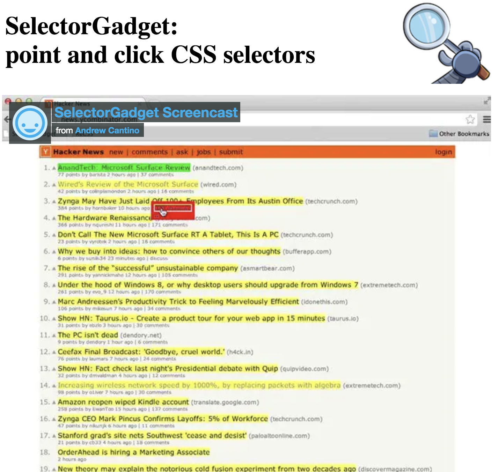
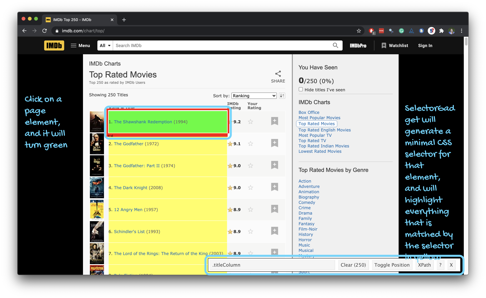
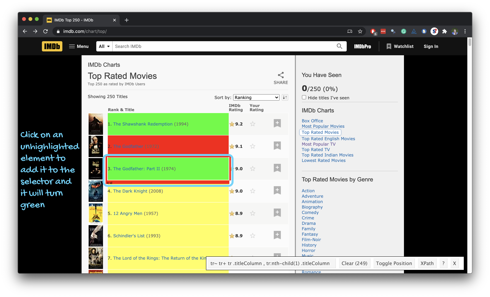

```{r child = "../setup.Rmd"}
```

```{r packages, echo = FALSE, message=FALSE, warning=FALSE}
library(tidyverse)
library(rvest)
library(DT)
```

class: middle

# Scraping the web

---

## Scraping the web: what? why?

- Increasing amount of data is available on the web
--

- These data are provided in an unstructured format: you can always copy&paste, but it's time-consuming and prone to errors

--
- Web scraping is the process of extracting this information automatically and transform it into a structured dataset

--
- Two different scenarios:
    - Screen scraping: extract data from source code of website, with html parser (easy) or regular expression matching (less easy).
    - Web APIs (application programming interface): website offers a set of structured http requests that return JSON or XML files.

---

class: middle

# Web Scraping with rvest

---

## Hypertext Markup Language

- Most of the data on the web is still largely available as HTML 
- It is structured (hierarchical / tree based), but it''s often not available in a form useful for analysis (flat / tidy).

```html
<html>
  <head>
    <title>This is a title</title>
  </head>
  <body>
    <p align="center">Hello world!</p>
  </body>
</html>
```

---

## rvest

.pull-left[
- The **rvest** package makes basic processing and manipulation of HTML data straight forward
- It's designed to work with pipelines built with `%>%`
]
.pull-right[
```{r echo=FALSE,out.width=230,fig.align="right"}
knitr::include_graphics("img/rvest.png")
```
]

---

## Core rvest functions

- `read_html`   - Read HTML data from a url or character string
- `html_node `  - Select a specified node from HTML document
- `html_nodes`  - Select specified nodes from HTML document
- `html_table`  - Parse an HTML table into a data frame
- `html_text`   - Extract tag pairs' content
- `html_name`   - Extract tags' names
- `html_attrs`  - Extract all of each tag's attributes
- `html_attr`   - Extract tags' attribute value by name

---

## SelectorGadget

.pull-left-narrow[
- Open source tool that eases CSS selector generation and discovery
- Easiest to use with the [Chrome Extension](https://chrome.google.com/webstore/detail/selectorgadget/mhjhnkcfbdhnjickkkdbjoemdmbfginb) 
- Find out more on the [SelectorGadget vignette](https://cran.r-project.org/web/packages/rvest/vignettes/selectorgadget.html)
]
.pull-right-wide[
```{r echo=FALSE, out.width="75%"}

```
]

---

## Using the SelectorGadget

```{r echo=FALSE, out.width="80%"}
knitr::include_graphics("img/selector-gadget/selector-gadget.gif")
```

---

```{r echo=FALSE, out.width="95%"}
knitr::include_graphics("img/selector-gadget/selector-gadget-1.png")
```

---

```{r echo=FALSE, out.width="95%"}
knitr::include_graphics("img/selector-gadget/selector-gadget-2.png")
```

---

```{r echo=FALSE, out.width="95%"}

```

---

```{r echo=FALSE, out.width="95%"}
knitr::include_graphics("img/selector-gadget/selector-gadget-4.png")
```

---

```{r echo=FALSE, out.width="95%"}

```

---

## Using the SelectorGadget

Through this process of selection and rejection, SelectorGadget helps you come up with the appropriate CSS selector for your needs

```{r echo=FALSE, out.width="65%"}
knitr::include_graphics("img/selector-gadget/selector-gadget.gif")
```
