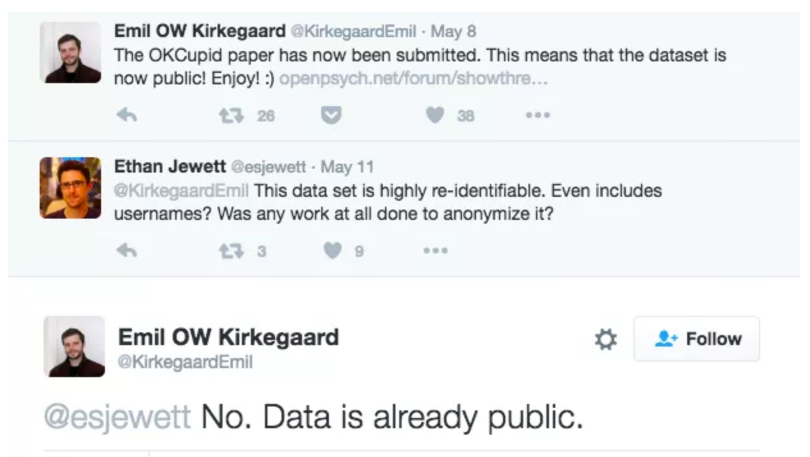
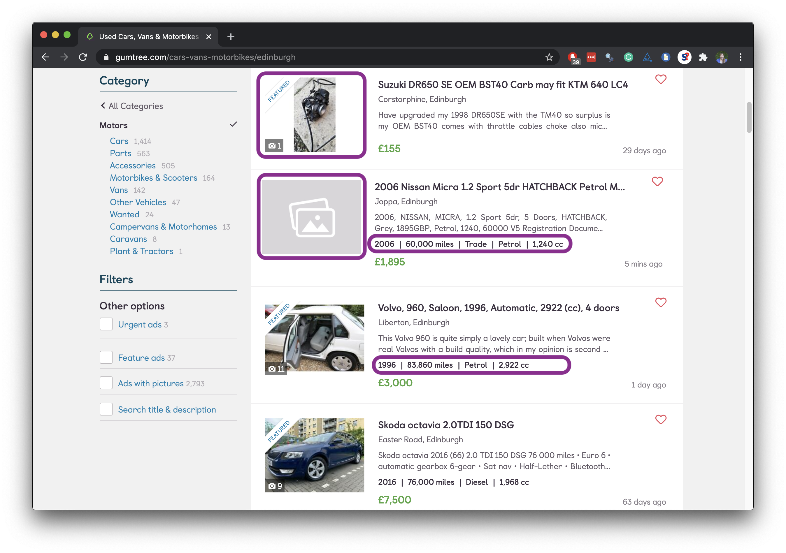
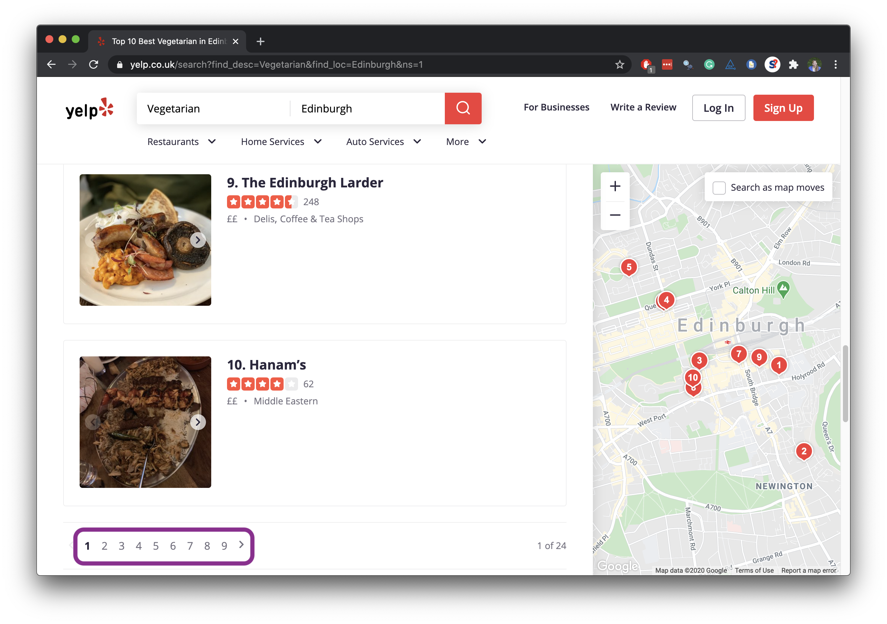

```{r child = "../setup.Rmd"}
```

```{r packages, echo = FALSE, message=FALSE, warning=FALSE}
library(tidyverse)
```

class: middle

# Ethics

---

## "Can you?" vs "Should you?"

```{r echo=FALSE, out.width="60%"}
knitr::include_graphics("img/ok-cupid-1.png")
```

.footnote[.small[
Source: Brian Resnick, [Researchers just released profile data on 70,000 OkCupid users without permission](https://www.vox.com/2016/5/12/11666116/70000-okcupid-users-data-release), Vox.
]]

---

## "Can you?" vs "Should you?"

```{r echo=FALSE, out.width="70%"}

```

---

class: middle

# Challenges

---

## Unreliable formatting at the source

```{r echo=FALSE, out.width="70%"}

```

---

## Data broken into many pages

```{r echo=FALSE, out.width="70%"}

```

---

class: middle

# Workflow

---

## Screen scraping vs. APIs

Two different scenarios for web scraping:

- Screen scraping: extract data from source code of website, with html parser (easy) or regular expression matching (less easy)

- Web APIs (application programming interface): website offers a set of structured http requests that return JSON or XML files

---

## A new R workflow

- When working in an R Markdown document, your analysis is re-run each time you knit

- If web scraping in an R Markdown document, you'd be re-scraping the data each time you knit, which is undesirable (and not *nice*)!

- An alternative workflow: 
  - Use an R script to save your code 
  - Saving interim data scraped using the code in the script as CSV or RDS files
  - Use the saved data in your analysis in your R Markdown document
