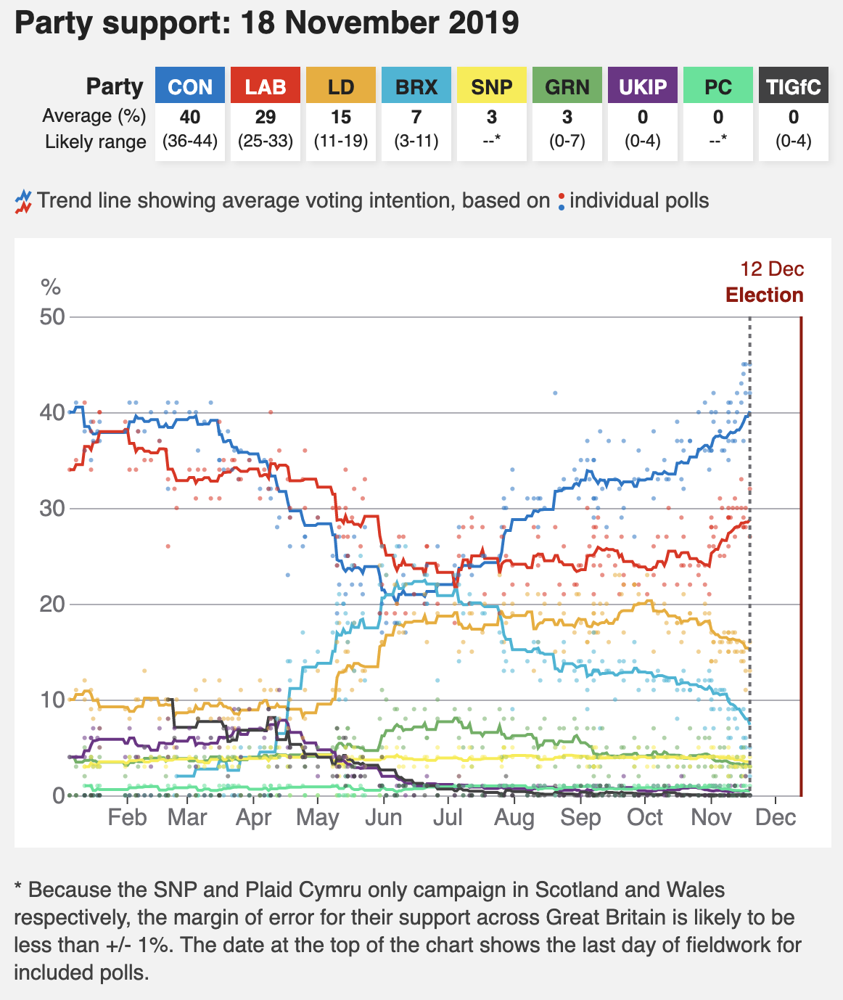
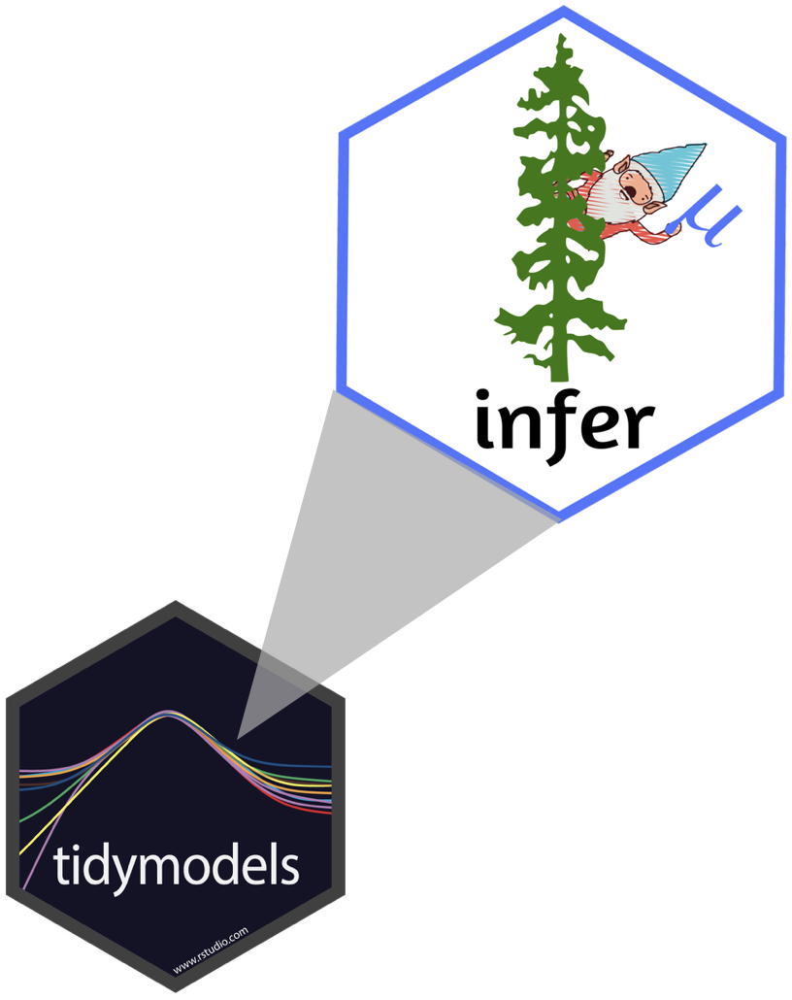

```{r child = "../setup.Rmd"}
```

```{r packages, echo=FALSE, message=FALSE, warning=FALSE}
library(tidyverse)
library(broom)
```

class: middle

# Inference

---

- Statistical inference is the process of using sample data to make conclusions 
about the underlying population the sample came from.
- Similar to tasting a spoonful of soup while cooking to make an inference about the entire pot.

```{r echo=FALSE, out.width="60%"}
knitr::include_graphics("img/photo-1571942676516-bcab84649e44.png")
```

---

## Estimation

So far we have done lots of estimation (mean, median, slope, etc.), i.e.
- used data from samples to calculate sample statistics
- which can then be used as estimates for population parameters

---

.question[
If you want to catch a fish, do you prefer a spear or a net?
]

<br>

.pull-left[
```{r echo=FALSE, out.width="80%"}
knitr::include_graphics("img/spear.png")
```
]
.pull-right[
```{r echo=FALSE, out.width="80%"}
knitr::include_graphics("img/net.png")
```
]

---

.question[
If you want to estimate a population parameter, do you prefer to report a range 
of values the parameter might be in, or a single value?
]

<br>

--

- If we report a point estimate, we probably won’t hit the exact population 
parameter.
- If we report a range of plausible values we have a good shot at capturing 
the parameter.

---

```{r echo=FALSE, out.width=450}

```

.footnote[
Source: [General election poll tracker: How do the parties compare?](https://www.bbc.co.uk/news/uk-politics-49798197), 18 Nov 2019.
]

---

class: middle

# Confidence intervals

---

## Confidence intervals

A plausible range of values for the population parameter is a **confidence interval**.

--
- In order to construct a confidence interval we need to quantify the variability 
of our sample statistic.

--
- For example, if we want to construct a confidence interval for a population mean, 
we need to come up with a plausible range of values around our observsed sample mean.

--
- This range will depend on how precise and how accurate our sample mean is as an 
estimate of the population mean.

--
- Quantifying this requires a measurement of how much we would expect the sample 
mean to vary from sample to sample.

---

.question[
Suppose we split the class in half down the middle of the classroom and ask 
each student their heights. Then, we calculate the mean height of students 
on each side of the classroom. Would you expect these two means to be exactly 
equal, close but not equal, or wildly different?
]

--

<br><br>

.question[
Suppose you randomly sample 50 students and 5 of them are left handed. If you 
were to take another random sample of 50 students, how many would you expect to 
be left handed? Would you be surprised if only 3 of them were left handed? Would 
you be surprised if 40 of them were left handed?
]

---

## Quantifying the variability of a sample statistic

We can quantify the variability of sample statistics using

- simulation: via bootstrapping (today)

or

- theory: via Central Limit Theorem (in Stat 2!)

---

class: middle

# Bootstrapping

---

## Bootstrapping


- The term **bootstrapping** comes from the phrase "pulling oneself up by one’s 
bootstraps", which is a metaphor for accomplishing an impossible task without 
any outside help.
- In this case the impossible task is estimating a population parameter, and we’ll 
accomplish it using data from only the given sample.
- Note that this notion of saying something about a population parameter using 
only information from an observed sample is the crux of statistical inference, 
it is not limited to bootstrapping.

---

## Rent in Edinburgh

.question[
Take a guess! How much does a typical 3 BR flat in Edinburgh rents for?
]

---

## Sample

Fifteen 3 BR flats in Edinburgh were randomly selected on rightmove.co.uk.

```{r message=FALSE}
library(tidyverse)
edi_3br <- read_csv2("data/edi-3br.csv") # ; separated
```

.small[
```{r, echo=FALSE}
edi_3br
```
]

---

## Observed sample

```{r message=FALSE, echo=FALSE, out.width="80%"}
ggplot(data = edi_3br, mapping = aes(x = rent)) +
  geom_histogram(binwidth = 200) +
  labs(title = "Rent of 3 BR flats in Edinburgh")
```

---

## Observed sample

Sample mean ≈ £`r edi_3br %>% summarise(med_rent = mean(rent)) %>% pull() %>% round()` `r emo::ji("scream")`

<br>

```{r echo=FALSE, out.width="90%"}
knitr::include_graphics("img/rent-bootsamp.png")
```

---

## Bootstrap population

Generated assuming there are more flats like the ones in the observed sample... Population mean = `r emo::ji("question")`

<br>

```{r echo=FALSE, out.width="90%"}
knitr::include_graphics("img/rent-bootpop.png")
```

---

## Bootstrapping scheme

1. Take a bootstrap sample - a random sample taken **with replacement** from the 
original sample, of the same size as the original sample.
2. Calculate the bootstrap statistic - a statistic such as mean, median, 
proportion, slope, etc. computed on the bootstrap samples.
3. Repeat steps (1) and (2) many times to create a bootstrap distribution - 
a distribution of bootstrap statistics.
4. Calculate the bounds of the XX% confidence interval as the middle XX% 
of the bootstrap distribution.

---

## Let's bootstrap

<iframe src="https://wheeldecide.com/e.php?c1=825+&c2=2400&c3=1900&c4=1500&c5=3250&c6=2145&c7=1500&c8=1950&c9=1725&c10=2995&c11=1400&c12=1995&c13=1250&c14=1995&c15=1600&time=5" width="500" height="500" scrolling="no" frameborder="0" align="center"></iframe>

---

class: middle

# Bootstrapping in R

---

## Two ways

1. Using `for` loops
2. Using the **infer** package


---

## Bootstrapping with `for` loops

.question[
Work in groups to explain what is happening in each line of the code below.
]

```{r}
set.seed(9014)

boot_df <- tibble(
  replicate = 1:100,
  stat = rep(NA, 100)
  )

for (i in 1:100){
   boot_df$stat[i] <- edi_3br %>% 
     sample_n(15, replace = TRUE) %>% 
     summarise(stat = mean(rent)) %>% 
     pull()
}
```

---

## Bootstrap results

```{r out.width="60%"}
ggplot(boot_df, aes(x = stat)) +
  geom_histogram(binwidth = 100)
```

.pull-left[
.small[
```{r eval=FALSE}
boot_df %>%
  summarise(
    lower = quantile(stat, 0.025),
    upper = quantile(stat, 0.975),
    )
```
]
]
.pull-right[
```{r echo=FALSE}
boot_df %>%
  summarise(
    lower = quantile(stat, 0.025),
    upper = quantile(stat, 0.975),
    )
```
]

---

## infer $\in$ tidymodels

.pull-left[
```{r echo=FALSE, out.width=350}

```
]
.pull-right[
The objective of `infer` is to perform statistical inference using an expressive statistical grammar that coheres with the `tidyverse` design framework.
```{r}
library(infer)
```
]

.footnote[
[infer.netlify.com](https://infer.netlify.com/)
]

---

## Generate bootstrap means

```{r eval=FALSE}
edi_3br %>%
  # specify the variable of interest
  specify(response = rent)
```

---

## Generate bootstrap means

```{r eval=FALSE}
edi_3br %>%
  # specify the variable of interest
  specify(response = rent)
  # generate 15000 bootstrap samples
  generate(reps = 15000, type = "bootstrap")
```

---

## Generate bootstrap means

```{r eval=FALSE}
edi_3br %>%
  # specify the variable of interest
  specify(response = rent)
  # generate 15000 bootstrap samples
  generate(reps = 15000, type = "bootstrap")
  # calculate the mean of each bootstrap sample
  calculate(stat = "mean")
```

---

## Generate bootstrap means

```{r include=FALSE}
set.seed(834782)
```


```{r}
# save resulting bootstrap distribution
boot_df <- edi_3br %>%
  # specify the variable of interest
  specify(response = rent) %>% 
  # generate 15000 bootstrap samples
  generate(reps = 15000, type = "bootstrap") %>% 
  # calculate the mean of each bootstrap sample
  calculate(stat = "mean")
```

---

## The bootstrap sample

.question[
How many observations are there in `boot_df`? What does each observation represent?
]

```{r}
boot_df
```

---

## Visualize the bootstrap distribution

```{r out.width="80%"}
ggplot(data = boot_df, mapping = aes(x = stat)) +
  geom_histogram(binwidth = 100) +
  labs(title = "Bootstrap distribution of means")
```

---

## Calculate the confidence interval

A 95% confidence interval is bounded by the middle 95% of the bootstrap distribution.

```{r}
boot_df %>%
  summarize(lower = quantile(stat, 0.025),
            upper = quantile(stat, 0.975))
```

---

## Visualize the confidence interval

```{r include=FALSE}
# for using these values later
lower_bound <- boot_df %>% summarize(lower_bound = quantile(stat, 0.025)) %>% pull() %>% round()
upper_bound <- boot_df %>% summarize(upper_bound = quantile(stat, 0.975)) %>% pull() %>% round()
```

```{r echo=FALSE, out.width="80%"}
ggplot(data = boot_df, mapping = aes(x = stat)) +
  geom_histogram(binwidth = 100) +
  geom_vline(xintercept = c(lower_bound, upper_bound), 
             color = "#A7D5E8", lty = 2) +
  labs(title = "Bootstrap distribution of means",
       subtitle = "and 95% confidence interval")
```

---

## Interpret the confidence interval

.question[
The 95% confidence interval for the mean rent of three bedroom flats in 
Edinburgh was calculated as (`r lower_bound`, `r upper_bound`). Which of the 
following is the correct interpretation of this interval?

<br>

**(a)** 95% of the time the mean rent of three bedroom flats in this sample is between £`r lower_bound` and £`r upper_bound`.

**(b)** 95% of all three bedroom flats in Edinburgh have rents between £`r lower_bound` and £`r upper_bound`.

**(c)** We are 95% confident that the mean rent of all three bedroom flats is between £`r lower_bound` and £`r upper_bound`.

**(d)** We are 95% confident that the mean rent of three bedroom flats in this sample is between £`r lower_bound` and £`r upper_bound`.
]

---

class: middle

# Accuracy vs. precision

---

## Confidence level

**We are 95% confident that ...**

- Suppose we took many samples from the original population and built a 95% confidence interval based on each sample.
- Then about 95% of those intervals would contain the true population parameter.

---

## Commonly used confidence levels

.question[
Which line (orange dash/dot, blue dash, green dot) represents which confidence level?
]

```{r echo=FALSE, out.width="80%"}
l90 <- boot_df %>% summarize(lower_bound = quantile(stat, 0.05)) %>% round(2) %>% pull()
u90 <- boot_df %>% summarize(lower_bound = quantile(stat, 0.95)) %>% round(2) %>% pull()

l99 <- boot_df %>% summarize(lower_bound = quantile(stat, 0.005)) %>% round(2) %>% pull()
u99 <- boot_df %>% summarize(lower_bound = quantile(stat, 0.995)) %>% round(2) %>% pull()

ggplot(data = boot_df, mapping = aes(x = stat)) +
  geom_histogram(binwidth = 100) +
  geom_vline(xintercept = c(lower_bound, upper_bound), color = "#A7D5E8", lty = 2) +
  geom_vline(xintercept = c(l90, u90), color = "chartreuse4", lty = 3) +
  geom_vline(xintercept = c(l99, u99), color = "orange", lty = 6) +
  labs(title = "Bootstrap distribution of means",
       subtitle = "and various confidence intervals")
```

---

## Precision vs. accuracy

.question[
If we want to be very certain that we capture the population parameter, should 
we use a wider interval or a narrower interval? What drawbacks are associated 
with using a wider interval?
]

--


--

.question[
How can we get best of both worlds -- high precision and high accuracy?
]

---

## Changing confidence level

.question[
How would you modify the following code to calculate a 90% confidence interval? 
How would you modify it for a 99% confidence interval?
]

```{r eval=FALSE}
edi_3br %>%
  specify(response = rent) %>% 
  generate(reps = 15000, type = "bootstrap") %>% 
  calculate(stat = "mean") %>%
  summarize(lower = quantile(stat, 0.025),
            upper = quantile(stat, 0.975))
```

---

## Recap

- Sample statistic $\ne$ population parameter, but if the sample is good, it can be a good estimate.
- We report the estimate with a confidence interval, and the width of this interval depends on the variability of sample statistics from different samples from the population.
- Since we can't continue sampling from the population, we bootstrap from the one sample we have to estimate sampling variability.
- We can do this for any sample statistic:
  - For a mean: `calculate(stat = "mean")`
  - For a median: `calculate(stat = "median")`
  - Learn about calculating bootstrap intervals for other statistics 
  in your homework.
  
