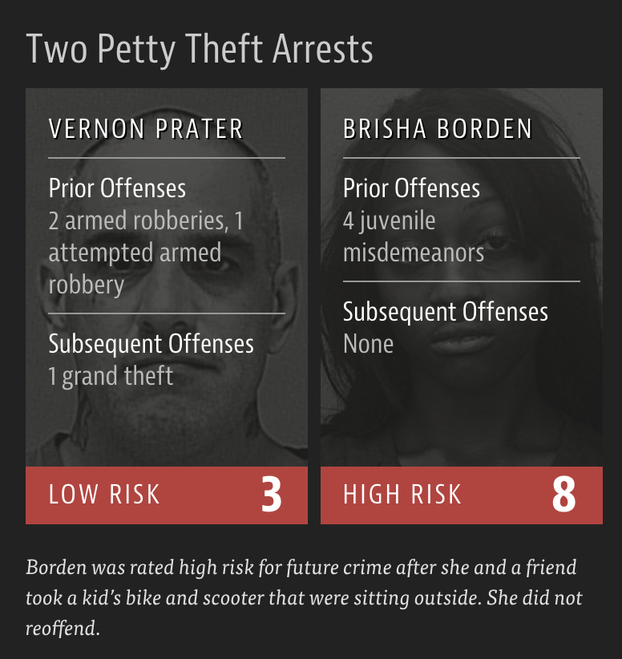

```{r child = "../setup.Rmd"}
```

```{r packages, echo = FALSE, message=FALSE, warning=FALSE}
library(tidyverse)
```

class: middle

# First a bit of fun...
# The Hathaway Effect

---

.pull-left[
- Oct. 3, 2008: Rachel Getting Married opens, BRK.A up 0.44%  
- Jan. 5, 2009: Bride Wars opens, BRK.A up 2.61%  
- Feb. 8, 2010: Valentine’s Day opens, BRK.A up 1.01%  
- March 5, 2010: Alice in Wonderland opens,  BRK.A up 0.74%  
- Nov. 24, 2010: Love and Other Drugs opens, BRK.A up 1.62%  
- Nov. 29, 2010: Anne announced as co-host of the Oscars, BRK.A up 0.25%
]
.pull-right[
```{r echo=FALSE, fig.align="left"}
knitr::include_graphics("img/hathaway-effect-poster.jpg")
```
]

.footnote[
.midi[
Dan Mirvish. [The Hathaway Effect: How Anne Gives Warren Buffett a Rise](https://www.huffpost.com/entry/the-hathaway-effect-how-a_b_830041).  
The Huffington Post. 2 Mar 2011.
]
]

---

class: middle

# Algorithmic bias and gender

---

## Google Translate

```{r echo=FALSE, out.width="100%"}
knitr::include_graphics("img/google-translate-gender-bias.png")
```

---

## Amazon's experimental hiring algorithm

- Used AI to give job candidates scores ranging from one to five stars -- much like shoppers rate products on Amazon
- Amazon's system was not rating candidates for software developer jobs and other technical posts in a gender-neutral way; it taught itself that male candidates were preferable

.pull-left-wide[
>Gender bias was not the only issue. Problems with the data that underpinned the models’ judgments meant that unqualified candidates were often recommended for all manner of jobs, the people said.
]

.footnote[
Jeffrey Dastin. [Amazon scraps secret AI recruiting tool that showed bias against women](https://reut.rs/2Od9fPr).  
Reuters. 10 Oct 2018.
]

---

class: middle

# Algorithmic bias and race

---

## Facial recognition

```{r echo=FALSE, out.width="35%"}
knitr::include_graphics("img/guardian-facial-recognition.png")
```

.footnote[
.midi[
Ian Tucker. ['A white mask worked better': why algorithms are not colour blind](https://www.theguardian.com/technology/2017/may/28/joy-buolamwini-when-algorithms-are-racist-facial-recognition-bias).  
The Guardian. 28 May 2017.
]
]

---

## Criminal Sentencing

.center[
There’s software used across the country to predict future criminals.  
And it’s biased against blacks.
]

```{r out.width="60%", echo=FALSE}
knitr::include_graphics("img/propublica-criminal-sentencing.png")
```

.footnote[
.midi[
Julia Angwin, Jeff Larson, Surya Mattu, and Lauren Kirchner. [Machine Bias](https://www.propublica.org/article/machine-bias-risk-assessments-in-criminal-sentencing). 23 May 2016. ProPublica.
]
]

---

## A tale of two convicts

.pull-left[

]
--
.pull-right[

]

---

class: middle

>“Although these measures were crafted with the best of intentions, I am concerned that they inadvertently undermine our efforts to ensure individualized and equal justice,” he said, adding, “they may exacerbate unwarranted and unjust disparities that are already far too common in our criminal justice system and in our society.”
>  
>Then U.S. Attorney General Eric Holder (2014)

---

## ProPublica analysis

### **Data:**

Risk scores assigned to more than 7,000 people arrested in Broward County, Florida, in 2013 and 2014 + whether they were charged with new crimes over the next two years

---

## ProPublica analysis

### **Results:**

- 20% of those predicted to commit violent crimes actually did
- Algorithm had higher accuracy (61%) when full range of crimes taken into account (e.g. misdemeanors)
```{r echo=FALSE, out.width = "85%"}
knitr::include_graphics("img/propublica-results.png")
```
- Algorithm was more likely to falsely flag black defendants as future criminals, at almost twice the rate as white defendants
- White defendants were mislabeled as low risk more often than black defendants

---

## How to write a racist AI without trying

.center[
<iframe width="900" height="450" src="https://notstatschat.rbind.io/2018/09/27/how-to-write-a-racist-ai-in-r-without-really-trying/" frameborder="0" style="background:white;"></iframe>  
]

.footnote[
.midi[
Thomas Lumley. [How to write a racist AI in R without really trying](https://notstatschat.rbind.io/2018/09/27/how-to-write-a-racist-ai-in-r-without-really-trying/).  
Biased and Inefficient. 27 September 2018.
]
]

---

class: middle

# Further reading

---

## Machine Bias

.pull-left[
```{r echo=FALSE, out.width="100%"}
knitr::include_graphics("img/propublica-machine-bias.png")
```
]
.pull-right[
[Machine Bias](https://www.propublica.org/article/machine-bias-risk-assessments-in-criminal-sentencing)  
<br>
by Julia Angwin, Jeff Larson, Surya Mattu, and Lauren Kirchner
]

---

## Ethics and Data Science

.pull-left[
```{r echo=FALSE, out.width="65%"}
knitr::include_graphics("img/ethics-data-science.jpg")
```
]
.pull-right[
[Ethics and Data Science](https://www.amazon.com/Ethics-Data-Science-Mike-Loukides-ebook/dp/B07GTC8ZN7)  
<br>
by Mike Loukides, Hilary Mason, DJ Patil  
(Free Kindle download)
]

---

## Weapons of Math Destruction

.pull-left[
```{r echo=FALSE, out.width="65%"}
knitr::include_graphics("img/weapons-of-math-destruction.jpg")
```
]
.pull-right[
[Weapons of Math Destruction](https://www.penguin.co.uk/books/304/304513/weapons-of-math-destruction/9780141985411.html)  
How Big Data Increases Inequality and Threatens Democracy  
<br>
by Cathy O'Neil
]

---

## Algorithms of Oppression

.pull-left[
```{r echo=FALSE, out.width="65%"}
knitr::include_graphics("img/algorithms-of-oppression.jpg")
```
]
.pull-right[
[Algorithms of Oppression](https://nyupress.org/9781479837243/algorithms-of-oppression/)  
How Search Engines Reinforce Racism  
<br>
by Safiya Umoja Noble
]

---

## Parting thoughts

- At some point during your data science learning journey you will learn tools that can be used unethically
- You might also be tempted to use your knowledge in a way that is ethically questionable either because of business goals or for the pursuit of further knowledge (or because your boss told you to do so)

.question[
How do you train yourself to make the right decisions (or reduce the likelihood of accidentally making the wrong decisions) at those points?
]

---

## Do good with data

- Data Science for Social Good: 
  - [The Alan Turing Institute](https://www.turing.ac.uk/collaborate-turing/data-science-social-good)
  - [University of Chicago](https://dssg.uchicago.edu/)
- [DataKind](https://www.datakind.org/): DataKind brings high-impact organizations together with leading data scientists to use data science in the service of humanity.
- Sign the Manifesto for Data Practices: [datapractices.org/manifesto](https://datapractices.org/manifesto/)

---

## Further watching

.center[
<iframe width="800" height="450" src="https://www.youtube.com/embed/fgf2VjnhpCs?start=1162" frameborder="0" allow="accelerometer; autoplay; encrypted-media; gyroscope; picture-in-picture" allowfullscreen></iframe>  
]

.footnote[
.midi[
Julien Cornebise. AI for Good in the R and Python ecosystems. useR 2019.
]
]
