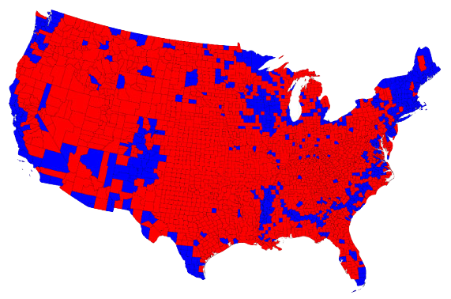
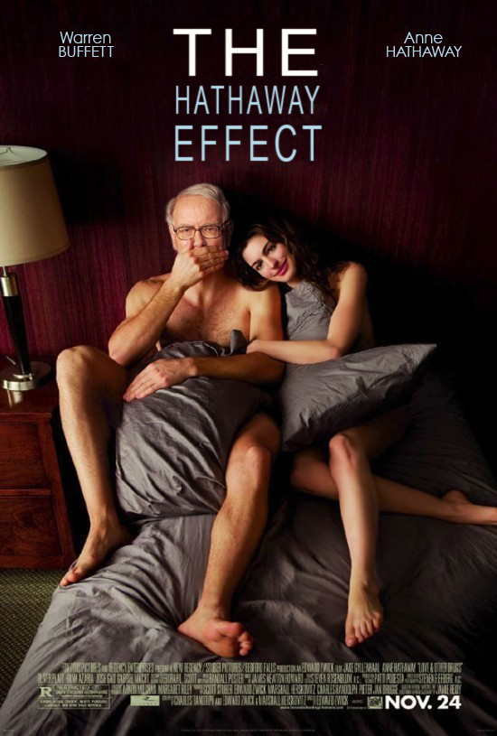
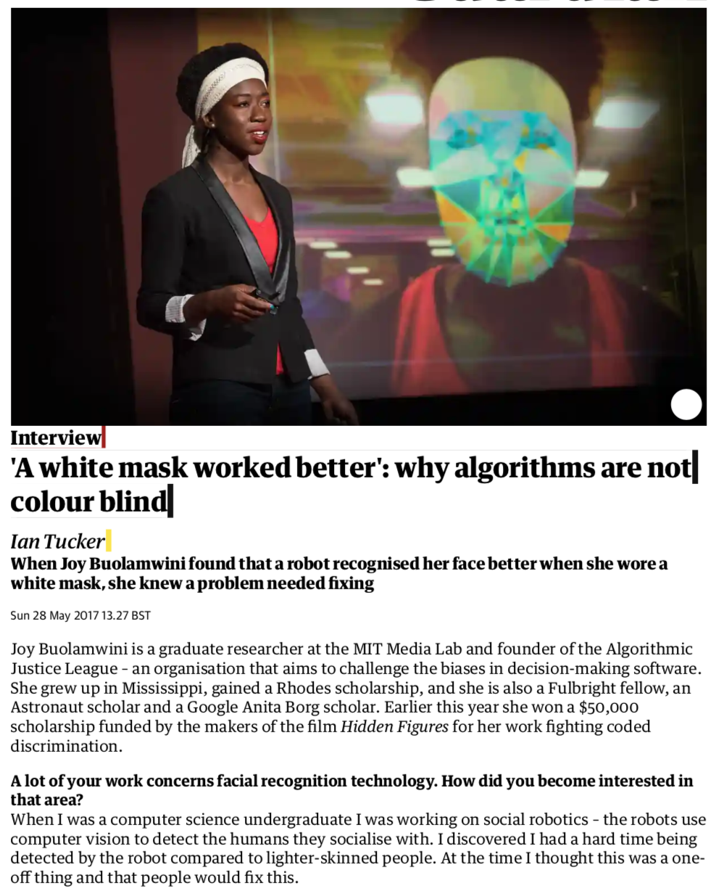
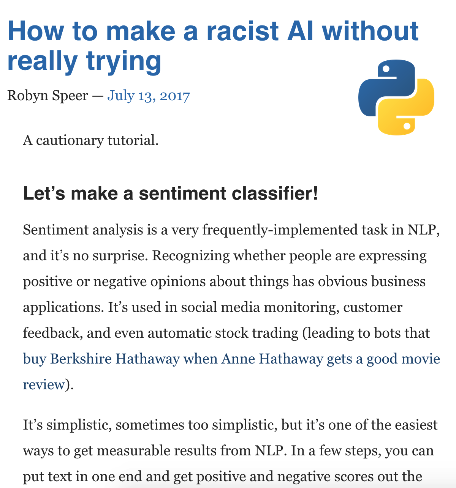
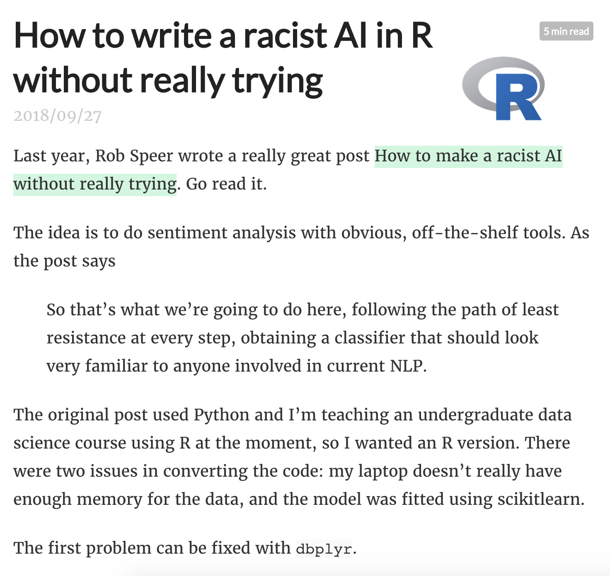

```{r child = "../setup.Rmd"}
```

```{r packages, echo=FALSE, message=FALSE, warning=FALSE}
library(tidyverse)
library(broom)
```

## Data science ethics

- Misrepresentation
- Privacy
- Algorithmic bias

---

class: middle

# Misrepresentation

---

.question[
What is the difference between these two pictures? Which presents a better way to represent these data?
]

<br>

```{r echo=FALSE, out.width=850, fig.align="center"}
knitr::include_graphics("img/axis-start-at-0.png")
```

.footnote[
Ingraham, C. (2019) ["You’ve been reading charts wrong. Here’s how a pro does it."](https://www.washingtonpost.com/business/2019/10/14/youve-been-reading-charts-wrong-heres-how-pro-does-it/), The Washington Post, 14 Oct.
]

---

.question[
What is wrong with this picture? How would you correct it?
]

```{r echo=FALSE, out.width=850, fig.align="center"}
knitr::include_graphics("img/cost_of_gas.png")
```

---

.question[
Do you recognize this map? What does it show?
]

```{r echo=FALSE, out.width=700, fig.align="center"}

```

--

.footnote[
Gamio, L. (2016) ["Election maps are telling you big lies about small things"](https://www.washingtonpost.com/graphics/politics/2016-election/how-election-maps-lie/), The Washington Post, 1 Nov.
]

---

.pull-left[
```{r echo=FALSE, out.width=350, fig.align="center"}
knitr::include_graphics("img/citizens-for-trump.png")
```
]
--
.pull-right[
```{r echo=FALSE, out.width=350, fig.align="center"}
knitr::include_graphics("img/counties-for-trump.png")
```
]

.footnote[
Credit: Alberto Cairo, [Visual Trumpery talk](https://visualtrumperytour.wordpress.com/).
]

---

```{r echo=FALSE, out.width=800, fig.align="center"}
knitr::include_graphics("img/cairo-vote-percentages.png")
```

.footnote[
Credit: Alberto Cairo, [Visual Trumpery talk](https://visualtrumperytour.wordpress.com/).
]

---

```{r echo=FALSE, out.width=900, fig.align="center"}
  knitr::include_graphics("img/cairo-what-matters.png")
```

.footnote[
Credit: Alberto Cairo, [Visual Trumpery talk](https://visualtrumperytour.wordpress.com/).
]

---

## Further reading

.pull-left[
```{r echo=FALSE, out.width=350, fig.align="right"}
knitr::include_graphics("img/cairo-how-charts-lie.jpg")
```
]
.pull-right[
[How Charts Lie](https://wwnorton.com/books/9781324001560)  
Getting Smarter about Visual Information  
by Alberto Cairo
]

---

class: middle

# Privacy

---

class: middle

### Ok Cupid

---

## OK Cupid data breach

- In 2016, researchers published data of 70,000 OkCupid users—including usernames, political leanings, drug usage, and intimate sexual details.

>Some may object to the ethics of gathering and releasing this data. However, all the data found in the dataset are or were already publicly available, so releasing this dataset merely presents it in a more useful form.  
>Researchers Emil Kirkegaard and Julius Daugbjerg Bjerrekær

- Although the researchers did not release the real names and pictures of the OkCupid users, critics noted that their identities could easily be uncovered from the details provided—such as from the usernames.

---

.question[
In analysis of data individuals willingly shared publicly on a given platform (e.g. social media data), how do you make sure you don't violate reasonable expectations of privacy?
]


---

class: middle

### Facebook & Cambridge Analytica

---


---

class: middle

# Algorithmic bias

---

class: middle

### First a bit of fun...
### The Hathaway Effect

---

.pull-left[
```{r echo=FALSE, out.width=350, fig.align="right"}

```
]
.pull-right[
**Oct. 3, 2008:** Rachel Getting Married opens: BRK.A up 0.44%  
**Jan. 5, 2009:** Bride Wars opens: BRK.A up 2.61%  
**Feb. 8, 2010:** Valentine’s Day opens: BRK.A up 1.01%  
**March 5, 2010:** Alice in Wonderland opens:  BRK.A up 0.74%  
**Nov. 24, 2010:** Love and Other Drugs opens: BRK.A up 1.62%  
**Nov. 29, 2010:** Anne announced as co-host of the Oscars: BRK.A up 0.25%
]

.footnote[
Mirvish, D. (2011) [The Hathaway Effect: How Anne Gives Warren Buffett a Rise](https://www.huffpost.com/entry/the-hathaway-effect-how-a_b_830041), The Huffington Post, 2 Mar.
]

---

class: middle

### Algorithmic bias and gender

---

## Google Translate

```{r echo=FALSE, out.width=900, fig.align="center"}
knitr::include_graphics("img/google-translate-gender-bias.png")
```

---

## Amazon's experimental hiring algorithm

- Used AI to give job candidates scores ranging from one to five stars - much like shoppers rate products on Amazon, some of the people said
- Company realized its new system was not rating candidates for software developer jobs and other technical posts in a gender-neutral way
- Amazon’s system taught itself that male candidates were preferable

>Gender bias was not the only issue. Problems with the data that underpinned the models’ judgments meant that unqualified candidates were often recommended for all manner of jobs, the people said.

.footnote[
Dastin, J. (2018) [Amazon scraps secret AI recruiting tool that showed bias against women](https://reut.rs/2Od9fPr), Reuters, 10 Oct.
]

---

class: middle

### Algorithmic bias and race

---

.pull-left[
```{r echo=FALSE, out.width=500, fig.align="right"}

```
]
.pull-right[
['A white mask worked better': why algorithms are not colour blind](https://www.theguardian.com/technology/2017/may/28/joy-buolamwini-when-algorithms-are-racist-facial-recognition-bias)  
<br>
*by Ian Tucker*
]

---

## Further watching

<div style="max-width:854px"><div style="position:relative;height:0;padding-bottom:56.25%"><iframe src="https://embed.ted.com/talks/lang/en/joy_buolamwini_how_i_m_fighting_bias_in_algorithms" width="854" height="480" style="position:absolute;left:0;top:0;width:100%;height:100%" frameborder="0" scrolling="no" allowfullscreen></iframe></div></div>

---

## Criminal Sentencing


There’s software used across the country to predict future criminals. And it’s biased against blacks.
.small[
[propublica.org/article/machine-bias-risk-assessments-in-criminal-sentencing](https://www.propublica.org/article/machine-bias-risk-assessments-in-criminal-sentencing), May 23, 2016
]

---

## A tale of two convicts

.pull-left[

]
--
.pull-right[

]

---

class: middle

>“Although these measures were crafted with the best of intentions, I am concerned that they inadvertently undermine our efforts to ensure individualized and equal justice,” he said, adding, “they may exacerbate unwarranted and unjust disparities that are already far too common in our criminal justice system and in our society.”
>  
>Then U.S. Attorney General Eric Holder (2014)

---

## ProPublica analysis

### Data: 

Risk scores assigned to more than 7,000 people arrested in Broward County, Florida, in 2013 and 2014 + whether they were charged with new crimes over the next two years

---

## ProPublica analysis

### Results:

- 20% of those predicted to commit violent crimes actually did
- Algorithm had higher accuracy (61%) when full range of crimes taken into account (e.g. misdemeanors)

- Algorithm was more likely to falsely flag black defendants as future criminals, at almost twice the rate as white defendants
- White defendants were mislabeled as low risk more often than black defendants

---

## Further reading

.pull-left[
```{r echo=FALSE, out.width=500, fig.align="right"}
knitr::include_graphics("img/propublica-machine-bias.png")
```
]
.pull-right[
[Machine Bias](https://www.propublica.org/article/machine-bias-risk-assessments-in-criminal-sentencing)  
There’s software used across the country to predict future criminals. And it’s biased against blacks.  
<br>
*by Julia Angwin, Jeff Larson, Surya Mattu and Lauren Kirchner, ProPublica*
]

---

## Further watching

.center[
<iframe width="800" height="450" src="https://www.youtube.com/embed/MfThopD7L1Y" frameborder="0" allow="accelerometer; autoplay; encrypted-media; gyroscope; picture-in-picture" allowfullscreen></iframe>  
Predictive Policing: Bias In, Bias Out
by Kristian Lum
]

---

## How to make a racist AI without trying

.pull-left[

.center[
[Link to post](https://blog.conceptnet.io/posts/2017/how-to-make-a-racist-ai-without-really-trying/)
]
]
.pull-right[

.center[
[Link to post](https://notstatschat.rbind.io/2018/09/27/how-to-write-a-racist-ai-in-r-without-really-trying/)
]
]

---

## Review

.question[
A company uses a machine learning algorithm to determine which job advertisement to display for users searching for technology jobs. Based on past results, the algorithm tends to display lower paying jobs for women than for men (after controlling for other characteristics than gender).

What ethical considerations might be considered when reviewing this algorithm?
]

.footnote[
Source: Modern Data Science with R, by Baumer, Kaplan, and Horton
]

---

class: middle

# Continuing your education on data science ethics

---

## Further reading

.pull-left[

]
.pull-right[
[Ethics and Data Science](https://www.amazon.com/Ethics-Data-Science-Mike-Loukides-ebook/dp/B07GTC8ZN7)  
by Mike Loukides, Hilary Mason, DJ Patil  
(Free Kindle download)
]

---

## Further reading

.pull-left[

]
.pull-right[
[Weapons of Math Destruction](https://www.amazon.com/Ethics-Data-Science-Mike-Loukides-ebook/dp/B07GTC8ZN7)  
How Big Data Increases Inequality and Threatens Democracy  
<br>
*by Cathy O'Neil*
]

---

## Further watching

.center[
<iframe width="800" height="450" src="https://www.youtube.com/embed/fgf2VjnhpCs?start=1162" frameborder="0" allow="accelerometer; autoplay; encrypted-media; gyroscope; picture-in-picture" allowfullscreen></iframe>  
AI for Good in the R and Python ecosystems  
by Julien Cornebise
]

---

## Parting thoughts

- At some point during your data science learning journey you will learn tools that can be used unethically
- You might also be tempted to use your knowledge in a way that is ethically questionable either because of business goals or for the pursuit of further knowledge (or because your boss told you to do so)

.question[
How do you train yourself to make the right decisions (or reduce the likelihood of accidentally making the wrong decisions) at those points?
]

---

## Do good with data

- Data Science for Social Good: 
  - [University of Chicago](https://dssg.uchicago.edu/)
  - [The Alan Turing Institute](https://www.turing.ac.uk/collaborate-turing/data-science-social-good)
- [DataKind](https://www.datakind.org/): DataKind brings high-impact organizations together with leading data scientists to use data science in the service of humanity.
- Sign the Manifesto for Data Practices: [datapractices.org/manifesto](https://datapractices.org/manifesto/)
