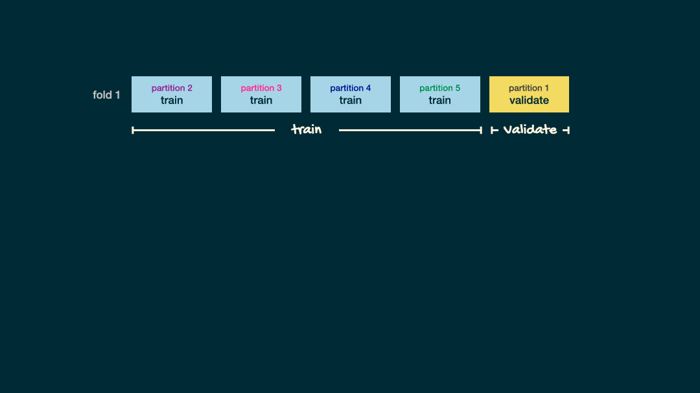

```{r child = "../setup.Rmd"}
```

```{r packages, echo = FALSE, message=FALSE, warning=FALSE}
library(tidyverse)
library(tidymodels)
library(gghighlight)
library(knitr)
set.seed(1234)
```

class: middle

# Data and exploration

---

background-image: url("img/the-office.jpeg")
class: middle

---

## Data

```{r}
office_ratings <- read_csv("data/office_ratings.csv")
office_ratings
```

.footnote[
.small[
Source: The data come from [data.world](https://data.world/anujjain7/the-office-imdb-ratings-dataset), by way of [TidyTuesday](https://github.com/rfordatascience/tidytuesday/blob/master/data/2020/2020-03-17/readme.md). 
]
]

---

## IMDB ratings

.panelset[
```{r panelset = c(output = "Plot", source = "Code")}
ggplot(office_ratings, aes(x = imdb_rating)) +
  geom_histogram(binwidth = 0.25) +
  labs(
    title = "The Office ratings",
    x = "IMDB Rating"
  )
```
]

---

## IMDB ratings vs. number of votes

.panelset[
```{r panelset = c(output = "Plot", source = "Code"), out.width="55%"}
ggplot(office_ratings, aes(x = total_votes, y = imdb_rating, color = season)) +
  geom_jitter(alpha = 0.7) +
  labs(
    title = "The Office ratings",
    x = "Total votes",
    y = "IMDB Rating",
    color = "Season"
  )
```
]

---

## Outliers

.panelset[
```{r panelset = c(output = "Plot", source = "Code"), out.width="55%"}
ggplot(office_ratings, aes(x = total_votes, y = imdb_rating)) +
  geom_jitter() +
  gghighlight(total_votes > 4000, label_key = title) +
  labs(
    title = "The Office ratings",
    x = "Total votes",
    y = "IMDB Rating"
  )
```
]

.footnote[
.small[
If you like the [Dinner Party](https://www.imdb.com/title/tt1031477/) episode, I highly recommend this ["oral history"](https://www.rollingstone.com/tv/tv-features/that-one-night-the-oral-history-of-the-greatest-office-episode-ever-629472/) of the episode published on Rolling Stone magazine.
]
]

---

## IMDB ratings vs. seasons

.panelset[
```{r panelset = c(output = "Plot", source = "Code"), out.width="55%"}
ggplot(office_ratings, aes(x = factor(season), y = imdb_rating, color = season)) +
  geom_boxplot() +
  geom_jitter() +
  guides(color = "none") +
  labs(
    title = "The Office ratings",
    x = "Season",
    y = "IMDB Rating"
  )
```
]

---

class: middle

# Modeling

---

## Train / test

- Create an initial split

```{r}
set.seed(1122)
office_split <- initial_split(office_ratings) # prop = 3/4 by default
```

--
.pull-left[
- Save training data
```{r}
office_train <- training(office_split)
dim(office_train)
```
]

--
.pull-right[
- Save testing data
```{r}
office_test  <- testing(office_split)
dim(office_test)
```
]

---

## Specify model

```{r}
office_mod <- linear_reg() %>%
  set_engine("lm")

office_mod
```

---

## Build recipe

.panelset[
.panel[.panel-name[Code]
```{r}
office_rec <- recipe(imdb_rating ~ ., data = office_train) %>%
  # title isn't a predictor, but keep around to ID
  update_role(title, new_role = "ID") %>%
  # extract month of air_date
  step_date(air_date, features = "month") %>%
  step_rm(air_date) %>%
  # make dummy variables of month 
  step_dummy(contains("month")) %>%
  # remove zero variance predictors
  step_zv(all_predictors())
```
]
.panel[.panel-name[Output]
.small[
```{r}
office_rec
```
]
]
]

---

## Build workflow

.panelset[
.panel[.panel-name[Code]
```{r}
office_wflow <- workflow() %>%
  add_model(office_mod) %>%
  add_recipe(office_rec)
```
]
.panel[.panel-name[Output]
.small[
```{r}
office_wflow
```
]
]
]

---

## Fit model

.panelset[
.panel[.panel-name[Code]
```{r}
office_fit <- office_wflow %>%
  fit(data = office_train)
```
]
.panel[.panel-name[Output]
.small[
```{r}
tidy(office_fit) %>%
  print(n = 12)
```
]
]
]

---

class: middle

# Evaluate model

---

## Make predictions for training data

```{r}
office_train_pred <- predict(office_fit, office_train) %>%
  bind_cols(office_train %>% select(imdb_rating, title))

office_train_pred
```

---

## R-squared

Percentage of variability in the IMDB ratings explained by the model

```{r}
rsq(office_train_pred, truth = imdb_rating, estimate = .pred)
```

--

.question[
Are models with high or low $R^2$ more preferable?
]

---

## RMSE

An alternative model performance statistic: **root mean square error**

$$ RMSE = \sqrt{\frac{\sum_{i = 1}^n (y_i - \hat{y}_i)^2}{n}} $$

--

```{r rmse-train}
rmse(office_train_pred, truth = imdb_rating, estimate = .pred)
```

--

.question[
Are models with high or low RMSE are more preferable?
]

---

## Interpreting RMSE

.question[
Is this RMSE considered low or high?
]

```{r ref.label="rmse-train"}
```

--

```{r}
office_train %>%
  summarise(min = min(imdb_rating), max = max(imdb_rating))
```

---

class: middle

.hand[
.light-blue[
but, really, who cares about predictions on .pink[training] data?
]
]

---

## Make predictions for testing data

```{r}
office_test_pred <- predict(office_fit, office_test) %>%
  bind_cols(office_test %>% select(imdb_rating, title))

office_test_pred
```

---

## Evaluate performance on testing data

- RMSE of model fit to testing data

```{r}
rmse(office_test_pred, truth = imdb_rating, estimate = .pred)
```

- $R^2$ of model fit to testing data

```{r}
rsq(office_test_pred, truth = imdb_rating, estimate = .pred)
```

---

## Training vs. testing

<br>

```{r echo=FALSE}
rmse_train <- rmse(office_train_pred, truth = imdb_rating, estimate = .pred) %>% 
  pull(.estimate) %>%
  round(3)

rsq_train <- rsq(office_train_pred, truth = imdb_rating, estimate = .pred) %>% 
  pull(.estimate) %>%
  round(3)

rmse_test <- rmse(office_test_pred, truth = imdb_rating, estimate = .pred) %>% 
  pull(.estimate) %>%
  round(3)

rsq_test <- rsq(office_test_pred, truth = imdb_rating, estimate = .pred) %>% 
  pull(.estimate) %>%
  round(3)

tibble(
  data      = c(rep("train", 2), rep("test", 2)),
  estimate  = c(rmse_train, rsq_train, rmse_test, rsq_test),
  metric    = c("RMSE", "R-squared", "RMSE", "R-squared")
) %>%
  pivot_wider(names_from = data, values_from = estimate) %>%
  bind_cols(comparison = c("RMSE lower for training", "R-squared higher for training")) %>%
  kable()
```

---

## Evaluating performance on training data

-  The training set does not have the capacity to be a good arbiter of performance.

--
- It is not an independent piece of information; predicting the training set can only reflect what the model already knows.

--
- Suppose you give a class a test, then give them the answers, then provide the same test. The student scores on the second test do not accurately reflect what they know about the subject; these scores would probably be higher than their results on the first test.

.footnote[
.small[
Source: [tidymodels.org](https://www.tidymodels.org/start/resampling/)
]
]

---

class: middle

# Cross validation

---

## Cross validation

More specifically, **v-fold cross validation**:

- Shuffle your data v partitions
- Use 1 partition for validation, and the remaining v-1 partitions for training
- Repeat v times

.footnote[
.small[
You might also heard of this referred to as k-fold cross validation.
]
]

---

## Cross validation

```{r echo=FALSE, out.width="100%"}
knitr::include_graphics("img/cross-validation.png")
```

---

## Split data into folds

.pull-left[
```{r}
set.seed(345)

folds <- vfold_cv(office_train, v = 5)
folds
```
]
.pull-right[
```{r echo=FALSE, out.width="100%", fig.align="right"}
knitr::include_graphics("img/cross-validation.png")
```
]

---

## Fit resamples

.pull-left[
```{r}
set.seed(456)

office_fit_rs <- office_wflow %>%
  fit_resamples(folds)

office_fit_rs
```
]
.pull-right[
```{r echo=FALSE, out.width="100%", fig.align="right"}

```
]

---

## Collect CV metrics

```{r}
collect_metrics(office_fit_rs)
```

---

## Deeper look into CV metrics

.panelset[
.panel[.panel-name[Raw]
```{r}
collect_metrics(office_fit_rs, summarize = FALSE) %>%
  print(n = 10)
```
]
.panel[.panel-name[Tidy]
```{r echo=FALSE}
collect_metrics(office_fit_rs, summarize = FALSE) %>%
  select(id, .metric, .estimate) %>%
  pivot_wider(names_from = .metric, values_from = .estimate) %>%
  kable(col.names = c("Fold", "RMSE", "R-squared"), digits = 3)
```
]
]

---

## How does RMSE compare to y?

- Cross validation RMSE stats

```{r echo=FALSE}
collect_metrics(office_fit_rs, summarize = FALSE) %>%
  filter(.metric == "rmse") %>%
  summarise(
    min = min(.estimate),
    max = max(.estimate),
    mean = mean(.estimate),
    med = median(.estimate),
    sd = sd(.estimate),
    IQR = IQR(.estimate)
  )
```

- Training data IMDB score stats

```{r echo=FALSE}
office_train %>%
  summarise(
    min = min(imdb_rating),
    max = max(imdb_rating),
    mean = mean(imdb_rating),
    med = median(imdb_rating),
    sd = sd(imdb_rating),
    IQR = IQR(imdb_rating)
  )
```

---

## What's next?

```{r echo=FALSE, out.width="100%", fig.align="right"}
knitr::include_graphics("img/post-cv-testing.png")
```

