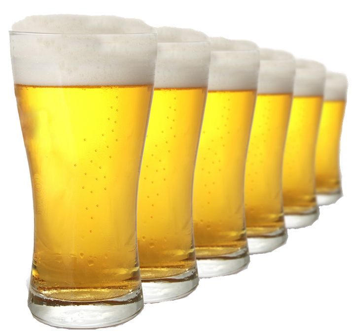

```{r include=FALSE}
library(tufte)
library(knitr)
library(dsbox) # devtools::install_github("rstudio-education/dsbox")
library(DT)
options(
  htmltools.dir.version = FALSE, # for blogdown
  show.signif.stars = FALSE,     # for regression output
  digits = 2
  )
knitr::opts_chunk$set(eval = TRUE)
```

<div style= "float:right;position: relative; margin-left: 20px">
```{r image, echo=FALSE, fig.align="right"}

```
</div>

In 2017, the U.S. beer industry shipped (sold) 207.4 million barrels of beer – equivalent to more than 2.9 billion cases of 24-12 ounce servings. In addition, the industry shipped approximately 2 million barrels of cider, equivalent to more than 28.3 million cases. Additionally, the U.S. beer industry sells more than $111.1 billion in beer and malt-based beverages to U.S. consumers each year. (Source: [The U.S. Beer Industry]( https://www.nbwa.org/resources/industry-fast-facts))

Do you know how many breweries are around you? And how much beer they brew? In this lab we scrape and analyze data on US breweries.

We will start with getting data on breweries in North Carolina. Then, you will use a similar approach to get data on breweries in a different state of our choosing.

In order to complete this lab you will need a Chrome browser with the [Selector Gadget extension](http://selectorgadget.com/) installed.

```{marginfigure}
By now you should be familiar with instructions for getting started and setting up your git configuration. If not, you can refer to one of the earlier labs.
```

# Packages

In this lab we will work with the `tidyverse`, `rvest`, and `robotstxt` packages. These packages should already be installed in your project, and you can load them with the following:

```{r load-packages, message=FALSE}
library(tidyverse) 
library(rvest)
library(robotstxt)
```

# The data

We will scrape brewery information from https://www.ratebeer.com/breweries/. RateBeer.com is an in-depth, consumer-driven source of beer information. We will use the state-level brewery lists on this site to first obtain information on all breweries in a given state. Then, we will dive deeper and obtain additional information on each of the breweries in that state, one-by-one, by automating our code to do so.

Before getting started, let's check that a bot has permissions to access pages on this domain.

```{r paths-allowed, warning=FALSE}
paths_allowed("https://www.ratebeer.com/")
```

## North Carolina

The goal of this exercise is scrape the data from


and save it as a data frame that looks like the following.

Note that you might have a different number of rows and some of the data 
may have also changed at the date when you scrape it. The following data table 
was generated based on data scraped on April 18, 2018.

```{r read-nc-page, echo=FALSE, message=FALSE}
datatable(ncbreweries)
```

1. Based on the information on the North Carolina breweries page, how many total (active + closed) breweries are there in NC?

The code for the following should go in the `script.R file.`

- Let's start with the names of breweries. Use the selector gadget to determine the path to the names of breweries, and create a vector containing 251 elements of type character which are the names of the breweries.

Next we get the cities. The paths for the cities on the active vs. closed page are different.

- Create two vectors, one called `active_cities` and the other `closed_cities` that contain the cities of the active and closed breweries, respectively. Then, combine these vectos with 

```{r eval=FALSE}
cities <- c(active_cities, closed_cities)
```

- Scrape brewery type, number of beers brewed at each brewery, year when brewery first opened ("est.")s. Save these as vectors called `types`, `counts`, `ests`,  `urls`, and `status` respectively.

- Create a data frame (`tibble`) called `ncbreweries` with column names shown in the table above.

- Save this data frame as `ncbreweries.csv` using the `write_csv` function into the `/data` folder: `write.csv(ncbreweries.csv, path = "data/ncbreweries.csv")`.

2. Load `ncbreweries.csv` in your Rmd.

3. There is at least one error in the data: Edenton Brewing Company appears to have been opened in 1900, but this is not true. Find out when this Brewery was opened, and correct the data.

```{r echo=FALSE}
ncbreweries <- ncbreweries %>%
  mutate(est = ifelse(name == "Edenton Brewing Company", 2003, est))
```

4. Which city in NC has the most breweries? How many breweries are in Durham, NC? What are they?

5. Recreate the following visualization, and interpret it.

```{r echo=FALSE, fig.fullwidth = TRUE}
ncbreweries %>%
  count(est, type) %>%
  ggplot(aes(x = est, y = n, color = type)) +
    geom_point() +
    geom_line() +
    labs(x = "Year", y = "Number of brewery openings",
         title = "Number of breweries openening each year",
         subtitle = "By type")
```

## Choose your own state

Do the following in the `script.R` file.

Repeat what you did above (potentially with some modifications) to create a similar data frame (with the same columns) for a different state of your choosing. Save the result in a csc file with the name of the state you chose, e.g. `cabreweries.csv`.

Load the new data in the R Markdown.

6. Determine which city in that state has the highest number breweries.

7. Determine which city has the youngest breweries, on average.

8. Write a function to grab the zip code for each of the breweries from their own pages (at the URL you recorded). Test this function out on the first three breweries.

9. By using the `map` function, grab the zip code for all of the breweries from their own pages (at the URL you recorded) and add this as a new column to your data frame.

10. Determine which zip code in that state has the highest number breweries.
