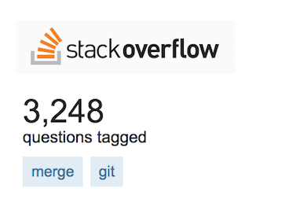
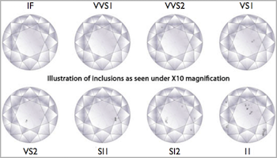

```{r packages, echo=FALSE, message=FALSE, warning=FALSE}
library(tidyverse)
```

```{r setup, include=FALSE}
# R options
options(
  htmltools.dir.version = FALSE, # for blogdown
  show.signif.stars = FALSE,     # for regression output
  warn = 1
  )
# Set dpi and height for images
knitr::opts_chunk$set(fig.height = 2.5, fig.width = 5, dpi = 300) 
# ggplot2 color palette with gray
color_palette <- list(gray = "#999999", 
                      salmon = "#E69F00", 
                      lightblue = "#56B4E9", 
                      green = "#009E73", 
                      yellow = "#F0E442", 
                      darkblue = "#0072B2", 
                      red = "#D55E00", 
                      purple = "#CC79A7")
htmltools::tagList(rmarkdown::html_dependency_font_awesome())
# For magick
dev.off <- function(){
  invisible(grDevices::dev.off())
}
# For ggplot2
ggplot2::theme_set(ggplot2::theme_bw())
```

class: center, middle

# R/RStudio

---

# R/RStudio

- R: statistical programming language

- RStudio: integrated development environment for the R language

- RStudio Cloud allows us to use RStudio without local installation (which can be hairy)
  - Interested in learning about other ways of using RStudio -- come by office hours
  - Already have another way of using RStudio -- make sure to maintain Cloud account for quick classroom execises
  
---

# R packages

- R is an open source language

- Packages developed by open source developers


---

class: center, middle

# Git/GitHub

---

## Merge conflicts

.pull-left[
Confused about merge conflicts? Everyone is...
]
.pull-right[

]

--

- Why does a merge conflict happen?

--

- TELL ME YOUR WOES...

---

## Caching your password

Needs to be done on a per-project basis (for now):

- Go to the Terminal within a project (the most recent lab?)
- Type the following to cache your password for $60 * 60 * 24 * 7 = 604800$ seconds

```{bash eval=FALSE}
git config --global credential.helper 'cache --timeout 604800'
```

---

## Tips for collaborating via Git/GitHub

- Always pull first before you start working.

- Commit, and push, often to minimize merge conflicts and/or to make merge conflicts easier to resolve.

- If you find yourself in a situation that is difficult to resolve, ask questions asap, don't let it linger and get bigger.

---

class: center, middle

# Visualizing Star Wars (better)

Follow along on `r emo::ji("cloud")`: Review and recap - 02-07 -- `viz-star-wars.Rmd`

---

## Starting point

```{r}
library(tidyverse)
starwars <- starwars %>%
  filter(mass < 500)

ggplot(data = starwars, aes(x = height, y = mass, color = gender)) +
  geom_point()
```

---

## Add title

```{r}
ggplot(data = starwars, aes(x = height, y = mass, color = gender)) +
  geom_point() +
  labs(title = "Mass vs. height of Star Wars characters")
```

---

## Add x and y labels

```{r}
ggplot(data = starwars, aes(x = height, y = mass, color = gender)) +
  geom_point() +
  labs(title = "Mass vs. height of Star Wars characters",
       x = "Height (in cm)", y = "Mass (in kg)")
```

---

## Change legend label

```{r}
ggplot(data = starwars, aes(x = height, y = mass, color = gender)) +
  geom_point() +
  labs(title = "Mass vs. height of Star Wars characters",
       x = "Height (in cm)", y = "Mass (in kg)", color = "Gender")
```

---

## Change zooming

```{r}
ggplot(data = starwars, aes(x = height, y = mass, color = gender)) +
  geom_point() +
  labs(title = "Mass vs. height of Star Wars characters",
       x = "Height (in cm)", y = "Mass (in kg)", color = "Gender") +
  xlim(c(100, 200)) + 
  ylim(c(40, 120))
```

---

## Change transparency

```{r}
ggplot(data = starwars, aes(x = height, y = mass, color = gender)) +
  geom_point(alpha = 0.3) +
  labs(title = "Mass vs. height of Star Wars characters",
       x = "Height (in cm)", y = "Mass (in kg)", color = "Gender")
```

---

## Change theme - `theme_dark()`

```{r}
ggplot(data = starwars, aes(x = height, y = mass, color = gender)) +
  geom_point() +
  labs(title = "Mass vs. height of Star Wars characters",
       x = "Height (in cm)", y = "Mass (in kg)", color = "Gender") +
  theme_dark()
```

---

## Change theme - `theme_minimal()`

```{r}
ggplot(data = starwars, aes(x = height, y = mass, color = gender)) +
  geom_point() +
  labs(title = "Mass vs. height of Star Wars characters",
       x = "Height (in cm)", y = "Mass (in kg)", color = "Gender") +
  theme_minimal()
```

---

## 538 theme

```{r}
# install.packages("ggthemes")
library(ggthemes)

ggplot(data = starwars, aes(x = height, y = mass, color = gender)) +
  geom_point() +
  labs(title = "Mass vs. height of Star Wars characters",
       x = "Height (in cm)", y = "Mass (in kg)", color = "Gender") +
  theme_fivethirtyeight()
```

---

## Further customization

- It is possible to do a lot more customization to your plots
- See http://ggplot2.tidyverse.org/ for help on using the ggplot2 package
    + You can find a list of all ggplot2 functions in the Reference tab of the package homepage
- You'll find that sometimes customization is valuable, and sometimes the defaults work well and while customization might be doable (technically) it might not be necessary

---

class: center, middle

# Activity

Follow along on `r emo::ji("cloud")`: Review and recap - 02-07 -- `examine-world-trend.Rmd`

---

## Examining world trends

Examine the code given to produce the existing plots in the "Examining Gapminder data" document. Then, make the appropriate changes listed below. 

- Task 1: Subset for 1952 (instead of 2007)
- Task 2: Plot life expectancy (`lifeExp`) vs. population (`pop`)
- Task 3: In addition to coloring the points by continent, size the points by GPD (`gpdPercap`)
- Task 4: A brief (1-2 sentences only) description of what you see in the plot.

Work on it individually, but consult with your teammates alogn the way.
    
---

class: center, middle

# Wrangling diamonds `r emo::ji("ring")`

Follow along on `r emo::ji("cloud")`: Review and recap - 02-07 -- `wrangling-diamonds.Rmd`

---

## The data

Diamond prices are driven by 4Cs: carat, cut, color, and clarity. We'll explore a dataset containing the prices and other attributes of almost 54,000 diamondsn from the tidyverse package.

Take a peek at the codebook with

```{r eval=FALSE}
?diamonds
```

or at http://ggplot2.tidyverse.org/reference/diamonds.html.

---

## 4Cs

- Carat: unit of mass equal to 200 mg used for measuring gemstones and pearls 

- Cut: objective measure of a diamond's light performance / sparkle

- Color:


- Clarity:



---

## Measurements


---

## Price

.question[
What type of variable is price? Would you expect its distribution to be symmetric, right-skewed, or left-skewed? Why? Make a histogram of the distribution of diamond prices. Does the shape of the distribution match your expectation?
]

--

```{r}
ggplot(data = diamonds, mapping = aes(x = price)) +
  geom_histogram(binwidth = 500)
```

---

## Cut

.question[
How many diamonds of each type of cut are there? List them in ascending order.
]

--

```{r}
diamonds %>%
  count(cut) %>%
  arrange(n)
```

---

## Clarity

.question[
Calculate the relative frequency of each clarity of diamonds. List them in descending order.
]

--

```{r}
diamonds %>%
  count(cut) %>%
  mutate(rel_freq_cut = round(n / sum(n), 3)) %>%
  arrange(desc(rel_freq_cut))
```

---

## Clarity by cut

.question[
Calculate the relative frequency of each clarity of diamonds by cut. For each cut type, determine which clarity type is most likely, and display its relative frequency for that cut.
]

--

```{r}
diamonds %>%
  count(cut, clarity) %>%
  group_by(cut) %>%
  mutate(rel_freq_clarity = round(n / sum(n), 3)) %>%
  arrange(cut, desc(rel_freq_clarity)) %>%
  top_n(1)
```

---

## Depth and price

.question[
Plot the relationship between depth and price of only fair cut diamonds.
]

--

```{r}
diamonds %>%
  filter(cut == "Fair") %>%
  ggplot(mapping = aes(x = depth, y = price)) +
    geom_point()
```

---

## Recap

- Start with data frame
- Pipe into a verb
- Only print output if counting, summarizing, etc.
- Save output as the original data frame (or something else) if more will be done with the data frame in another step/pipe
