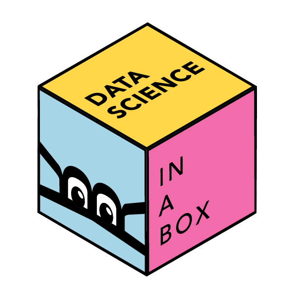

# Welcome {.unnumbered}

 How can we effectively and efficiently teach data science to students with little to no background in computing and statistical thinking?
How can we equip them with the skills and tools for reasoning with various types of data and leave them wanting to learn more?
This introductory data science course is our (working) answer to this question.

The source code for everything you see here can be found [on GitHub](https://github.com/rstudio-education/datascience-box).

The core content of the course focuses on data acquisition and wrangling, exploratory data analysis, data visualization, inference, modelling, and effective communication of results.
Time permitting, the course also introduces additional concepts and tools like interactive visualization and reporting, text analysis, and Bayesian inference.
A heavy emphasis is placed on a consistent syntax (with tools from the [tidyverse](https://www.tidyverse.org/)), reproducibility (with [R Markdown](https://rmarkdown.rstudio.com/)), and version control and collaboration (with Git and GitHub).
In addition, out-of-class learning is supplemented with interactive [tutorials](https://rstudio.github.io/learnr/).
The goal of the course is to bring students from zero to being able to work in a team on a fully reproducible data science project analysing a dataset of their choice and answering questions they care about.

Data Science in a Box contains the materials required to teach (or learn from) the course described above, all of which are [freely-available and open-source](https://github.com/rstudio-education/datascience-box/blob/master/LICENSE.md).
They include course materials such as slide decks, homework assignments, guided labs, sample exams, a final project assignment, as well as materials for instructors such as pedagogical tips, information on computing infrastructure, technology stack, and course logistics.

Majority of the materials linked live in the GitHub repo serving this website.
You can access the repo [here](https://github.com/rstudio-education/datascience-box).

Please note that Data Science in a Box uses a [Contributor Code of Conduct](https://contributor-covenant.org/version/2/0/CODE_OF_CONDUCT.html).
By contributing to this project, you agree to abide by its terms.

## License {.unnumbered}

 This online work is licensed under a <a rel="license" href="https://creativecommons.org/licenses/by-sa/4.0/">Creative Commons Attribution-ShareAlike 4.0 Internationale</a>.
Visit [here](https://github.com/rstudio-education/datascience-box/blob/master/LICENSE.md) for more information about the license.

## Acknowledements {.unnumbered}

Huge thanks to the \#rstats education community who have made numerous suggestions for this resource, to Lee Suddaby and Zeno Kujawa for converting the homework assignments to learnr tutorials, and to [Müge Çetinkaya](http://muge.fr/) for the hex logo!

This website is built with [bookdown](https://bookdown.org/), the lovely icons by [icons8](http://icons8.com/), and none of this would be possible without the [tidyverse](https://tidyverse.org/).
