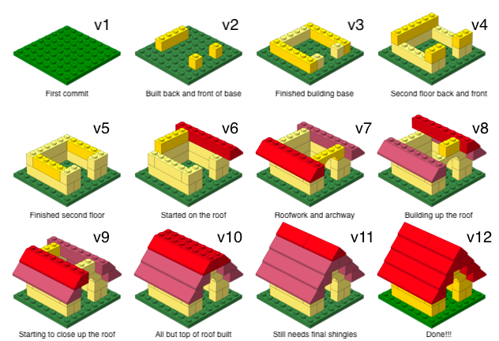

```{r packages, echo=FALSE, message=FALSE, warning=FALSE}
library(tidyverse)
```

```{r setup, include=FALSE}
# R options
options(
  htmltools.dir.version = FALSE, # for blogdown
  show.signif.stars = FALSE,     # for regression output
  warn = 1
  )
# Set dpi and height for images
knitr::opts_chunk$set(fig.height = 2.5, fig.width = 5, dpi = 300) 
# ggplot2 color palette with gray
color_palette <- list(gray = "#999999", 
                      salmon = "#E69F00", 
                      lightblue = "#56B4E9", 
                      green = "#009E73", 
                      yellow = "#F0E442", 
                      darkblue = "#0072B2", 
                      red = "#D55E00", 
                      purple = "#CC79A7")
htmltools::tagList(rmarkdown::html_dependency_font_awesome())
# For magick
dev.off <- function(){
  invisible(grDevices::dev.off())
}
# For ggplot2
ggplot2::theme_set(ggplot2::theme_bw())
```

class: center, middle

# A reproducible data analysis

---

## Let's talk about burritos!

<iframe src="https://giphy.com/embed/6587R2Pda6iFW" width="853" height="480" frameBorder="0" class="giphy-embed" allowFullScreen></iframe><p><a href="https://giphy.com/gifs/burrito-6587R2Pda6iFW">via GIPHY</a></p>

---

## Recap: What did we just do?

- Locate a repository on **GitHub**

- Clone and open the project in **RStudio**

- Run the analysis using **R Markdown**

- Edit the analysis to exclude reviews from "Other" reviewers using **R** syntax

- Re-run the analysis using **R Markdown**

---

## Reproducibility checklist

Near-term goals:

- Are the tables and figures reproducible from the code and data?
- Does the code actually do what you think it does?
- In addition to what was done, is it clear **why** it was done? 
(e.g., how were parameter settings chosen?)

Long-term goals:

- Can the code be used for other data?
- Can you extend the code to do other things?

---

## Toolkit


- Scriptability $\rightarrow$ R

- Literate programming (code, narrative, output in one place) $\rightarrow$ R Markdown

- Version control $\rightarrow$ Git / GitHub

---

class: center, middle

# R and RStudio

---

## What is R/RStudio?

- R is a statistical programming language

- RStudio is a convenient interface for R (an integreated development environment, IDE)

---

## Let's take a tour - R / RStudio

<center>
[DEMO]
</center>

--

Concepts introduced:

- Console

- Using R as a calculator

- Environment

- Loading and viewing a data frame

- Accessing a variable in a data frame

- R functions

---

## R essentials

A short list (for now):

- Functions are (most often) verbs, followed by what they will be applied to in paramtheses:

```{r eval=FALSE}
do_this(to_this)
do_that(to_this, to_that, with_those)
```

--

- Columns (variables) in data frames are accessed with `$`:

```{r eval=FALSE}
dataframe$var_name
```

--

- Packages are installed with the `install.packages` function and loaded with the `library` function, once per session:

```{r eval=FALSE}
install.packages("package_name")
library(package_name)
```

---

## What is the Tidyverse?

.pull-left[

]

.pull-right[
<center>
<a href="https://www.tidyverse.org/">tidyverse.org</a>
</center>

- The tidyverse is an opinionated collection of R packages designed for data science. 
- All packages share an underlying philosophy and a common syntax. 
]

--

*Note:* [Hadley Wickham](http://hadley.nz/), the author and maintainer of these packages (along with a team of developers), will join us on Feb 5! So start collecting your questions for him now.

---

class: center, middle

# R Markdown

---


## R Markdown

- Fully reproducible reports -- each time you knit the analysis is ran from the beginning

- Simple markdown syntax for text

- Code goes in chunks, defined by three backticks, narrative goes outside of chunks

---

## Let's take a tour -- R Markdown

<center>
[DEMO]
</center>

Before we move on...

.question[
What is the Bechdel test?
]

--

The Bechdel test asks whether a work of fiction features at least two women who talk to each other about something other than a man, and there must be two women named characters.

--

Concepts introduced:

- Forking a project of mine: "Bechdel"

- Knitting documents

- R Markdown and (some) R syntax

---

## R Markdown tips

- Keep the [R Markdown cheat sheet](https://github.com/rstudio/cheatsheets/raw/master/rmarkdown-2.0.pdf) and Markdown Quick Reference (Help -> Markdown Quick Reference) handy, we'll refer to it often as the course progresses

- The workspace of your R Markdown document is separate from the Console

<br><br>
<center>
[DEMO]
</center>

---

## How will we use R Markdown?

- Every assignment / report / project / etc. is an R Markdown document

- You'll always have a template R Markdown document to start with

- The amount of scaffolding in the template will decrease over the semester

---

class: center, middle

# Git and GitHub

---

## How do we collaborate?

- The statistical programming language we'll use is R

- The software we use to interface with R is RStudio

- But how do I get you the course materials that you can build on for your assignments?
    + Hint: I'm not going to email you documents, that would be a mess!
  
---

## Version control

- We introduced GitHub as a platform for collaboration

- But it's much more than that...

- It's actually desiged for version control

---

## Versioning


---

## Versioning

with human readable messages



---

## Why do we need version control?


---

# Git and GitHub tips

- Git is a version control system -- like “Track Changes” features from Microsoft Word on steroids. GitHub is the home for your Git-based projects on the internet -- like DropBox but much, much better).

--

- There are millions of git commands -- ok, that's an exaggeration, but there are a lot of them -- and very few people know them all. 99% of the time you will use git to add, commit, push, and pull.

--

- We will be doing Git things and interfacing with GitHub through RStudio, but if you google for help you might come accross methods for doing these things in the command line -- skip that and move on to the next resource unless you feel comfortable trying it out.

--

- There is a great resource for working with git and R: [happygitwithr.com](http://happygitwithr.com/). Some of the content in there is beyond the scope of this course, but it's a good place to look for help.

*Note:* [Jenny Bryan](https://github.com/jennybc), the author of Happy Git with R as well as some Tidyverse packages, will also be joining us on Feb 5. So start collecting your questions for her too.

---

## Let's take a tour -- Git / GitHub

**We'll cover this time permitting, you'll see it again in lab tomorrow**

Concepts introduced:

- Connect an R project to Github repository

- Working with a local and remote repository

- Committing, Pushing and Pulling

There is just a bit more of GitHub that we'll use in this class, but for today this is enough.

---

class: center, middle

# Recap

---

## Recap

Can you answer these questions?

- What is reproducible data analysis, and why do we care?
- What is version control, and why do we care?
- What is R vs RStudio?
- What is git vs GitHub (and do I need to care)?
