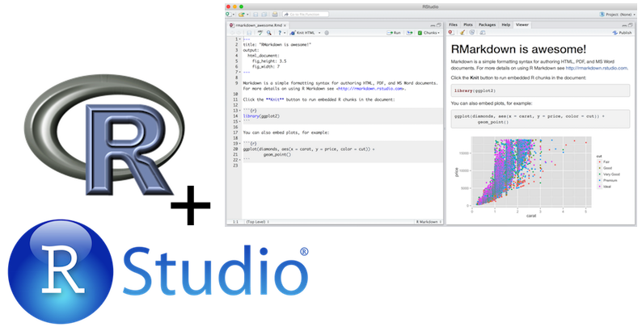
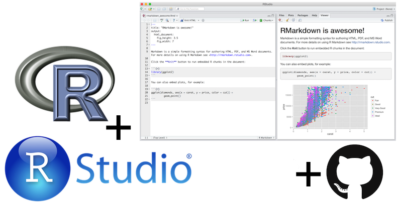
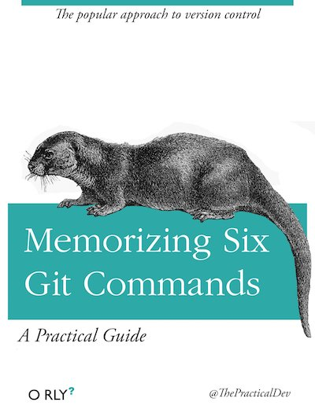

# Goals

## Questions to answer by the end of class

- What is reproducible data analysis, and why do we care?
- What is version control, and why do we care?
- What is R vs RStudio?
- What is git vs GitHub (and do I need to care)?

# Reproducibility

## Reproducibility: who cares? {.smaller}

- [Science retracts gay marriage paper without agreement of lead author LaCour](http://news.sciencemag.org/policy/2015/05/science-retracts-gay-marriage-paper-without-lead-author-s-consent)
    + Two Berkeley grad students who attempted to replicate the study 
quickly discovered that the data must have been faked.

- [Seizure study retracted after authors realize data got "terribly mixed"](http://retractionwatch.com/2013/01/seizure-study-retracted-after-authors-realize-data-got-terribly-mixed/)

- [Bad spreadsheet merge kills depression paper, quick fix resurrects it](http://retractionwatch.com/2014/07/01/bad-spreadsheet-merge-kills-depression-paper-quick-fix-resurrects-it/)
    + Original conclusion: Lower levels of CSF IL-6 were associated with 
current depression and with future depression [...].
    + Revised conclusion: Higher levels of CSF IL-6 and IL-8 were 
associated with current depression [...].

## Reproducibility: why should we care?

<div class="columns-2">
**Two-pronged approach**

\#1 
Convince researchers to adopt a reproducible research workflow

<br><br>

\#2
Train new researchers who don’t have any other workflow

<br><br>


</div>

## Reproducible data analysis

- Scriptability $\rightarrow$ R

- Literate programming $\rightarrow$ R Markdown

- Version control $\rightarrow$ Git / GitHub

# Scripting and literate programming 

## Donald Knuth "Literate Programming (1983)"

"Let us change our traditional attitude to the construction of programs: 
Instead of imagining that our main task is to instruct a *computer- what 
to do, let us concentrate rather on explaining to *human beings- what we 
want a computer to do."

- These ideas have been around for years!
- and tools for putting them to practice have also been around
- but they have never been as accessible as the current tools


## Reproducibility checklist

Near-term goals:

- Are the tables and figures reproducible from the code and data?
- Does the code actually do what you think it does?
- In addition to what was done, is it clear **why** it was done? 
(e.g., how were parameter settings chosen?)

Long-term goals:

- Can the code be used for other data?
- Can you extend the code to do other things?

# Toolkit

## Toolkit

<center>

</center>

# Demo

## Logging on to RStudio

- Go to https://vm-manage.oit.duke.edu/containers/rstudio

- Log on with your Net ID and password

## Live R/RStudio demo

- R as a calculator

```{r}
2 + 2
factorial(20)
```

- Working with variables

```{r}
x = 2
x * 3
```

# Collaboration

## How do we collaborate?

- The statistical programming language we'll use is R

- The software we use to interface with R is RStudio

- But how do I get you the course materials that you can build on for your assignments?
    + Hint: I'm not going to email you documents, that would be a mess!
    
## The complete toolkit

<center>

</center>


## GitHub live demo

- Follow the link to create a repository on GitHub

- Connect an R project to Github repository

- Working with a local and remote repository

- Staging, Committing, Pushing and Pulling

(There is just a bit more of GitHub that we'll use in this class, but for today this is enough.)


# Documenting and reporting

## R Markdown 

- Fully reproducible reports

- Simple markdown syntax for text

- Code goes in chunks

**Tip**: Keep the R Markdown cheat sheet and Markdown Quick Reference (Help -> Markdown Quick Reference) handy, we'll refer to it often as the course progresses. 

<br/>

<div align="center">
[Live demo -- follow along]
</div>

# On to data analysis

## Exercises

* Exercise 0
    - Load any necessary packages and data

* Exercise 1
    - Visualize the relationship between life expectancy and GDP per capita in 2007 using a scatter plot.

* Exercise 2
    - Repeat the visualization from Exercise 1, but now color the points by continent.

## Step 0: Load necessary packages

Packages are the fundamental units of reproducible R code. They include 
reusable R functions, the documentation that describes how to use them, 
and sample data.

- In the following exercises we'll use the `readr` (for loading data), `dplyr` (for data wrangling), and `ggplot2` (for visualization) packages.

- To use these packages, we must first load in our markdown file

```{r message=FALSE}
library(dplyr)
library(ggplot2)
library(readr)
```

## Step 1: Load data

```{r}
gapminder = read_csv("https://stat.duke.edu/~mc301/data/gapminder.csv")
```

## Step 2: Subset data

- Start with the `gapminder` dataset

- Filter for cases (rows) where year is equal to 2007

- Save this new subsetted dataset as `gap07`

```{r}
gap07 <- gapminder %>%
  filter(year == 2007)
```


## Step 3: Explore and visualize

**Task:** Visualize the relationship between `gdpPercap` and `lifeExp`.

```{r, fig.height=3, fig.width=7}
ggplot(data = gap07, aes(x = gdpPercap, y = lifeExp)) + 
  geom_point()
```

## Step 4: Dig deeper

**Task:** Color the points by continent.

```{r, fig.height=3, fig.width=7}
ggplot(data = gap07, aes(x = gdpPercap, y = lifeExp, color = continent)) +
  geom_point()
```

## Update your analysis

What if you wanted to now change your analysis 

- to subset for 1952

- plot life expectancy (`lifeExp`) vs. population (`pop`)

- and size the points by GPD (`gpdPercap`)
    - hint: add argument `size = gpdPercap` to your plotting code

# Version control with GitHub

## Version control

- We introduced GitHub as a platform for collaboration

- But it's much more than that...

- It's actually desiged for version control

## Why version control? {.smaller}

<div class="centered" style="margin-top: -1em;">

</div>

## Why version control?

- Simple formal system for tracking all changes to a project

- Time machine for your projects
    + Remove the fear of breaking things

- Learning curve is a bit steep, but when you need it you *REALLY* need it

<br/>
<br/>

<div class="centering">
<blockquote>
Your closest collaborator is you six months ago, but you don’t reply to emails.
</blockquote>
<cite>-- Paul Wilson, UW-Madison</cite>
</div>

## 

<center>

</center>
    
# Recap

## Can you answer these questions?

- What is reproducible data analysis, and why do we care?
- What is version control, and why do we care?
- What is R vs RStudio?
- What is git vs GitHub (and do I need to care)?

## Before next class

- Readings for next Tuesday posted

- A brief mini homework will be posted tonight, you'll receive a link to create your repo (just like we did today) and complete a short data visualization task using an R Markdown file I provide
    + Having difficulty? Ask on Slack or come to office hours!
