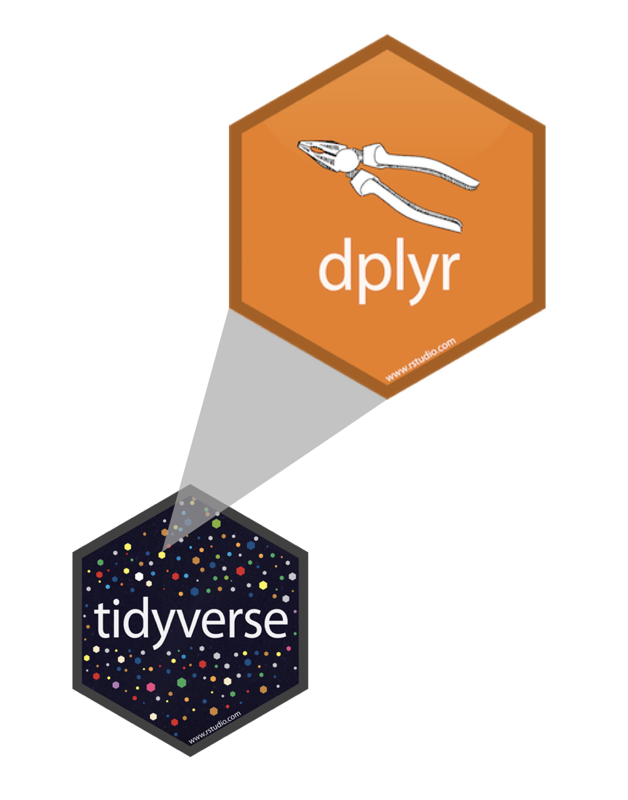

layout: true
  
<div class="my-footer">
<span>
<a href="https://datasciencebox.org/" target="_blank">datasciencebox.org
</a>
</span>
</div> 

---

```{r packages, echo=FALSE, message=FALSE, warning=FALSE}
library(tidyverse)
library(emo)
library(dsbox)
```

```{r setup, include=FALSE}
# R options
options(
  htmltools.dir.version = FALSE, # for blogdown
  show.signif.stars = FALSE,     # for regression output
  warn = 1
  )
# figure height, width, dpi
knitr::opts_chunk$set(fig.height = 2.5, fig.width = 5, dpi = 300) 
# fontawesome
htmltools::tagList(rmarkdown::html_dependency_font_awesome())
# magick
dev.off <- function(){
  invisible(grDevices::dev.off())
}
# code highlighting
hook_source <- knitr::knit_hooks$get('source')
knitr::knit_hooks$set(source = function(x, options) {
  x <- stringr::str_replace(x, "^[[:blank:]]?([^*].+?)[[:blank:]]*#<<[[:blank:]]*$", "*\\1")
  hook_source(x, options)
})
```


class: center, middle

# Tidy data

---

## Tidy data

>Happy families are all alike; every unhappy family is unhappy in its own way. 
>
>Leo Tolstoy

--

.pull-left[
**Characteristics of tidy data:**

- Each variable forms a column.
- Each observation forms a row.
- Each type of observational unit forms a table.
]
--
.pull-right[
**Characteristics of untidy data:**

!@#$%^&*()
]

---

## Summary tables 

.question[
Is each of the following a dataset or a summary table?
]

.small[
.pull-left[
```{r echo=FALSE}
starwars %>%
  select(name, height, mass)
```
]
.pull-right[
```{r echo=FALSE}
starwars %>%
  group_by(gender) %>%
  summarize(avg_height = round(mean(height, na.rm = TRUE), 2))
```
]
]

---

class: center, middle

# Pipes

---

## Where does the name come from?

The pipe operator is implemented in the package **magrittr**, it's pronounced 
"and then".

.pull-left[

]
.pull-right[

]

---

## Review: How does a pipe work?

- You can think about the following sequence of actions - find key, 
unlock car, start car, drive to school, park.
- Expressed as a set of nested functions in R pseudocode this would look like:
```{r eval=FALSE}
park(drive(start_car(find("keys")), to = "campus"))
```
- Writing it out using pipes give it a more natural (and easier to read) 
structure:
```{r eval=FALSE}
find("keys") %>%
  start_car() %>%
  drive(to = "campus") %>%
  park()
```

---

## What about other arguments?

To send results to a function argument other than first one or to use the previous result for multiple arguments, use `.`:

```{r fig.height=1.8, fig.width = 3.75}
starwars %>%
  filter(species == "Human") %>%
  lm(mass ~ height, data = .)
```

---

class: center, middle

# Data wrangling

---

## Bike crashes in NC 2007 - 2014

The dataset is in the **dsbox** package:

```{r load-data, eval=FALSE}
library(dsbox)
ncbikecrash
```

---

## Variables

View the names of variables via
```{r}
names(ncbikecrash)
```

and see detailed descriptions with `?ncbikecrash`.

---

## Viewing your data

- In the Environment, after loading with `data(ncbikecrash)`, and click on the 
name of the data frame to view it in the data viewer
- Use the `glimpse` function to take a peek

```{r}
glimpse(ncbikecrash)
```

---

## A Grammar of Data Manipulation

**dplyr** is based on the concepts of functions as verbs that manipulate data frames.

.pull-left[

]
.pull-right[
.midi[
- `filter`: pick rows matching criteria
- `slice`: pick rows using index(es)
- `select`: pick columns by name
- `pull`: grab a column as a vector
- `arrange`: reorder rows
- `mutate`: add new variables
- `distinct`: filter for unique rows
- `sample_n` / `sample_frac`: randomly sample rows
- `summarise`: reduce variables to values
- ... (many more)
]
]

---

## **dplyr** rules for functions

- First argument is *always* a data frame
- Subsequent arguments say what to do with that data frame
- Always return a data frame
- Don't modify in place

---

## A note on piping and layering

- The `%>%` operator in **dplyr** functions is called the pipe operator. This means you "pipe" the output of the previous line of code as the first input of the next line of code.
- The `+` operator in **ggplot2** functions is used for "layering". This means you create the plot in layers, separated by `+`.

---

## `filter` to select a subset of rows

for crashes in Durham County

```{r}
ncbikecrash %>%
  filter(county == "Durham") #<<
```

---

## `filter` for many conditions at once

for crashes in Durham County where biker was 0-5 years old

```{r}
ncbikecrash %>%
  filter(county == "Durham", bike_age_group == "0-5")
```

---

## Logical operators in R

operator    | definition                   || operator     | definition
------------|------------------------------||--------------|----------------
`<`         | less than                    ||`x`&nbsp;&#124;&nbsp;`y`     | `x` OR `y` 
`<=`        |	less than or equal to        ||`is.na(x)`    | test if `x` is `NA`
`>`         | greater than                 ||`!is.na(x)`   | test if `x` is not `NA`
`>=`        |	greater than or equal to     ||`x %in% y`    | test if `x` is in `y`
`==`        |	exactly equal to             ||`!(x %in% y)` | test if `x` is not in `y`
`!=`        |	not equal to                 ||`!x`          | not `x`
`x & y`     | `x` AND `y`                  ||              |

---

## `select` to keep variables

```{r}
ncbikecrash %>%
  filter(county == "Durham", bike_age_group == "0-5") %>%
  select(locality, speed_limit)
```

---

## `select` to exclude variables

```{r}
ncbikecrash %>%
  select(-object_id)
```

---

## `select` a range of variables

```{r}
ncbikecrash %>%
  select(city:locality)
```

---

## `slice` for certain row numbers

First five
```{r}
ncbikecrash %>%
  slice(1:5)
```

---

## `slice` for certain row numbers

Last five
```{r}
last_row <- nrow(ncbikecrash)
ncbikecrash %>%
  slice((last_row - 4):last_row)
```

---

## `pull` to extract a column as a vector

```{r}
ncbikecrash %>%
  slice(1:6) %>%
  pull(locality)
```

vs.

```{r}
ncbikecrash %>%
  slice(1:6) %>%
  select(locality)
```

---

## `sample_n` / `sample_frac` for a random sample

- `sample_n`: randomly sample 5 observations

```{r}
ncbikecrash_n5 <- ncbikecrash %>%
  sample_n(5, replace = FALSE)
dim(ncbikecrash_n5)
```

- `sample_frac`: randomly sample 20% of observations

```{r}
ncbikecrash_perc20 <-ncbikecrash %>%
  sample_frac(0.2, replace = FALSE)
dim(ncbikecrash_perc20)
```

---

## `distinct` to filter for unique rows

And `arrange` to order alphabetically

```{r}
ncbikecrash %>% 
  select(county, city) %>% 
  distinct() %>% 
  arrange(county, city)
```

---

## `summarise` to reduce variables to values

```{r}
ncbikecrash %>%
  summarise(avg_hr = mean(crash_hour))
```

---

## `group_by` to do calculations on groups

```{r}
ncbikecrash %>%
  group_by(hit_run) %>%
  summarise(avg_hr = mean(crash_hour))
```

---

## `count` observations in groups

```{r}
ncbikecrash %>%
  count(driver_alcohol_drugs)
```

---

## `mutate` to add new variables

```{r eval=FALSE}
ncbikecrash %>%
  mutate(driver_alcohol_drugs_simplified = case_when(
    driver_alcohol_drugs == "Missing"       ~ NA,
    str_detect(driver_alcohol_drugs, "Yes") ~ "Yes",
    TRUE                                    ~ "No"
  ))
```

---

## "Save" when you `mutate`

Most often when you define a new variable with `mutate` you'll also want to save the resulting data frame, often by writing over the original data frame.

```{r}
ncbikecrash <- ncbikecrash %>%
  mutate(driver_alcohol_drugs_simplified = case_when(
    str_detect(driver_alcohol_drugs, "Yes") ~ "Yes",
    TRUE                                    ~ driver_alcohol_drugs
  ))
```

---

## Check before you move on

```{r}
ncbikecrash %>% 
  count(driver_alcohol_drugs, driver_alcohol_drugs_simplified)
```

```{r}
ncbikecrash %>% 
  count(driver_alcohol_drugs_simplified)
```
