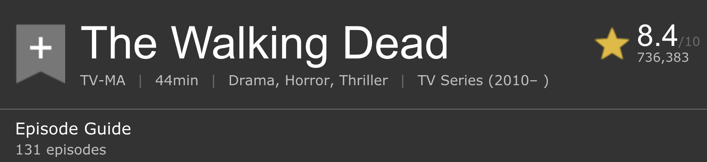

```{r packages, echo=FALSE, message=FALSE, warning=FALSE}
library(tidyverse)
library(knitr)
```

```{r setup, include=FALSE}
# R options
options(
  htmltools.dir.version = FALSE, # for blogdown
  show.signif.stars = FALSE,     # for regression output
  warn = 1
  )
# Set dpi and height for images
knitr::opts_chunk$set(fig.height = 2.5, fig.width = 5, dpi = 300) 
# ggplot2 color palette with gray
color_palette <- list(gray = "#999999", 
                      salmon = "#E69F00", 
                      lightblue = "#56B4E9", 
                      green = "#009E73", 
                      yellow = "#F0E442", 
                      darkblue = "#0072B2", 
                      red = "#D55E00", 
                      purple = "#CC79A7")
htmltools::tagList(rmarkdown::html_dependency_font_awesome())
# For magick
dev.off <- function(){
  invisible(grDevices::dev.off())
}
# For ggplot2
ggplot2::theme_set(ggplot2::theme_bw())
```

class: center, middle

# Application exercise

---

## Popular TV shows

RStudio Cloud $\rightarrow$ Web scraping + automation

1. Scrape the list of most popular TV shows on IMDB: http://www.imdb.com/chart/tvmeter

2. Examine each of the *first three* (or however many you can get through) tv show subpage to also obtain genre and runtime.

Time permitting, also try to get the following:
  - How many episodes so far
  - Certificate
  - First five plot keywords
  - Country
  - Language
  
Add this information to the data frame you created in step 1.

---

class: center, middle

# Functions

---

## Setup

```{r}
library(tidyverse)
library(rvest)

st <- read_html("http://www.imdb.com/title/tt4574334/")
twd <- read_html("http://www.imdb.com/title/tt1520211/")
got <- read_html("http://www.imdb.com/title/tt0944947/")
```


---

## Why functions?

- Automate common tasks in a power powerful and general way than copy-and-pasting:
    - You can give a function an evocative name that makes your code easier to understand.
    - As requirements change, you only need to update code in one place, instead of many.
    - You eliminate the chance of making incidental mistakes when you copy and paste (i.e. updating a variable name in one place, but not in another).

--

- Down the line: Improve your reach as a data scientist by writing functions (and packages!) that others use

---

## When should you write a function?

Whenever you’ve copied and pasted a block of code more than twice.

.question[
Do you see any problems in the code below?
]

.small[
```{r eval=FALSE}
st_episode <- st %>%
  html_nodes(".np_right_arrow .bp_sub_heading") %>%
  html_text() %>%
  str_replace(" episodes", "") %>%
  as.numeric()

got_episode <- got %>%
  html_nodes(".np_right_arrow .bp_sub_heading") %>%
  html_text() %>%
  str_replace(" episodes", "") %>%
  as.numeric()

twd_episode <- got %>%
  html_nodes(".np_right_arrow .bp_sub_heading") %>%
  html_text() %>%
  str_replace(" episodes", "") %>%
  as.numeric()
```
]

---

## Inputs

.question[
How many inputs does the following code have?
]

```{r eval=FALSE}
st_episode <- st %>%
  html_nodes(".np_right_arrow .bp_sub_heading") %>%
  html_text() %>%
  str_replace(" episodes", "") %>%
  as.numeric()
```

---

## Turn your code into a function

1. Pick a short but informative **name**, preferably a verb.

<br>
<br>
<br>
<br>

```{r eval=FALSE}
scrape_episode <- 
  
  
  
  
  
  
```

---

## Turn your code into a function

1. Pick a short but informative **name**, preferably a verb.
2. List inputs, or **arguments**, to the function inside `function`. If we had more the call would look like `function(x, y, z)`.

<br>

```{r eval=FALSE}
scrape_episode <- function(x){
  
  
  
  
  
}  
```

---

## Turn your code into a function

1. Pick a short but informative **name**, preferably a verb.
2. List inputs, or **arguments**, to the function inside `function`. If we had more the call would look like `function(x, y, z)`.
3. Place the **code** you have developed in body of the function, a `{` block that immediately follows `function(...)`.

```{r}
scrape_episode <- function(x){
  x %>%
    html_nodes(".np_right_arrow .bp_sub_heading") %>%
    html_text() %>%
    str_replace(" episodes", "") %>%
    as.numeric()
}
```

--

```{r}
scrape_episode(st)
```

---

## Check your function


```{r}
scrape_episode(twd)
```


```{r}
scrape_episode(got)
```

---

## Naming functions

> "There are only two hard things in Computer Science: cache invalidation and naming things." - Phil Karlton

--

- Names should be short but clearly evoke what the function does

--

- Names should be verbs, not nouns

--

- Multi-word names should be separated by underscores (`snake_case` as opposed to `camelCase`)

--

- A family of functions should be named similarly (`scrape_title`, `scrape_episode`, `scrape_genre`, etc.)

--

- Avoid overwriting existing (especially widely used) functions

---

## Scraping show info

.small[
```{r}
scrape_show_info <- function(x){

  title <- x %>%
    html_node("#title-overview-widget h1") %>%
    html_text() %>%
    str_trim()

  runtime <- x %>%
    html_node("time") %>%
    html_text() %>%
    str_replace("\\n", "") %>%
    str_trim()
  
  genres <- x %>%
    html_nodes(".txt-block~ .canwrap a") %>%
    html_text() %>%
    str_trim() %>%
    paste(collapse = ", ")
  
  tibble(title = title, runtime = runtime, genres = genres)
}
```
]

---

.small[
```{r}
scrape_show_info(st)
scrape_show_info(twd)
scrape_show_info(got)
```
]

---

.question[
How would you update the following function to use the URL of the page as an argument?
]

.small[
```{r eval=FALSE}
scrape_show_info <- function(x){

  title <- x %>%
    html_node("#title-overview-widget h1") %>%
    html_text() %>%
    str_trim()

  runtime <- x %>%
    html_node("time") %>%
    html_text() %>%
    str_replace("\\n", "") %>%
    str_trim()
  
  genres <- x %>%
    html_nodes(".txt-block~ .canwrap a") %>%
    html_text() %>%
    str_trim() %>%
    paste(collapse = ", ")
  
  tibble(title = title, runtime = runtime, genres = genres)
}
```
]

---

.small[
```{r}
scrape_show_info <- function(x){
  
{{  y <- read_html(x) }}

  title <- y %>%
    html_node("#title-overview-widget h1") %>%
    html_text() %>%
    str_trim()

  runtime <- y %>%
    html_node("time") %>%
    html_text() %>%
    str_replace("\\n", "") %>%
    str_trim()

  genres <- y %>%
    html_nodes(".txt-block~ .canwrap a") %>%
    html_text() %>%
    str_trim() %>%
    paste(collapse = ", ")
  
  tibble(title = title, runtime = runtime, genres = genres)
}
```
]

---

## Let's check

.small[
```{r}
st_url <- "http://www.imdb.com/title/tt4574334/"
twd_url <- "http://www.imdb.com/title/tt1520211/"
got_url <- "http://www.imdb.com/title/tt0944947/"
```
]
--
.small[
```{r}
scrape_show_info(st_url)
scrape_show_info(twd_url)
scrape_show_info(got_url)
```
]

---

class: center, middle

# Automation

---

.question[
You now have a function that will scrape the relevant info on shows given its URL. Where can we get a list of URLs of top 100 most popular TV shows on IMDB? Write the code for doing this in your teams.
]

---

```{r}
urls <- read_html("http://www.imdb.com/chart/tvmeter") %>%
  html_nodes(".titleColumn a") %>%
  html_attr("href") %>%
  paste("http://www.imdb.com", ., sep = "")
```

```{r echo=FALSE}
urls
```

---

## Go to each page, scrape show info 

Now we need a way to programatically direct R to each page on the `urls` list and run the `scrape_show_info` function on that page.

.small[
```{r}
scrape_show_info(urls[1])
scrape_show_info(urls[2])
scrape_show_info(urls[3])
```
]

---

## Go to each page, scrape show info 

In other words, we want to **map** the `scrape_show_info` function to each element of `show_urls`:

```{r eval=FALSE}
top_100_shows <- map_df(urls, scrape_show_info)
```

--

- This will hit the `urls` one after another, and grab the info.

--

- If you get `HTTP Error 429 (Too man requests)` you might want to slow down your hits.

--

- You can add a `Sys.sleep()` call to slow down your function:

```{r eval=FALSE}
scrape_show_info <- function(x){

{{  Sys.sleep(runif(1)) }}
  
  ...

}
```
